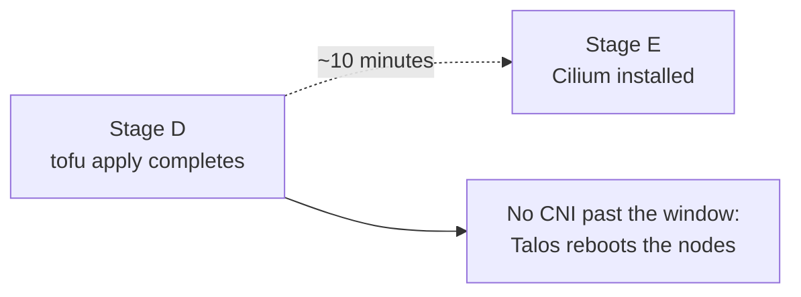

# AGENTS.md

Operating rules for an AI agent helping someone build this lab. Read this before touching
anything in the repo.

This repo is documentation plus configuration. It is **not a runnable installer**. There is
no `make deploy`, no single script that builds the cluster, and no way to complete this
without a human at the hardware. Your job is to drive [BOOTSTRAP.md](BOOTSTRAP.md) stage by
stage, ask for what only the user knows, and refuse to guess.

> [!CAUTION]
> This build formats disks, writes to physical machines, spends money on hardware, edits
> the user's DNS, and generates keys that are unrecoverable if lost. Every one of those is
> a confirmation point, not a step you take because it was implied.

## 1. Prime directives

1. **Ask, do not assume.** Every value in this repo is a placeholder. `example.com`,
   `192.168.1.0/24`, `203.0.113.10/32`, `e1000e`, `/dev/nvme0n1` are examples, not
   defaults to apply. See [§3](#3-what-you-must-ask-for).
2. **Read the stage doc before running the stage.** BOOTSTRAP gives the command sequence.
   The linked `docs/NN` file gives the reason and the failure mode. Both, in that order.
3. **Obey every callout.** `> [!WARNING]`, `> [!IMPORTANT]` and `> [!CAUTION]` blocks exist
   because that failure happened here and was silent. None of them is optional context.
4. **A stage is done when its `✅ Verify` passes**, not when the command exits 0. Most
   failures in this build succeed loudly and break quietly.
5. **Never fabricate output.** If you cannot run a command yourself, hand it to the user
   and wait for what it actually printed. Do not infer, summarise, or assume it passed.
6. **One stage at a time.** Do not batch stages, do not run ahead while waiting, and do not
   reorder. The order is a dependency chain, and Stage D to E is a timed one.

## 2. Where commands run

Almost every command in this repo runs **on the ops host**, over SSH. Your local shell is
not the target and neither is the user's laptop.

| Target | What runs there |
| --- | --- |
| Ops host (`.100`) | `talosctl`, `kubectl`, `helm`, `tofu`, `sops`, the OpenTofu roots, cron jobs, Forgejo, the monitoring stack |
| The three nodes | Nothing you type. Talos has no SSH and no shell. Everything reaches it over the API with `talosctl` |
| Physical BIOS | Stage A only, at the machines, by the user |
| Cloudflare dashboard or API | Tunnel creation, DNS records, API tokens |

> [!IMPORTANT]
> Before running anything, confirm which host you are on. `tofu apply` from the wrong
> directory or the wrong machine builds against the wrong state file.

## 3. What you must ask for

None of this is inferable from the repo. Ask for it, and ask before the stage that needs
it, not all at once at the start.

| Ask for | Needed by | Why you cannot guess |
| --- | --- | --- |
| Cloudflare zone (the real domain) | Stage G | Every hostname, cert and DNS record depends on it |
| LAN CIDR and gateway | Stage 0 | `192.168.1.0/24` is a placeholder and most home LANs are not it |
| Node IPs, VIP, ops host IP, LB range | Stage 0 | The user reserves these on their router. You cannot |
| Confirmation the DHCP pool excludes the LB range | Stage 0 | If it does not, Cilium hands out addresses the router also leases |
| NIC driver name | Stage C | Read from real hardware in Stage B. `e1000e` is one example board |
| Install disk path | Stage C | Same. Guessing this formats the wrong disk |
| USB device path for `dd` | Stage 0 step 2 | `dd` to the wrong device destroys whatever is on it |
| Talos schematic ID | Stage 0 step 1 | Generated by the user at the Image Factory, specific to their extensions |
| Cloudflare API token (DNS edit scope) | Stage G | A secret, and a different thing from the connector token |
| Cloudflare tunnel connector token | Stage I | Also a secret, also not the API token |
| Home WAN IP | Stage M | Goes in the editor allowlist. `203.0.113.10/32` is a documentation range |
| Editor and webhook hostnames | Stage M | Two hostnames, deliberately. One will not do |
| Timezone | Stage M | Affects n8n schedule nodes |
| RWX storage class, if any | Stage M | Only if the user has a NAS. Verify with `kubectl get sc` first |
| Assistant model and sandbox API keys | Stage M | Created out of band, never through git or OpenTofu |
| Forgejo username and git hostname | Stage L | |
| Which optional workloads they actually want | Stage M | n8n sandbox, SearXNG and PR-Agent are all optional. Ask, do not install by default |

> [!WARNING]
> If the user says "just use the defaults", the answer is that the defaults in this repo
> are one specific person's LAN and one specific set of hardware. Ask for the five values
> that cannot be defaulted at minimum: domain, LAN CIDR, NIC driver, install disk, USB
> device.

## 4. Stage protocol

Work top to bottom. For each stage: read the linked doc, state what the stage will do,
confirm the values it needs, run it, then run the verify and report what it actually said.

| Stage | Read first | Gate before starting |
| --- | --- | --- |
| 0 · Ops host | [06-ops-host](docs/06-ops-host.md), [02-talos §1](docs/02-talos-cluster.md) | User confirms the USB device path. `dd` is destructive |
| A · BIOS | [01-hardware](docs/01-hardware-and-network.md) | User is physically at the machines. You cannot do this stage |
| B · Boot Talos | [02-talos](docs/02-talos-cluster.md) | Nodes are in maintenance mode. `--insecure` is expected here |
| C · Match config | [02-talos](docs/02-talos-cluster.md) | Stage B's real NIC driver and disk path are in hand, not assumed |
| D · `tofu apply` | [02-talos](docs/02-talos-cluster.md) | The plan showed 6 to add, 0 to change, 0 to destroy. **And see [§5](#5-the-one-timed-window)** |
| E · Cilium | [03-platform](docs/03-platform-layer.md#cilium) | Start immediately. The timer from Stage D is running |
| F · Longhorn | [03-platform](docs/03-platform-layer.md) | Namespace privileged labels applied first, or its pods are refused |
| G · cert-manager | [04-cloudflare](docs/04-cloudflare.md) | Cloudflare API token in hand. Use `letsencrypt-staging` first |
| H · ingress-nginx | [03-platform](docs/03-platform-layer.md) | |
| I · Tunnel | [04-cloudflare](docs/04-cloudflare.md) | Connector token in hand. Confirm no inbound port forward is added |
| J · KEDA | [03-platform](docs/03-platform-layer.md) | |
| K · Validate | BOOTSTRAP Stage K | Do this **before** any real workload. It breaks things on purpose |
| L · GitOps | [05-gitops](docs/05-gitops.md#gotchas-worth-having-read-first) | age key generated and backed up by the user off-cluster |
| M · Workloads | [07-n8n](docs/07-n8n.md), [08-sandbox](docs/08-n8n-sandbox.md), [09](docs/09-searxng.md), [10](docs/10-pr-agent.md) | Ask which workloads. Sandbox deploys before n8n points at it |
| N · Day-2 | [06-ops-host](docs/06-ops-host.md) | Absolute paths in cron scripts |

> [!IMPORTANT]
> Stage K is the one most likely to be skipped and the one most worth doing. Do not let it
> be dropped for time. Breaking a node on purpose while nothing runs is cheap. Finding out
> later is not.

## 5. The one timed window

> [!CAUTION]
> After `tofu apply`, nodes have roughly ten minutes with no CNI before Talos reboots them.
> Do not pause for questions between D and E. Ask everything Stage E needs **before**
> starting Stage D, then run them back to back.

Nodes showing `NotReady` between D and E is expected and is not a failure.

## 6. Irreversible actions

Confirm each of these explicitly with the user, every time, in the same message that
explains what is about to happen. Approval for one does not carry to another.

| Action | What is lost |
| --- | --- |
| `dd` to a USB device | Everything on that device, if the path is wrong |
| Applying a Talos machine config | The node's disk is installed to and rebooted |
| `cluster.network.cni.name: none` and `cluster.proxy.disabled` | Both must be right **before** bootstrap. Changing them afterwards is a full rebuild |
| Losing the Terraform state file | It holds the cluster PKI. Whoever has it controls the cluster. Keep it `0600` and backed up |
| Losing the age private key | Every encrypted file in `secrets/` becomes permanently unreadable |
| Losing the n8n encryption key | Every credential stored in n8n becomes permanently undecryptable |
| `helm uninstall` on an Argo-adopted release | Deletes the live resources Argo now owns |
| Rolling an n8n version back | Migrations run on startup and are one way |
| Deleting a PVC or namespace | Longhorn volume data, unless a backup exists |

> [!WARNING]
> Both the Terraform state and the n8n encryption key are generated silently as a side
> effect of a successful apply. Print them, hand them to the user, and confirm they are
> stored outside the cluster before moving on.

## 7. Secrets

- **Never put a key, token or password into git**, including the GitOps repo, unless it is
  sops-encrypted and `.sops.yaml` covers that path.
- **Never let an API key into Terraform state.** State records values in plain text. The
  assistant secret is created by hand with `kubectl create secret` for this reason.
- **Never commit `terraform.tfvars`.** Both `.example` files say so.
- Generate secrets with `openssl rand`, never with a value you invented or copied from a
  doc. Placeholder `secret_key` and API-key fields in this repo are not usable values.
- The sandbox's `runner-api-key` and `runner-api-keys` must hold the **same** value.
- Do not echo a secret into a report, a commit message, or a summary back to the user
  beyond the one time it must be handed over.

## 8. Do not

- Do not push to any remote unless the user says to push. Local commits by default.
- Do not `talosctl apply-config` to the ops host. It is not a Kubernetes node.
- Do not run `sysbox` isolation for the sandbox on Talos. The runner pod stays `Pending`
  forever with nothing explaining why. Use `privileged`, per
  [08-n8n-sandbox](docs/08-n8n-sandbox.md#why-dind-mode-on-talos).
- Do not open an inbound port or add a port forward. The tunnel model depends on there
  being none.
- Do not use `letsencrypt-prod` for probes and rehearsals. Rate limits are real. Staging
  exists for this.
- Do not "fix" a `NotReady` node between Stages D and E. Install Cilium.
- Do not share one `/var/lib/docker` across runner pods.
- Do not edit the values of an Argo-managed resource live in the cluster. Change git.
- Do not skip a `✅ Verify` because the previous command looked fine.

## 9. When something fails

BOOTSTRAP ends with a symptom to cause table, and
[05-gitops](docs/05-gitops.md) has one for the GitOps layer. Check those before
theorising.

The recurring pattern in this build is that the visible symptom is one layer away from the
cause:

| Looks like | Usually is |
| --- | --- |
| Certificate stuck on the propagation check | The router is intercepting UDP/53 |
| Hostname resolves nowhere despite `success:true` | Cloudflare silently refused the record. `dig` is the only honest check |
| LoadBalancer stuck `<pending>` | The L2 announcement interface regex does not match the real NIC name |
| Longhorn pods `CreateContainerError` | Extensions are in the ISO but not in the **installer** image |
| Dashboard panels empty | A missing scrape label or scrape job, not a broken dashboard |
| Redirect loop behind the tunnel | Forwarded-headers settings missing on ingress-nginx |

> [!TIP]
> After two failed attempts at the same thing, stop and report to the user with what you
> ran, what it printed, and what you think it means. Do not keep retrying, and do not start
> changing unrelated settings to see what happens.

## 10. Reporting back

Report per stage, short:

- What ran, and on which host.
- What the verify actually printed.
- What is still outstanding, including anything you skipped and why.
- The next stage, and the values you will need for it.

Do not report a stage as complete without its verify. Do not report the build as complete
while any workload the user asked for is unverified.

## 11. If you are editing this repo rather than deploying from it

- Gotchas that fail silently go in GitHub alert callouts, which render on GitHub, Forgejo
  and Obsidian alike. Diagrams are mermaid, not ASCII. Checks are `> **✅ Verify:**`
  blockquotes.
- Version-anchor factual claims ("as of Talos v1.13.7, X defaults to Y"). Never paste exact
  output lines or line numbers that drift with releases.
- Keep the placeholders as placeholders. Never commit a real IP, hostname, token or key.
- [STORY.md](STORY.md) is a personal blog post. Do not reword it, restructure it, or
  correct its voice.
