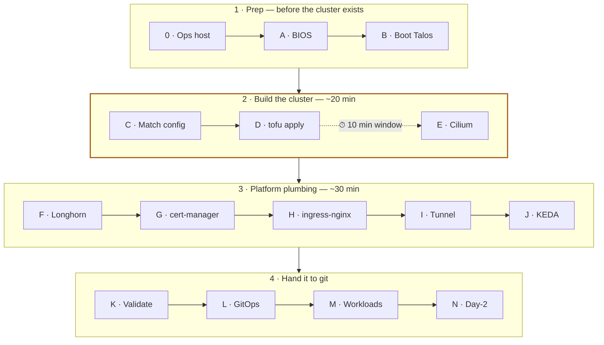

# Bootstrap · bare metal to running workloads

This is the follow-along for [STORY.md](STORY.md), written for people who self-host with
Docker and are new to Kubernetes and Talos. Before starting you need: the hardware from
[01-hardware-and-network](docs/01-hardware-and-network.md) (three used office PCs plus a
Raspberry Pi), a Cloudflare account with your domain on it, and a workstation to drive the
cluster with `talosctl` / `kubectl` / `tofu` (Stage 0 turns the Pi into exactly that, so
an SSH client and a browser are enough). Budget a weekend, not an afternoon: hands-on
time is short, but downloads, reboots, and DNS propagation fill the gaps.

Before this: four powered-off machines and a domain. After this: a three-node Kubernetes
cluster serving n8n on your own hostnames, rebuildable from git.



The single linear sequence. Every stage has a command and a ✅ verify line. Work top to
bottom, and don't skip the verifies.

> [!TIP]
> Hands-on time once Stage 0 is done: roughly one to two hours, most of it waiting on
> `tofu apply` and Helm rollouts. The dotted edge above is the one hard deadline in the
> whole build, and Stage D explains it.

---

## Stage 0 · Ops host and prep

Do this before the cluster hardware is on the desk. Everything here runs on the
Raspberry Pi, the ops host: the always-on machine that drives and watches the cluster
without being part of it. SSH in, clone this repo, and run the script from the repo root.

```bash
# on a fresh Debian 13 / Raspberry Pi OS Lite 64-bit
LAN_CIDR=192.168.1.0/24 ./scripts/bootstrap-ops-host.sh
```

One script preps the Pi: it installs Docker and the four cluster tools (`talosctl` /
`kubectl` / `helm` / `tofu`), starts the monitoring stack with Docker Compose (Grafana
and friends), turns on the UFW firewall plus automatic security updates
(unattended-upgrades), and creates `/opt/lab/{tofu,kube,talos,talos-images,cron}`.

Then:

1. **Build the Talos factory image.** Talos, the operating system the nodes will run,
   ships built to order: the factory gives you a schematic ID, the name of your exact
   build and its extensions. The same ID must be behind both the ISO you boot from and
   the installer the cluster later pulls. [02-talos-cluster §1](docs/02-talos-cluster.md).
   Save the schematic ID and download the ISO to `/opt/lab/talos-images/`.
2. **Flash the USB stick.** `dd` writes the ISO onto the stick and wipes whatever was
   there, so confirm the device name first.
   ```bash
   lsblk                                   # confirm the USB device, not your backup disk
   sudo dd if=/opt/lab/talos-images/metal-amd64-v1.13.7.iso of=/dev/sdX bs=4M status=progress conv=fsync
   ```
3. **Reserve IPs** on the router so nothing else ever takes them: nodes `.101–.103`,
   VIP `.110`, ops host `.100`, NAS `.239`, and **exclude `.200–.230` from the DHCP
   pool** for the Cilium LB range (LAN addresses the cluster hands out to services it
   exposes, starting in Stage E). The VIP is a floating IP shared by the control-plane
   nodes, the ones that run Kubernetes itself, which here is all three: it moves to a
   healthy node when its holder fails, so the cluster API survives losing a node.
4. **Stage the OpenTofu root.** OpenTofu (the open-source Terraform fork) reads config
   files that say what you want and makes machines match them. This root is the folder
   of config describing the whole cluster. Copy `iac/tofu/cluster/` to
   `/opt/lab/tofu/cluster/`, `cp terraform.tfvars.example terraform.tfvars`, paste the
   install image (the one carrying your schematic ID from step 1), then run
   `tofu validate`, which checks the files for errors without touching anything.

> **✅ Verify:** Grafana answers on `http://192.168.1.100:3000`, and `tofu validate`
> reports the configuration valid.

---

## Stage A · Physical and BIOS  *(~10 min per node)*

The one stage spent at the machines themselves, with a monitor and keyboard plugged
into each node in turn. Wire all three nodes to the same switch. Label them physically
**node-1 / 2 / 3** so you always know which box has which IP.

Per node, with the USB stick in, set five things in the BIOS (menu names vary by
vendor, every board has them): Secure Boot **off** (so the stick is allowed to boot) ·
boot order **USB → NVMe** (stick first now, internal disk after Talos installs itself) ·
after power loss **Last State** (nodes come back on their own after an outage) ·
Wake-on-LAN **on** (so they can be powered up over the network) · VT-x/VT-d **on**
(hardware virtualization).

> **✅ Verify:** each node powers on, passes its self-test, and boots the Talos USB stick.

---

## Stage B · Boot Talos, capture facts  *(~10 min)*

Back on the Pi for good: Talos has no SSH and no shell, so everything from here on
happens over its API with `talosctl`, run from the Pi.

All three nodes come up in maintenance mode (running from USB, unconfigured, waiting to
be told who they are) with DHCP addresses from the router. Note those IPs from the
router's client list, then ask each node what hardware it sees. `--insecure` is
expected here: a node in maintenance mode has no certificates yet.

```bash
talosctl -n <MAINT_IP> get links --insecure   # NIC name and driver
talosctl -n <MAINT_IP> get disks --insecure   # confirm /dev/nvme0n1
```

> **✅ Verify:** all three nodes answer, and you have the NIC **driver** name and the disk
> path written down for Stage C.

---

## Stage C · Match the config to your hardware  *(~5 min)*

Stage B told you what the machines actually have. This stage makes the OpenTofu config
agree with it. The file to edit is `/opt/lab/tofu/cluster/terraform.tfvars`, the one you
created in Stage 0. Its defaults assume an Intel NIC (driver `e1000e`), an NVMe disk at
`/dev/nvme0n1`, and a `192.168.1.x` LAN. If Stage B showed exactly that, edit nothing and
skip to the dry run.

If something differed, open the file, remove the leading `#` from the matching line, and
put in your value:

```hcl
# nic_driver   = "e1000e"          # replace with the driver "get links" showed
# install_disk = "/dev/nvme0n1"    # replace with the disk "get disks" showed
# node_ips     = ["192.168.1.101", "192.168.1.102", "192.168.1.103"]
# vip_ip       = "192.168.1.110"
# gateway      = "192.168.1.1"
```

The last three only change if your LAN is not `192.168.1.x`, and they must match the
reservations you made in Stage 0.

Then dry-run it. `tofu init` downloads the provider (the plugin OpenTofu drives Talos
with), and `tofu plan` prints what would be created without touching anything:

```bash
cd /opt/lab/tofu/cluster
tofu init
tofu plan
```

> **✅ Verify:** the plan proposes six things to add and nothing to change or destroy:
> machine secrets, one config apply per node, one bootstrap, one kubeconfig. If it errors
> instead, the message names the `terraform.tfvars` line to fix.

---

## Stage D · Provision the cluster  *(~15 min)*

On the Pi, in `/opt/lab/tofu/cluster`. `tofu apply` performs the plan from Stage C: it
generates the machine secrets, pushes a config to each node (each installs Talos to its
internal disk and reboots), runs the one-time bootstrap that tells the first node to
form the cluster, and produces credentials. The `tofu output` lines save those
credentials to files: the kubeconfig is how `kubectl` logs into Kubernetes, the
talosconfig is how `talosctl` logs into Talos, and `chmod 600` makes each readable by
you alone. The `export` line points both tools at those files for this shell session.
Finally, `talosctl health` asks the cluster to check itself over the VIP.

```bash
cd /opt/lab/tofu/cluster
tofu apply     # init already ran in Stage C

tofu output -raw kubeconfig  > /opt/lab/kube/config  && chmod 600 /opt/lab/kube/config
tofu output -raw talosconfig > /opt/lab/talos/config && chmod 600 /opt/lab/talos/config
export KUBECONFIG=/opt/lab/kube/config TALOSCONFIG=/opt/lab/talos/config

talosctl -e 192.168.1.110 -n 192.168.1.101 health \
  --control-plane-nodes 192.168.1.101,192.168.1.102,192.168.1.103
```

> **✅ Verify:** `talosctl health` reports etcd healthy on all three. etcd is the
> replicated database holding everything Kubernetes knows, so healthy etcd means the
> cluster exists.

> [!NOTE]
> `kubectl get nodes` shows all three **NotReady**, and that is expected. A node counts as
> Ready only once it has a CNI, the network layer pods use to talk to each other, and
> installing one is the next stage.

> [!CAUTION]
> **Start a timer.** You have about ten minutes before Talos reboots nodes that still have
> no CNI. Go straight to Stage E.

---

## Stage E · Cilium  *(immediately)*

Still on the Pi, in the same shell (the exports from Stage D must still be set), with
`iac/` paths relative to your clone of this repo. Cilium is the CNI from Stage D's
warning: the network that connects pods (a pod, one or more containers deployed as a
unit, is the thing Kubernetes actually runs). Helm, Kubernetes' package manager,
installs it from a chart (a packaged app plus its settings). `cilium status --wait`
sits until every piece reports healthy, and the final apply hands Cilium the
`.200–.230` range reserved in Stage 0 so it can give services their own LAN addresses.

```bash
helm install cilium cilium/cilium -n kube-system --version 1.17.6 \
  -f iac/platform/cilium-values.yaml
cilium status --wait
kubectl apply -f iac/platform/cilium-lb-pool.yaml
```

> **✅ Verify:** all three nodes flip to **Ready** (`kubectl get nodes`), and
> `cilium status` shows everything green.

---

## Stage F · Longhorn  *(~5 min)*

Longhorn turns each node's disk into replicated cluster storage: volumes are kept as
three copies spread across the nodes, so data survives the node it was written on. The
first two commands create its namespace (a named slice of the cluster) and label it to
allow privileged pods, which Longhorn needs for raw disk access. Skip the labels and
its pods are refused. Then Helm installs it with the repo's settings.

```bash
kubectl create namespace longhorn-system
kubectl label namespace longhorn-system \
  pod-security.kubernetes.io/enforce=privileged \
  pod-security.kubernetes.io/audit=privileged \
  pod-security.kubernetes.io/warn=privileged

helm install longhorn longhorn/longhorn -n longhorn-system \
  -f iac/platform/longhorn-values.yaml
```

> **✅ Verify:** all pods Running (`kubectl -n longhorn-system get pods`), and
> `kubectl get sc` shows `longhorn (default)`. A StorageClass is a kind of storage pods
> can request, and default means workloads get Longhorn unless they ask for something
> else.

---

## Stage G · cert-manager  *(~5 min, budget 20)*

cert-manager fetches and renews Let's Encrypt certificates from inside the cluster. A
ClusterIssuer is a cluster-wide recipe for getting those certificates, and this repo
ships two, `letsencrypt-staging` and `letsencrypt-prod`. Both prove you own the domain
with DNS-01: cert-manager writes a temporary DNS record through your Cloudflare token
and Let's Encrypt looks for it, so nothing needs to be reachable from the internet. The
Helm flags point cert-manager's DNS checks at the cluster's own DNS service, the secret
stores a Cloudflare API token allowed to edit your domain's DNS, and the apply creates
both ClusterIssuers.

```bash
helm upgrade --install cert-manager jetstack/cert-manager -n cert-manager --create-namespace \
  --version v1.16.5 --set crds.enabled=true \
  --set 'extraArgs={--dns01-recursive-nameservers=10.96.0.10:53,--dns01-recursive-nameservers-only}'

kubectl -n cert-manager create secret generic cloudflare-api-token \
  --from-literal=api-token=<CF_TOKEN>
kubectl apply -f iac/platform/clusterissuers.yaml
```

> [!IMPORTANT]
> If the router intercepts UDP/53 (some answer every DNS question themselves), patch
> CoreDNS to forward over DoT (DNS over TLS, which a router cannot rewrite) **now**, per
> [03-platform-layer](docs/03-platform-layer.md#coredns-over-dot). Skipping it means
> cert-manager's propagation check stalls forever and you debug the wrong thing.

> **✅ Verify:** `kubectl get clusterissuer` shows both `Ready=True`. Issue a throwaway
> certificate against `letsencrypt-staging` first, since staging lets you rehearse without
> spending Let's Encrypt's production rate limits.

---

## Stage H · ingress-nginx  *(~5 min)*

ingress-nginx is the cluster's shared reverse proxy, the same job nginx does in front
of a home Docker stack: one LoadBalancer IP from the Cilium pool in front, per-hostname
routing rules behind it. An Ingress is one such rule, "this hostname goes to that
service". The repo's values file also carries the forwarded-headers settings the
Cloudflare tunnel needs later.

```bash
helm upgrade --install ingress-nginx ingress-nginx/ingress-nginx \
  -n ingress-nginx --create-namespace --version 4.11.3 \
  -f iac/platform/ingress-nginx-values.yaml
```

> **✅ Verify:** `kubectl -n ingress-nginx get svc` shows `EXTERNAL-IP 192.168.1.200`, the
> first address of the pool reserved in Stage 0.

---

## Stage I · Cloudflare Tunnel  *(~10 min)*

A tunnel means cloudflared dials out from the cluster to Cloudflare, and public traffic
rides that connection back in, so the router keeps zero open ports.

Create the tunnel and push the wildcard route, the one rule sending every hostname
under your domain into it ([04-cloudflare](docs/04-cloudflare.md)). Then, on the Pi:
the secret stores the connector token cloudflared uses to identify itself to
Cloudflare, and the apply runs cloudflared in the cluster.

```bash
kubectl create namespace cloudflared
kubectl -n cloudflared create secret generic cloudflared-tunnel-token \
  --from-literal=token=<CONNECTOR_TOKEN>
kubectl apply -f iac/platform/cloudflared.yaml
```

Deploy a throwaway `hello` Deployment (the object that runs and restarts a set of
pods) + Ingress, add its CNAME in Cloudflare with the proxy turned on, and:

> **✅ Verify:** `curl -I https://hello.example.com` returns `HTTP/2 200` with
> `server: cloudflare`, and no inbound firewall rule exists anywhere. Delete the probe
> afterwards.

---

## Stage J · KEDA and metrics-server  *(~5 min)*

KEDA is the autoscaler that will later add n8n worker pods when the job queue gets
deep. metrics-server collects CPU and memory numbers from the nodes to feed
`kubectl top` and CPU-based scaling, and its extra flags let it reach the kubelet (the
agent on each node) the way Talos exposes it.

```bash
helm install keda kedacore/keda -n keda --create-namespace
helm install metrics-server metrics-server/metrics-server -n kube-system \
  --set 'args={--kubelet-insecure-tls,--kubelet-preferred-address-types=InternalIP\,ExternalIP\,Hostname}'
```

> **✅ Verify:** `kubectl top nodes` returns numbers. Give it a minute after install to
> gather the first ones.

---

## Stage K · Validate the platform  *(the important part, ~15 min)*

> [!IMPORTANT]
> Do this **before** deploying anything you care about. Break things on purpose now,
> while nothing of value is running.

All of it from the Pi.

1. `kubectl get nodes` → 3× Ready, control-plane, schedulable (allowed to run normal
   workloads).
2. **Node loss.** `kubectl cordon` + `drain` one node (cordon marks it unschedulable,
   drain then evicts its pods onto the others). The API stays up via the VIP, a
   3-replica probe app keeps serving, and external requests through the tunnel keep
   returning 200. Uncordon.
3. **Storage.** Create a PVC (a PersistentVolumeClaim, a pod's request for storage) on
   `longhorn` → Bound, 3-replica volume created. Delete it.
4. **LoadBalancer.** `curl http://192.168.1.200` returns nginx's 404, which is correct,
   since no Ingress matches the bare IP.
5. **Ingress + TLS.** A probe hostname gets a Let's Encrypt prod cert in ~90 s via DNS-01
   and returns `HTTP/2 200` through the tunnel. Delete the namespace and the CNAME.
6. **Baseline snapshot.** Note what healthy looks like: nothing pending, nothing
   crash-looping, all tunnel connections healthy.

> **✅ Verify:** all six pass. The cluster is ready for workloads.

---

## Stage L · GitOps

From here the cluster's desired state lives in a git repo, and Argo CD, an in-cluster
agent that watches the repo and applies whatever changed, keeps the cluster matching
it: a change is a commit, and a rebuild is a clone.

1. **Forgejo on the ops host** (a self-hosted git service, your own GitHub) with its
   own Cloudflare tunnel, per [06-ops-host](docs/06-ops-host.md#forgejo). It lives on
   the Pi so the repo that rebuilds the cluster never depends on the cluster.
2. **age keypair.** sops encrypts individual values inside YAML files so secrets can
   sit in git unreadable, and age is the key format it uses here.
   `age-keygen -o ~/.config/sops/age/keys.txt`. Public key into `.sops.yaml`, private
   key into your password manager. Round-trip test with `sops -e -i` (encrypt a file in
   place) and `sops -d` (print it decrypted).
3. **Argo CD.**
   ```bash
   helm install argocd argo/argo-cd -n argocd --create-namespace --version 10.2.1 \
     --set 'repoServer.resources.requests.cpu=50m' \
     --set 'repoServer.resources.requests.memory=512Mi' \
     --set 'repoServer.resources.limits.memory=2Gi'
   ```
   The memory bump is not optional. See
   [05-gitops](docs/05-gitops.md#gotchas-worth-having-read-first).
4. **sops-secrets-operator** (chart 0.28.0, namespace `sops`), the piece that turns
   sops-encrypted files from git into live Kubernetes Secrets, with the age key mounted
   from `Secret/sops-age` so it can decrypt them.
5. **Seed the repo**: `bootstrap/`, `infra/`, `apps/`, `secrets/`, `scripts/bootstrap.sh`.
   Apply `bootstrap/root-app.yaml`, the one Argo Application that points at the repo.
   Everything else chains from it.
6. **Adopt the platform.** Argo takes ownership of the Helm releases installed by hand
   in Stages E through J without reinstalling them: extract values verbatim from live
   releases (`helm get values <release> -n <ns>`) into `infra/<name>/values.yaml`, and
   let Argo adopt them with `ServerSideApply=true`.

> **✅ Verify:** `kubectl -n argocd get apps` shows every app Synced and Healthy, with the
> platform still serving traffic throughout.

---

## Stage M · Workloads

### n8n

n8n ships in this repo as an OpenTofu module rather than a plain chart, so first
install the two controllers that let Argo drive OpenTofu: Flux's **source-controller**
(the fetching piece of Flux alone, so it does not conflict with Argo) and
[**tofu-controller**](https://github.com/flux-iac/tofu-controller), which runs the
module inside the cluster. The pipeline below filters the full Flux bundle down to
source-controller and its CRDs (the custom resource types it teaches Kubernetes):

```bash
kubectl create namespace flux-system
kubectl apply -f https://github.com/fluxcd/flux2/releases/latest/download/install.yaml \
  --dry-run=client -o yaml | \
  yq 'select(.metadata.name == "source-controller" or .kind == "CustomResourceDefinition")' | \
  kubectl apply -f -                                  # or `flux install --components=source-controller`

helm upgrade --install tofu-controller tofu-controller/tf-controller -n flux-system
```

> [!WARNING]
> Create the assistant secret out of band, by hand rather than through git or OpenTofu.
> Terraform state records values in plain text, and API keys must never land there.

Then push the manifests and let Argo take it (the closing `-w` watches the Terraform
object until the controller has applied it):

```bash
kubectl create namespace n8n
kubectl -n n8n create secret generic ai-assistant-secrets \
  --from-literal=model-api-key=... --from-literal=sandbox-api-key=...

# copy into the GitOps repo, then adjust hosts and the editor allowlist
cp -r iac/tofu/n8n            "$GITOPS_REPO/iac/tofu/n8n"
cp    iac/argocd/n8n-terraform.yaml "$GITOPS_REPO/bootstrap/"
cd "$GITOPS_REPO"
git commit -am "n8n" && git push
kubectl apply -f iac/argocd/app-n8n.yaml
kubectl -n flux-system get terraform n8n -w
```

Create the two proxied CNAMEs (the root's `dns_records_required` output lists them). Then
print the n8n encryption key and put it somewhere safe:

```bash
kubectl -n flux-system get secret n8n-tofu-outputs \
  -o jsonpath='{.data.n8n_encryption_key}' | base64 -d
```

> [!CAUTION]
> Back up that key **now**. Every credential stored in the instance is encrypted with it,
> and without it none of them can ever be decrypted again.

> [!NOTE]
> For a first bring-up or a debugging session, running the root by hand
> (`cd iac/tofu/n8n && tofu init && tofu apply`) is entirely reasonable. Expect the
> controller to overwrite anything changed out-of-band once it owns the root.

> **✅ Verify:** `kubectl -n n8n get pods` shows main, worker, and webhook pods all
> Running.

### n8n sandbox service

> [!IMPORTANT]
> **On Talos, or any immutable-rootfs distro, run the sandbox in `privileged` isolation.**
> Deploy from [`n8n-io/n8n-sandbox-service`](https://github.com/n8n-io/n8n-sandbox-service),
> path `charts/n8n-sandbox-service`, at a pinned commit (this lab uses `2a5af877`, chart
> `0.4.0`). The chart is not published to any registry, so the commit is the coordinate.

The values that matter are `dataPlane.mode: in-cluster` with `runner.isolation: privileged`
and `runner.acknowledgePrivileged: true`. That gives the runner its own Docker daemon
inside a pod, the one arrangement that keeps everything in-cluster on a node where the
root filesystem is read-only and nothing can be installed. The stronger `sysbox`
isolation needs a runtime installed on the node, which Talos does not allow (no shell, no
package manager, read-only `/`), and its runner pod stays `Pending` forever with nothing
explaining why. Full reasoning in
[08-n8n-sandbox](docs/08-n8n-sandbox.md#why-dind-mode-on-talos).

Deploy this **before** n8n points at it. Three prerequisites the chart cannot do for
itself ([08-n8n-sandbox](docs/08-n8n-sandbox.md)): privileged namespace labels (the
same reason as Longhorn), one shared auth secret, and a private CA issuer, your own
in-cluster certificate authority for the internal mTLS certificates (mutual TLS, where
both sides present certificates to prove who they are).

```bash
kubectl create namespace n8n-sandbox
# Without this, no runner pod is ever created and nothing obviously errors.
kubectl label namespace n8n-sandbox \
  pod-security.kubernetes.io/enforce=privileged \
  pod-security.kubernetes.io/warn=privileged \
  pod-security.kubernetes.io/audit=privileged

# runner-api-key and runner-api-keys must hold the SAME value.
RUNNER_KEY=$(openssl rand -hex 24)
kubectl -n n8n-sandbox create secret generic sandbox-auth \
  --from-literal=api-keys="$(openssl rand -hex 24)" \
  --from-literal=runner-registration-token="$(openssl rand -hex 24)" \
  --from-literal=runner-api-key="$RUNNER_KEY" \
  --from-literal=runner-api-keys="$RUNNER_KEY"

# A PRIVATE CA issuer for the four mTLS certificates, NOT letsencrypt-prod.
kubectl apply -f iac/apps/n8n-sandbox/ca-issuer.yaml
```

Then push `iac/apps/n8n-sandbox/values.yaml` and `iac/argocd/app-n8n-sandbox.yaml` to the
GitOps repo.

> **✅ Verify:** `kubectl -n n8n-sandbox logs deploy/n8n-sandbox-service-api | grep 'runner registered'`
> finds a match, then actually create a sandbox and run something in it, because a runner
> that started is not a runner that works. Commands in
> [08-n8n-sandbox](docs/08-n8n-sandbox.md#verify).

### SearXNG and PR-Agent

Push their Application manifests to the GitOps repo and let Argo take them.

> **✅ Verify:** the editor answers on its hostname, and the webhook host returns a
> **JSON** 404 for `/webhook/nope`. An HTML 404 means the webhook prefixes are hitting a
> main pod, see [07-n8n](docs/07-n8n.md#verifying-the-split-still-routes).

---

## Stage N · Day-2 hygiene

On the Pi. A nightly etcd snapshot is the cluster's memory: with it you can rebuild the
control plane after a disaster. The first command installs the snapshot script, the
second registers a cron job that runs it every night at 02:15.

```bash
sudo install -m755 scripts/etcd-snapshot.sh /opt/lab/cron/
echo '15 2 * * * root /opt/lab/cron/etcd-snapshot.sh >> /var/log/etcd-snapshot.log 2>&1' \
  | sudo tee /etc/cron.d/etcd-snapshot
```

Also wire up: the Longhorn backup target (where volume backups get copied) and its
nightly `RecurringJob` (Longhorn's scheduled-backup object), log shipping via Alloy
(Grafana's log collector), and the Prometheus scrape config against the cluster
([06-ops-host](docs/06-ops-host.md)).

> [!WARNING]
> **Check the cron log after the first night.** A cron script that cannot find `talosctl`
> on `PATH` fails silently and indefinitely, and you find out when you need the snapshot.

> **✅ Verify:** next morning, `sudo tail /var/log/etcd-snapshot.log` shows a fresh
> snapshot and no errors.

---

## If something breaks

| Symptom | Likely cause | Fix |
| --- | --- | --- |
| Nodes stuck `NotReady`, then reboot | Cilium not installed inside the ~10-minute window | Re-run `tofu apply`, then Cilium **immediately** |
| Cilium pods crash-loop | Wrong Talos values (cgroup / KubePrism / capabilities) | Recheck against [03-platform-layer](docs/03-platform-layer.md#cilium) |
| Longhorn pods `CreateContainerError` | Namespace not privileged, or extensions missing from the **install image** | Re-label the namespace; confirm the schematic is in the installer ref, not just the ISO |
| `talos_machine_bootstrap` ran too early | Provider ordering race | Keep `depends_on = [talos_machine_configuration_apply…]` |
| LoadBalancer stuck `<pending>` | Pool or L2 policy not applied, or the interface regex is wrong | Apply the pool; check the regex matches your NIC name |
| Certificate stuck on propagation check | Router hijacking UDP/53 | CoreDNS over DoT + `--dns01-recursive-nameservers=10.96.0.10:53` |
| Hostname resolves nowhere despite `success:true` | Cloudflare silently refused the record | `dig` it; pick a different name |
| Redirect loop behind the tunnel | Missing `use-forwarded-headers` / `compute-full-forwarded-for` | Set both on ingress-nginx |
| Can't reach the API after a node dies | VIP not configured | Confirm `vip.ip`; the VIP floats only across control-plane nodes |
