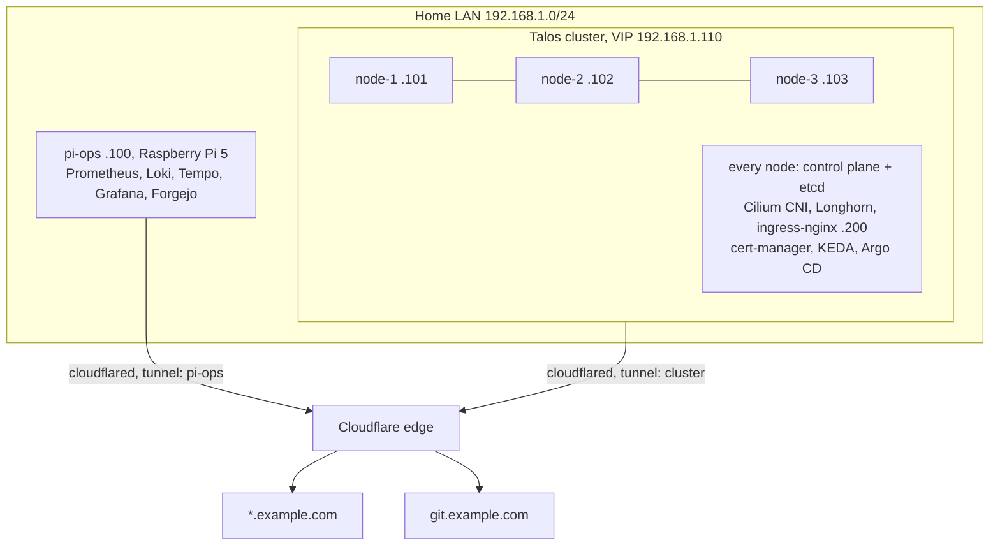

# Talos Kubernetes Homelab

A 3-node HA (highly available: any one node can fail) Kubernetes cluster on Talos Linux, a
stripped-down OS that runs nothing but Kubernetes, plus a Raspberry Pi ops host. It is
built entirely from OpenTofu (the open-source Terraform fork: the whole lab is described
in code files) and reconciled by Argo CD (the cluster is continuously matched to what git
declares). Everything external is reached through a Cloudflare Tunnel (an outbound-only
link to Cloudflare's edge), so no inbound port is open on the LAN.

This repo is the sanitised, publishable version of a lab that actually runs. IPs, domain
and hostnames are placeholders (`example.com`, `192.168.1.0/24`); the architecture,
gotchas and command sequences are real.

> [!TIP]
> **Where to start.** Written for someone comfortable with Docker at home but new to
> Kubernetes, the audience that already self-hosts n8n in one container. Read
> [STORY.md](STORY.md) for the narrative and the costs, then
> [BOOTSTRAP.md](BOOTSTRAP.md) for the build in command order, then docs/01 through 10 as
> the per-subsystem reference. Terms get defined at first use.



Reading the diagram:

| Thing | What it means |
| --- | --- |
| Control plane + etcd | The brains of Kubernetes (decides what runs where) and the database holding cluster state. Every node runs both, so any one can fail |
| VIP `.110` | A virtual IP: one address that floats across all three nodes, so clients survive any one dying |
| Cilium | Carries network traffic between pods |
| Longhorn | Replicates disk volumes across nodes |
| ingress-nginx | Routes incoming web requests to the right service |
| cert-manager | Issues and renews TLS certificates |
| KEDA | Scales workloads up and down on demand |
| Argo CD | Applies whatever git declares |
| pi-ops | The off-cluster box holding monitoring and git |

> [!NOTE]
> Two independent tunnels, on purpose. If the cluster is gone, git is still reachable, and
> git is the source of truth the cluster gets rebuilt from.

## Contents

| Doc | What |
| --- | --- |
| [STORY.md](STORY.md) | The blog post, from one n8n Docker container to this cluster: why, what it cost, what broke. Start here |
| [BOOTSTRAP.md](BOOTSTRAP.md) | Bare metal → running workloads, in order, with verify steps |
| [AGENTS.md](AGENTS.md) | Rules for an AI agent driving the build: what it must ask you for, what it must never assume, and the steps that are irreversible |
| [docs/01-hardware-and-network.md](docs/01-hardware-and-network.md) | The three machines, the Pi, BIOS, IP plan |
| [docs/02-talos-cluster.md](docs/02-talos-cluster.md) | Talos image factory + the OpenTofu cluster root |
| [docs/03-platform-layer.md](docs/03-platform-layer.md) | Cilium, Longhorn, cert-manager, ingress-nginx, KEDA |
| [docs/04-cloudflare.md](docs/04-cloudflare.md) | Tunnel model, per-hostname DNS, DNS-01 certs |
| [docs/05-gitops.md](docs/05-gitops.md) | Forgejo + Argo CD + SOPS/age, and the app pattern |
| [docs/06-ops-host.md](docs/06-ops-host.md) | Off-cluster observability, Forgejo, backups |
| [docs/07-n8n.md](docs/07-n8n.md) | n8n Community via `terraform-kubernetes-n8n`, split ingress, driven from Argo |
| [docs/08-n8n-sandbox.md](docs/08-n8n-sandbox.md) | `n8n-sandbox-service` for AI Assistant code execution, in `dind` mode (the service now lives upstream at n8n-io, and the doc covers the Talos specifics) |
| [docs/09-searxng.md](docs/09-searxng.md) | Self-hosted metasearch, also the assistant's search backend |
| [docs/10-pr-agent.md](docs/10-pr-agent.md) | AI code review on every Forgejo PR |
| [iac/](iac/) | The OpenTofu roots, platform values, Argo manifests |
| [scripts/](scripts/) | Ops-host bootstrap, etcd snapshots, Cloudflare DNS helper |

### How `iac/` is organised

Split by **how a thing is deployed**, not by what it is. A workload with a Helm chart
(Helm is the Kubernetes package manager, and a chart is one installable package) keeps its
values under `apps/`. A workload deployed by OpenTofu keeps its root under `tofu/`. n8n
appears in both, and the reason is explained under the table below.

```
iac/
├── tofu/          OpenTofu roots, run by tofu-controller or by hand
│   ├── cluster/       the Talos cluster itself
│   └── n8n/           the n8n module call + caller-owned ingress and RWX PVC
├── platform/      cluster plumbing installed before GitOps takes over
│                  (Cilium, Longhorn, cert-manager, ingress-nginx, cloudflared,
│                   Grafana provisioning + the custom dashboard JSON)
├── apps/          per-workload config, one directory per workload
│   ├── n8n/           minimal registry-sourced module call, the short path
│   ├── searxng/       Helm values          → two-source Application
│   ├── n8n-sandbox/   Helm values + CA     → two-source Application
│   └── pr-agent/      raw manifests        → single-source Application
└── argocd/        the Applications themselves, plus the CRs they own
```

Which shape a workload takes depends on what upstream publishes:

| Upstream publishes | Deployment shape | Config lives in | Example |
| --- | --- | --- | --- |
| A Helm chart | Two-source Application: chart + `ref: values` | `apps/<name>/values.yaml` | searxng, n8n-sandbox |
| Nothing (raw YAML) | Single-source Application: `path:` | `apps/<name>/*.yaml` | pr-agent |
| A Terraform module | A `Terraform` CR run by tofu-controller | `tofu/<name>/*.tf` | n8n |

**n8n has two entry points, and the difference is routing, not packaging.** Both are the
same module. Publishing it to the Terraform registry is what made the short one possible.

[`apps/n8n/`](iac/apps/n8n/) is a short self-contained module call, `source` +
`version` straight from the registry. `terraform apply` and you have queue-mode n8n
(editor and workers split, with jobs handed off through a queue) with Postgres, Valkey
(the open-source Redis fork) and TLS. Start there.

[`tofu/n8n/`](iac/tofu/n8n/) is what this lab actually runs: the same module with
`create_ingress = false`, plus a caller-owned split ingress and an RWX volume (one that
several pods can write to at once). That exists because Community edition has no SSO
(single sign-on), so authentication has to live at the ingress, and one hostname cannot
serve both an allowlisted editor and open webhooks.

Neither is a Helm Application, so `apps/n8n/` holds `.tf` where the other app directories
hold `values.yaml`, and it is still OpenTofu or Terraform that applies it.

That is a choice, not an absence. Upstream **does** publish a chart at
[`n8n-io/n8n-hosting`](https://github.com/n8n-io/n8n-hosting/tree/main/charts/n8n), and it
is a capable one: queue mode, workers, webhook processors, multi-main, KEDA. It expects
Postgres and Redis to already exist though (`database.useExternal`, `redis.useExternal`),
so the chart is one of three things you would have to assemble. The module provisions
CloudNativePG (a managed Postgres running inside the cluster) and Valkey itself, which
makes the whole workload a single `apply` and its version a single line in git. If you already run Postgres and Redis, the upstream chart is
the more obvious path and this repo's `apps/` pattern would fit it unchanged.

> [!WARNING]
> The registry `source` form works under **Terraform** only. OpenTofu resolves module
> registry addresses against a different index that does not carry this module. Use the
> `git::…?ref=` form there. Details in [docs/07](docs/07-n8n.md#calling-the-module).

## Design decisions

| Decision | Choice | Why |
| --- | --- | --- |
| Topology | 3× control-plane, all schedulable | True HA on three boxes, and you can pull a node to prove it |
| Provisioning | OpenTofu + `siderolabs/talos` | Reproducible: the whole cluster comes back from one `tofu apply` |
| CNI | Cilium, kube-proxy replacement | Built-in traffic rules and visibility (Hubble), and one fewer component to run |
| LoadBalancer | Cilium LB IPAM + L2 announcements | Cilium hands out service IPs itself, so no separate MetalLB install |
| Storage | Longhorn on the node NVMe | Volumes are copied across nodes, so storage survives one node down |
| Ingress / TLS | ingress-nginx + cert-manager (DNS-01) | Same cert works via tunnel and via LAN IP |
| External access | Cloudflare Tunnel, no port forwards | Nothing listens inbound and no LAN IP is ever public |
| GitOps | Forgejo (on the Pi) + Argo CD + SOPS/age | Git outlives the cluster, and secrets are encrypted in git yet editable offline |
| Observability | Prometheus/Loki/Tempo/Grafana **off-cluster** | Don't monitor a thing with itself |
| n8n | Community edition via OpenTofu module, run by tofu-controller | No licence needed, the module is the one deployment surface, and a version bump is one git commit |

## Upstream repos used here

- [`TpyoKnig/terraform-kubernetes-n8n`](https://github.com/TpyoKnig/terraform-kubernetes-n8n): the n8n module (CNPG + Valkey + KEDA + split ingress)
- [`n8n-io/n8n-sandbox-service`](https://github.com/n8n-io/n8n-sandbox-service): isolated code-execution sandboxes for the n8n AI Assistant, started as this lab's repo and now maintained upstream by n8n. Since chart `0.4.0` ([PR #126](https://github.com/n8n-io/n8n-sandbox-service/pull/126)), immutable-rootfs distributions such as Talos use `runner.isolation: privileged` with `runner.acknowledgePrivileged: true`, no tag pin required. The chart is vendored in the repo at `charts/n8n-sandbox-service`

## Reading the placeholders

| Placeholder | Replace with |
| --- | --- |
| `example.com` | Your Cloudflare-hosted zone |
| `192.168.1.0/24` | Your LAN |
| `203.0.113.10/32` | Your home WAN IP (in the ingress allowlists) |
| `<TUNNEL_UUID>`, `<ZONE_ID>`, `<ACCOUNT_ID>` | Cloudflare identifiers |
| `<SCHEMATIC_ID>` | Your Talos Image Factory schematic |
| `<user>` | Your Forgejo username |

> [!IMPORTANT]
> No secret, key, token or real address in this repo is live. `secret_key` and API-key
> fields are placeholders that must be regenerated before anything you build from this
> goes near the internet.
