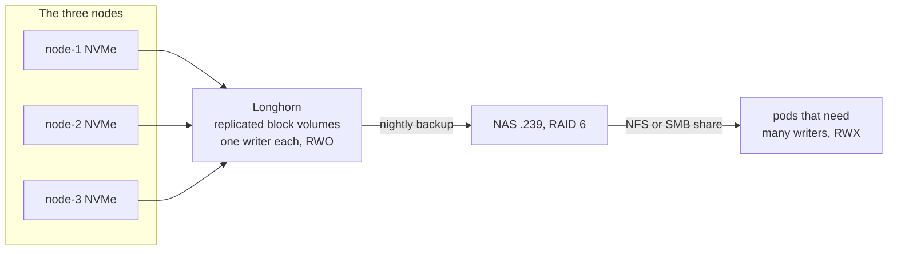

# 01 · Hardware & Network

This layer is everything below Kubernetes: three small PCs, their firmware, the flat
network they share, and the addresses nothing else on the LAN is allowed to take.

The operating system on those PCs is Talos, and it deserves a proper introduction
because everything else stands on it. Talos is a stripped-down Linux that runs nothing
but Kubernetes. There is no shell to log into and no SSH server to reach. You manage
each machine over an API with a command-line tool called `talosctl`, and a machine's
entire setup lives in one config file you apply through that API. Talos asks little of
hardware, but what it does need (wired ethernet, predictable IPs, the right boot order)
has to be true before any cluster exists. These are also the decisions that cost the
most to change later, so they get pinned down first.

Before this: three used PCs, a Pi, and a NAS in a pile. After this: every box has a
reserved IP, a recorded NIC and disk, and firmware that survives a power cut.

## Bill of materials

A few names in this table will come up constantly, so meet them once here. **Longhorn**
is the cluster's storage layer. It carves volumes out of each node's NVMe and keeps a
copy of every volume on more than one node, so a dead node does not take your data with
it. **Cilium** is the cluster's network layer. It moves traffic between pods and, in
this build, also answers on the LAN for the addresses the cluster exposes services on.
The **VIP** (virtual IP) is one extra IP address that all three nodes share. Whichever
node is alive answers on it, so your kubectl config points at one address that keeps
working when a node dies.

Three more, quickly. The **ops host** is the one machine kept deliberately outside the
cluster. It watches the cluster and stores backups, so the box you debug from is never
part of the patient. The **factory ISO** is the Talos installer image, built to order by
the Talos image factory and written once to the USB stick. **RWX** is short for
ReadWriteMany, a kind of volume that several pods can mount and write at the same time.

| Item | Qty | Notes |
| --- | --- | --- |
| Lenovo ThinkCentre M920q Tiny | 3 | 8th/9th-gen Intel T-series, single onboard Intel I219 NIC (`e1000e`) |
| RAM | 32 GB per node | 96 GB total. Comfortable for Longhorn (replicated block storage) + Cilium (the cluster's network layer) + queue-mode n8n + Postgres |
| NVMe SSD | ~256 GB each | M.2 2280. System disk **and** Longhorn data dir live here |
| USB stick | 1 | ≥1 GB, for the Talos factory ISO, re-used across all three nodes |
| Wired ethernet | 3 ports (+1 for NAS) | Same L2 segment (same wired network, no routing in between). No Wi-Fi, because the control-plane VIP (one IP that floats between the three nodes) and Cilium L2 announcements need it |
| Raspberry Pi 5 8 GB | 1 | Ops host: off-cluster observability + bastion. See [06-ops-host](06-ops-host.md) |
| NAS (4-bay, RAID 6) | 1 | Backup target and RWX shares. **Not** Longhorn's primary storage |
| 3.5" SATA drives | 4 | 8 TB 7200 RPM enterprise, bought used. Populate the NAS. Test every drive the day it arrives. A set bought recertified from a storefront arrived 4-for-4 dead and had to be returned |

Any small-form-factor x86 box works. The three things that matter: wired NIC, an NVMe
big enough for the OS plus Longhorn replicas, and a BIOS that can be told to power on
after an outage.

> [!NOTE]
> **Single NIC, no bonding.** One network port per box means one cable per box, with no
> backup path if it fails (bonding, which pairs two ports for redundancy, is not an option
> here). Fine for a lab. Accept it consciously rather than discover it.

## BIOS (each node)

Set these once in each node's firmware setup screen, before the first boot:

- **Secure Boot: Disabled.** Secure Boot makes the firmware refuse to start an operating
  system it does not recognize. Turning it off is the simplest path for Talos on metal.
- **Boot order: USB first, then NVMe.** With the stick in, the factory ISO boots and can
  install. With the stick out, the same order falls through to the internal disk.
- **After Power Loss: Last State.** Nodes come back from an outage on their own, with
  nobody walking over to press three power buttons.
- **Wake-on-LAN: Enabled.** Lets you power a box on over the network, which matters for
  a lab with no monitors or keyboards attached.
- **VT-x / VT-d: Enabled.** Intel's hardware virtualization features. Leave them on.
- **No boot-menu delay**, if the firmware offers it, so reboots do not sit waiting for a
  keypress.

## IP plan

Reserve a static block for the cluster and exclude it from the DHCP pool so nothing else
grabs those addresses. Two router features do the work here. A **DHCP reservation**
tells the router "this MAC address always gets this IP", so a node keeps its address
across reboots with no static config on the node itself. Excluding a range from the
pool tells the router "never hand these out to anyone", which protects the addresses
the cluster assigns for itself (the VIP and the Cilium LB pool below).

| Role | Address | Set where |
| --- | --- | --- |
| LAN gateway / router | `192.168.1.1` | Router |
| **Control-plane VIP** | **`192.168.1.110`** | Talos `machine.network.interfaces[].vip.ip` |
| node-1 (CP + etcd + schedulable) | `192.168.1.101` | DHCP reservation |
| node-2 | `192.168.1.102` | " |
| node-3 | `192.168.1.103` | " |
| NAS | `192.168.1.239` | DHCP reservation |
| Ops host (Pi 5) | `192.168.1.100` | DHCP reservation. Deliberately outside the cluster |
| **Cilium LB pool** | `192.168.1.200–230` | `CiliumLoadBalancerIPPool`, excluded from DHCP |

All three nodes are **control planes**: the machines that run Kubernetes itself, meaning
the API you talk to with `kubectl` and the brains that keep the cluster matching what
you asked for. Each one also runs **etcd**, the small replicated database where the
cluster stores everything it knows. etcd keeps working as long as two of the three
copies agree, which is a big part of why this build uses three nodes rather than two.
All three are also schedulable, meaning ordinary workloads land on them too. There are
no dedicated worker nodes at this size.

When something in the cluster needs its own LAN address, it asks for a LoadBalancer
service and Cilium hands it the next free IP from the pool above, one per exposed
service. Currently in use:

| IP | Service |
| --- | --- |
| `.200` | `ingress-nginx-controller` |
| `.201` | Postgres read-write endpoint, LAN-only, for Grafana dashboards |
| `.202` | In-cluster OCI registry (Zot) |
| `.203` | PR-Agent webhook receiver |

The **VIP** gives one stable `https://192.168.1.110:6443` that floats across the three
control-plane nodes and survives any single node dying. `kubeconfig` and `talosconfig`
(the files that tell `kubectl` and `talosctl` where the cluster is and how to prove who
you are) both point at it.

> [!WARNING]
> One exception, learned the hard way: point `talosconfig` at a **specific node IP** when
> running `talosctl upgrade-k8s`. The gRPC session (the long-lived connection talosctl
> holds open) to the VIP goes stale when the API server behind it restarts, and talosctl
> hangs on the final check of the kubelet (the agent that runs pods on each node) even
> though the upgrade completed.

## DNS and external access

- One Cloudflare-hosted zone. External traffic comes in over a **Cloudflare Tunnel**: a
  client inside the cluster dials out to Cloudflare, and visitors' requests ride back
  down that connection, so nothing ever connects inward to your LAN. Every external
  hostname is a **proxied CNAME** (an alias, with Cloudflare's proxy in front) pointing
  at `<TUNNEL_UUID>.cfargotunnel.com`. No port forwarding, no LAN IP is public.
- **Ingress** is the cluster's front door for web traffic: one component receives every
  HTTP request and routes it to the right service by hostname. Here that component is
  `ingress-nginx` on `192.168.1.200`. LAN clients can hit it by IP, and everything
  external arrives through the tunnel.
- HTTPS certificates come from **cert-manager**, a cluster add-on that requests and
  renews Let's Encrypt certificates on its own (set up here as a ClusterIssuer, one
  issuing config shared by the whole cluster). It proves you own the domain the
  **DNS-01** way, by planting a DNS TXT record, which needs nothing inbound at all. The
  same certificate therefore works on both paths, LAN and tunnel. See
  [04-cloudflare](04-cloudflare.md).
- **Split-horizon DNS was skipped** (answering LAN queries with local IPs instead of
  sending traffic out through Cloudflare and back). One hostname per service, everything
  tunnelled. LAN names can be added later if latency ever matters.

### Router DNS interception

> [!WARNING]
> Some consumer routers (UniFi among them) quietly intercept outbound DNS on UDP port 53
> and answer it themselves. The symptom is cert-manager's DNS-01 propagation self-check
> (it waits to see its own TXT record before asking Let's Encrypt to look) stalling
> forever on `_acme-challenge` TXT lookups while everything else looks healthy.

The fix that survives router firmware changes is to make CoreDNS (the DNS server that
runs inside the cluster) forward its queries over DNS-over-TLS, which is encrypted and on
a different port, so the router cannot grab it. See
[03-platform-layer](03-platform-layer.md#coredns-over-dot).

## Capture NIC and disk names before writing machine configs

Talos uses predictable interface names, and the same hardware can surface as `enp0s31f6`,
`eno2` or `eth0` depending on firmware. So before writing any config, ask the machines
what they actually have.

Boot each node from the USB stick. With nothing installed on its disk, Talos comes up in
**maintenance mode**: it runs entirely from RAM, takes a DHCP address, starts its API,
and waits for instructions. Nothing gets written to the machine. Find the address the
router leased it, then run these from the ops host (any box with `talosctl` on it
works). The first asks the node for its network interfaces, the second for its drives:

```bash
MAINT_IP=192.168.1.<dhcp-lease>          # NOT yet one of the reservations
talosctl -n "$MAINT_IP" get links --insecure    # NIC name and driver
talosctl -n "$MAINT_IP" get disks --insecure    # /dev/nvme0n1 etc.
```

`--insecure` is needed because a maintenance-mode node has no certificates yet, so the
usual authenticated connection cannot happen. Success is a short table from each
command: interface names with their drivers from `get links`, and the drives Talos can
see from `get disks`.

The **machine config** is the one YAML file that defines an entire Talos node: network,
disks, certificates, all of it. In it, prefer a **`deviceSelector`** matching the
**driver** over a hardcoded interface name. A driver match survives firmware quirks and
is identical across all three boxes, so one block works everywhere:

```yaml
network:
  interfaces:
    - deviceSelector:
        driver: e1000e
```

Record what you find:

| Node | MAC | NIC | Driver | Install disk |
| --- | --- | --- | --- | --- |
| node-1 | `aa:bb:cc:00:00:01` | `eno2` | `e1000e` | `/dev/nvme0n1` |
| node-2 | `aa:bb:cc:00:00:02` | `eno2` | `e1000e` | `/dev/nvme0n1` |
| node-3 | `aa:bb:cc:00:00:03` | `eno2` | `e1000e` | `/dev/nvme0n1` |

The NIC name matters in one more place. Cilium's **L2 announcement policy** is the bit
of config that makes the LB pool IPs answer on the LAN: Cilium announces "that address
lives here" on the local network on behalf of each exposed service. The policy matches
interfaces by regex.

> [!WARNING]
> For these boxes the right pattern is `^eno.*`, not the more commonly copy-pasted
> `^enp.*`. Get it wrong and every LoadBalancer service sits at `<pending>` with no error.

### Verify

Add the DHCP reservations for the recorded MACs on the router, then boot each node back
into the ISO. Maintenance mode runs from RAM, so you can move the one stick from box to
box and leave all three sitting at their reserved addresses at once. Then, from the ops
host, ask each expected address whether a Talos node answers on it:

```bash
for ip in 192.168.1.101 192.168.1.102 192.168.1.103; do
  talosctl -n "$ip" get links --insecure >/dev/null \
    && echo "$ip up" || echo "$ip NOT answering"
done
```

> **✅ Verify:** three lines ending in `up`. A node that does not answer is a boot-order
> problem or a reservation typo, in that order.

## NAS

A 4-bay appliance in RAID 6 (an array layout that stays alive with any two of its four
drives dead), used for two things:

1. **Off-cluster backup target.** The Pi's etcd snapshots and self-backups land here,
   plus Longhorn's backup store.
2. **RWX volumes.** `ReadWriteMany` claims (volumes several pods can mount and write at
   once), which Longhorn cannot serve: it does block storage, one writer per volume
   (RWO, ReadWriteOnce).



> [!NOTE]
> The NAS is deliberately **not** Longhorn's primary storage. Longhorn replicates across
> the three node NVMes and the NAS holds the cold copy, so a pool-wide corruption or a
> two-node loss is still recoverable.

Appliance quirks worth checking on yours before designing around it:

- **Root-squashed exports.** Many appliances demote a remote root user to a nobody
  account on their NFS shares, so anything that tries to set file ownership fails. Plain
  `rsync -a` dies on `chown` with exit 23. Use `rsync -a --no-o --no-g`, which skips
  copying owner and group.
- **NFS version.** NFS is the standard Unix network file share protocol, and versions 3
  and 4 differ enough to matter. Some appliances publish no NFSv4 pseudo-root (no
  export carries `fsid=0`), so only v3 mounts. Longhorn's NFS backup driver mounts
  `-t nfs4` with no v3 fallback and no way to override, so on such an appliance, use the
  **CIFS/SMB** backup target instead (SMB is the Windows-flavored share protocol, which
  most appliances also speak). Verify with `showmount -e <nas-ip>`, which lists what the
  NAS exports, and a manual mount at each version before committing.
- **RWX reclaim.** Three terms first: a CSI driver is the plumbing that connects
  Kubernetes to a storage system, a PVC is a workload's claim on a piece of storage,
  and the PV is the cluster's record of the storage behind that claim. When a claim is
  released, the NFS CSI driver's controller mounts the share itself to delete the old
  directory. Where that mount fails, the PV record disappears while every byte stays on
  the share: cleanup that reads as automatic and is not. Pin the NFS storage class to
  `reclaimPolicy: Retain` so the leak is at least visible. SMB has no portmapper
  dependency (a helper service NFS mounts rely on) and reclaims cleanly, so it can stay
  on `Delete`.
