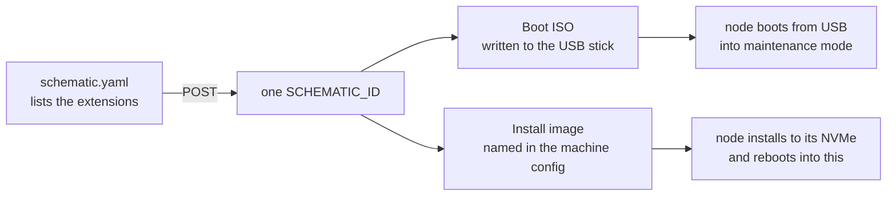
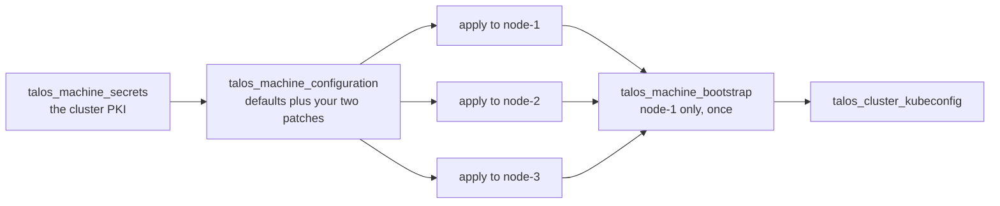

# 02 · Talos cluster (OpenTofu)

Talos is a Linux distro that runs Kubernetes and nothing else. It has no login of any kind:
no shell, no SSH, no package manager. The whole operating system is one read-only image,
and the only way to manage a node is its API, using the `talosctl` command from another
machine. Instead of logging in, you hand each node a machine config: one YAML file that
fully describes the node (network, disks, what to install). Because a node is nothing more
than its config, the whole cluster can be written down as code and rebuilt from that code.
This doc is that code. It ends with a kubeconfig, the credentials file that `kubectl` (the
standard Kubernetes command-line tool) uses to reach the cluster.

Before this: three boxes in maintenance mode (booted from USB, unconfigured, waiting for
instructions). After this: a working cluster.

The cluster is declared in OpenTofu, the open source fork of Terraform. If you have not
used either: you write files describing what should exist, run one command, and the tool
makes reality match, remembering what it built. It drives Talos through the
[`siderolabs/talos`](https://registry.terraform.io/providers/siderolabs/talos/latest)
provider, the plugin that teaches OpenTofu to speak the Talos API. This doc stops at
"cluster is up with a kubeconfig". Everything after that is
[03-platform-layer](03-platform-layer.md).

Source: [`iac/tofu/cluster/`](../iac/tofu/cluster/).

## 1. Image Factory schematic, before booting anything

Talos has no package manager, so extra drivers and tools cannot be added after the fact.
They are baked into the OS image itself as system extensions, and every build of the image
is made to order. Longhorn, the replicated storage layer installed in
[03](03-platform-layer.md), needs two of them, and they must be present in the Talos
**install image**, not only the ISO.

The build service is [factory.talos.dev](https://factory.talos.dev/), the hosted Talos
image builder known as Image Factory. You describe the build in a small YAML file called a
schematic, upload it, and get back a schematic ID that names your exact build:

```yaml
# schematic.yaml
customization:
  systemExtensions:
    officialExtensions:
      - siderolabs/iscsi-tools
      - siderolabs/util-linux-tools
```

Run the upload from the ops host (any machine with `curl` works). The reply is a line of
JSON whose `id` field is your schematic ID. Save it: it gets pasted twice below.

```bash
curl -s -X POST --data-binary @schematic.yaml https://factory.talos.dev/schematics
# => {"id":"<SCHEMATIC_ID>"}
```

That one ID names two different artifacts, and the difference matters:



- **Boot ISO** (write to USB and boot the machines from it): `https://factory.talos.dev/image/<SCHEMATIC_ID>/v1.13.7/metal-amd64.iso`
- **Install image** (what Talos copies onto the internal disk, referenced from the machine config): `factory.talos.dev/installer/<SCHEMATIC_ID>:v1.13.7`

> [!WARNING]
> **The extensions must be in the install image**, the right-hand box above. Putting them
> only in the ISO means they vanish the moment the node installs to disk and reboots, and
> Longhorn's pods then fail with `CreateContainerError` for reasons that point nowhere
> near the image.

## 2. Repo layout

```
iac/tofu/cluster/
├── versions.tf                 required_providers + provider block
├── variables.tf                cluster name, VIP, node IPs, install image, disk, NIC driver
├── main.tf                     secrets → machine config → apply ×3 → bootstrap → kubeconfig
├── terraform.tfvars.example    copy to terraform.tfvars; only install_image is required
└── patches/
    ├── common.yaml             install image/disk, NIC deviceSelector, Longhorn mount, registry mirrors
    └── controlplane.yaml       schedulable CPs, cni:none, proxy:disabled, VIP
```

> [!CAUTION]
> **State is a secret.** Terraform state is the local file where tofu records everything
> it built. Here it also holds the cluster PKI, the certificate-authority keys every node
> trusts, generated by `talos_machine_secrets`. Whoever has that file can control the
> cluster, so keep it `0600` on a backed-up host, or use an encrypted remote backend.
> Losing state does not lose the cluster, but it means re-importing before tofu can
> manage it again.

> [!TIP]
> If the client credential files (kubeconfig for `kubectl`, talosconfig for `talosctl`)
> ever go missing, which happens, for example after an unplanned reboot of the ops host,
> the cluster itself is unaffected. `tofu output -raw kubeconfig` and
> `tofu output -raw talosconfig` print fresh copies from state.

## 3. Machine config patches

The provider generates a complete machine config from Talos defaults, and these two files
are patches layered on top: only the settings this cluster changes. The `${...}`
placeholders are filled in from your `terraform.tfvars`.

`patches/common.yaml` is applied to every node. It sets where Talos installs itself,
switches the network from DHCP to a static setup, and adds the mount Longhorn needs:

```yaml
machine:
  install:
    image: ${install_image}
    disk: ${install_disk}
  network:
    interfaces:
      - deviceSelector:
          driver: ${nic_driver}
        dhcp: false
        # per-node addresses are strategic-merged in by the apply resource
        routes:
          - network: 0.0.0.0/0
            gateway: ${gateway}
  kubelet:
    extraMounts:
      - destination: /var/mnt/longhorn
        type: bind
        source: /var/mnt/longhorn
        options: [bind, rshared, rw]
```

The `deviceSelector` picks the network card by its driver name rather than an interface
name like `eth0`, which varies with firmware. You confirmed the driver while the nodes sat
in maintenance mode.

> [!WARNING]
> Talos v1.10 and later use `/var/mnt/longhorn`, not the older `/var/lib/longhorn`. Keep
> this mount and Longhorn's `defaultDataPath` in sync, or Longhorn silently writes into
> the ephemeral overlay (scratch space, not the disk) and your data is not where you think
> it is.

In Kubernetes, control-plane nodes are the ones that run the cluster's own machinery: the
API server, and etcd, the database that holds all cluster state. Larger clusters keep them
separate from the workers. With three machines total, all three are control planes and all
three also run normal workloads, so `controlplane.yaml` lands on every node too.

`patches/controlplane.yaml`:

```yaml
cluster:
  allowSchedulingOnControlPlanes: true   # 3-node HA that also runs workloads
  network:
    cni:
      name: none                          # Cilium provides CNI
  proxy:
    disabled: true                        # Cilium replaces kube-proxy
machine:
  network:
    interfaces:
      - deviceSelector:
          driver: ${nic_driver}
        vip:
          ip: ${vip_ip}
```

Two of those lines switch off Kubernetes defaults. `cni: none` tells Talos not to install
a CNI, the plugin that gives pods their network. `proxy: disabled` turns off kube-proxy,
the stock component that routes traffic to services. Cilium, installed first thing in
[03](03-platform-layer.md), takes over both jobs.

The `vip` is one shared virtual IP for the Kubernetes API: whichever control plane holds it
answers, and it moves if that node goes down. Everything from here on talks to the VIP, not
to any single node.

> [!WARNING]
> **Schema gotcha.** On Talos v1.13 the key is `cluster.proxy.disabled`. Older docs and
> examples show `cluster.network.proxy.disabled`, which v1.13 silently ignores. The result
> is kube-proxy running alongside Cilium's replacement, and a confusing network.

> [!IMPORTANT]
> Bootstrap is the one-time command that tells exactly one node to start etcd and form the
> cluster. Both `cni: none` and `proxy: disabled` must be set **before** that moment.
> Changing them afterwards is a rebuild.

## 4. The resources

This is the heart of `main.tf`, trimmed to what matters. Read top to bottom, it does what
the repo tree promised: generate cluster secrets, render the machine config, apply it to
all three nodes, then bootstrap one of them.



The three arrows into `bootstrap` are the `depends_on` below, drawn out. Bootstrap must
not start until every node already has its config.

```hcl
resource "talos_machine_secrets" "this" {}

data "talos_machine_configuration" "cp" {
  cluster_name     = var.cluster_name
  cluster_endpoint = var.cluster_endpoint     # https://192.168.1.110:6443, the VIP
  machine_type     = "controlplane"
  machine_secrets  = talos_machine_secrets.this.machine_secrets
  config_patches   = [
    templatefile("${path.module}/patches/common.yaml",       { ... }),
    templatefile("${path.module}/patches/controlplane.yaml", { ... }),
  ]
}

resource "talos_machine_configuration_apply" "cp" {
  for_each                    = toset(var.node_ips)
  client_configuration        = talos_machine_secrets.this.client_configuration
  machine_configuration_input = data.talos_machine_configuration.cp.machine_configuration
  node                        = each.value
  endpoint                    = each.value

  # per-node static address, merged onto the interface from common.yaml
  config_patches = [yamlencode({
    machine = { network = { interfaces = [{
      deviceSelector = { driver = var.nic_driver }
      addresses      = ["${each.value}/24"]
    }] } }
  })]
}

resource "talos_machine_bootstrap" "this" {
  depends_on           = [talos_machine_configuration_apply.cp]   # keep this
  node                 = var.node_ips[0]                          # exactly ONE node
  endpoint             = var.node_ips[0]
  client_configuration = talos_machine_secrets.this.client_configuration
}
```

Two things not to change:

- **`depends_on` on the bootstrap.** The provider has a
  [known race](https://github.com/siderolabs/terraform-provider-talos/issues/265): without
  this line, bootstrap can fire before the node configs have been applied.
- **Bootstrap runs on exactly one node.** etcd forms from there and the others join it.

One provider quirk to know: `talos_cluster_kubeconfig` is a **resource**, not a data
source. It was deprecated as a data source in provider 0.7, so older examples showing
`data` are out of date.

## 5. Apply and verify

Everything here runs on the ops host, from your copy of this repo. `terraform.tfvars` is
your answers file: only `install_image` is required, so paste the installer reference from
step 1 into it. Every other setting has a working default, with commented lines ready to
uncomment if your NIC driver, disk, or LAN differ from what maintenance mode showed you.

`tofu init` downloads the provider. `tofu apply` prints a plan of what it will create (the
machine secrets, a config apply per node, the bootstrap, the kubeconfig) and asks for a
`yes`, then does the work: it pushes a machine config to each node, waits while they
install to disk and reboot, and bootstraps etcd on the first one. This is the long step:
most of it is the nodes installing and rebooting.

```bash
cd iac/tofu/cluster
cp terraform.tfvars.example terraform.tfvars   # paste your install_image
tofu init
tofu apply

tofu output -raw kubeconfig  > /opt/lab/kube/config   && chmod 600 /opt/lab/kube/config
tofu output -raw talosconfig > /opt/lab/talos/config  && chmod 600 /opt/lab/talos/config
export KUBECONFIG=/opt/lab/kube/config TALOSCONFIG=/opt/lab/talos/config

talosctl -e 192.168.1.110 -n 192.168.1.101 health \
  --control-plane-nodes 192.168.1.101,192.168.1.102,192.168.1.103
```

The two `tofu output` lines write the credential files: the kubeconfig for `kubectl`, the
talosconfig for `talosctl`. `chmod 600` keeps them readable by you alone, and the `export`
line points both tools at them.

The `talosctl health` line asks the cluster to check itself, connecting through the VIP
(`-e`) and querying one node (`-n`).

> **✅ Verify:** the command runs through its checks and exits cleanly, with etcd healthy
> on all three nodes.

That check spoke to the Talos API on the nodes, the operating-system view. `kubectl` speaks
to the Kubernetes API the cluster now serves, the workload view:

```bash
kubectl get nodes
# expect all three nodes, STATUS NotReady
```

Nodes sit **`NotReady`** until a CNI is running, and we told Talos not to install one.
That is expected.

> [!CAUTION]
> It is also a **timer**. Talos reboots nodes that have had no CNI for about ten minutes.
> Go straight to Cilium, the first install in [03-platform-layer](03-platform-layer.md).

## 6. Registry mirrors (optional, but note how they work)

Skip this unless you plan to run your own image registry inside the cluster. The mechanism
is worth a skim anyway, because the failure is baffling the first time you hit it.

The trap: pods do not pull their own images. **containerd**, the container runtime on each
host, does the pulling, and it runs in the host's own network, not the pod network. There
it resolves names through Talos `hostDNS` on `127.0.0.53`, not through CoreDNS (the DNS
server that answers for names inside the cluster). So a cluster-internal name like
`myregistry.registry.svc.cluster.local:5000/...` can never resolve, and on top of that
containerd defaults to HTTPS while the registry speaks only HTTP.

A mirror entry in `common.yaml` solves both. It tells containerd that images whose
reference starts with this name come from this address instead. Talos matches the key
**literally** against the image reference and never resolves it as a name, and the
endpoint states `http://` outright:

```yaml
machine:
  registries:
    mirrors:
      "zot.registry.svc.cluster.local:5000":
        endpoints:
          - http://192.168.1.202:5000     # a node-routable LoadBalancer IP
```

Apply it with `talosctl patch machineconfig`, which edits the machine config on a live
node. No reboot required.

## Gotchas checklist

- [ ] Extensions in the **install image**, not just the ISO.
- [ ] `cni: none` + `proxy: disabled` set before bootstrap, with the v1.13 key spelling.
- [ ] `deviceSelector` matches the real NIC driver, confirmed in maintenance mode.
- [ ] Bootstrap targets exactly one node, with `depends_on`.
- [ ] Terraform state treated as a secret and backed up.
- [ ] Cilium installed within ten minutes of the apply.
