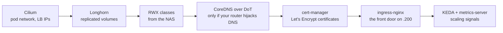

# 03 · Platform layer

Turns a bare Talos cluster into something workloads can land on. Install in this order,
because each layer assumes the previous one is healthy. Values files live in
[`iac/platform/`](../iac/platform/).

Coming from Docker, this layer covers what the daemon and a reverse proxy container gave
you between them: pod networking, persistent volumes, TLS, a front door, autoscaling
signals. Kubernetes ships with none of it and makes you pick each piece. Nearly
everything installs with Helm (the Kubernetes package manager: a chart is the package, a
values file is its config).

Every command on this page runs on the ops host, the Raspberry Pi where
[02-talos-cluster](02-talos-cluster.md) left `KUBECONFIG` pointing at the cluster.

Before this: three NotReady nodes running nothing. After this: storage, ingress and TLS on tap.



## Cilium

Kubernetes does not ship a pod network. It expects a plugin, called a CNI, to wire pods
together across nodes, and until one runs every node reports NotReady. Cilium is that
plugin here, and it also takes over the two jobs kube-proxy and MetalLB would otherwise
do: routing Service traffic between pods, and answering for LoadBalancer IPs on the LAN
(MetalLB is the add-on most bare-metal clusters install for that). It ships Hubble too,
a UI for watching the traffic between pods. The machine config already set `cni: none`
and `proxy: disabled`, so the cluster is waiting for exactly this install.

The chart's stock defaults do not work on Talos. These lines in
[`iac/platform/cilium-values.yaml`](../iac/platform/cilium-values.yaml) are the ones
that matter:

```yaml
ipam:
  mode: kubernetes
kubeProxyReplacement: true
k8sServiceHost: localhost      # Talos KubePrism...
k8sServicePort: 7445           # ...so Cilium reaches the API without kube-proxy
cgroup:
  autoMount:
    enabled: false             # Talos already mounts cgroup v2
  hostRoot: /sys/fs/cgroup
securityContext:
  capabilities:
    ciliumAgent: [CHOWN,KILL,NET_ADMIN,NET_RAW,IPC_LOCK,SYS_ADMIN,SYS_RESOURCE,DAC_OVERRIDE,FOWNER,SETGID,SETUID]
    cleanCiliumState: [NET_ADMIN,SYS_ADMIN,SYS_RESOURCE]
l2announcements:
  enabled: true                # advertise LoadBalancer IPs on the LAN over ARP
hubble:
  relay: { enabled: true }
  ui:    { enabled: true }
```

The first command installs the chart with those values, the second waits until every
Cilium pod reports healthy, and the third confirms the pod network is up:

```bash
helm install cilium cilium/cilium -n kube-system --version 1.17.6 -f iac/platform/cilium-values.yaml
cilium status --wait
kubectl get nodes            # all three flip to Ready
```

> **✅ Verify:** `cilium status` reports OK across the board and all three nodes show
> Ready. They had been NotReady since bootstrap, and this is the moment that changes.

Next, tell Cilium which LAN addresses it may hand to LoadBalancer Services. Pick a
range the router's DHCP pool will never touch. Both objects live in
[`iac/platform/cilium-lb-pool.yaml`](../iac/platform/cilium-lb-pool.yaml):

```yaml
apiVersion: cilium.io/v2alpha1
kind: CiliumLoadBalancerIPPool
metadata: { name: lan-pool }
spec:
  blocks: [{ start: "192.168.1.200", stop: "192.168.1.230" }]
---
apiVersion: cilium.io/v2alpha1
kind: CiliumL2AnnouncementPolicy
metadata: { name: lan-l2 }
spec:
  interfaces: ["^eno.*"]       # match YOUR NIC name, not the copy-pasted ^enp.*
  externalIPs: true
  loadBalancerIPs: true
```

> [!TIP]
> If a Service later shows `<pending>` in the EXTERNAL-IP column of `kubectl get svc`, it
> is almost always one of three things: the pool was never applied, the pool overlaps the
> router's DHCP range, or the interface regex does not match your NIC name.

## Longhorn

Longhorn is the cluster's storage. It takes part of each node's disk and turns it into
replicated block storage: every volume is copied to all three nodes as it is written,
so a pod can land on any node and find its data there, and losing one node loses no
data. This is the piece a Docker host's named volumes never gave you.

It needs two things. The `iscsi-tools` and `util-linux-tools` Talos extensions are
already in the image, so nothing to do there.

> [!IMPORTANT]
> The namespace must be labelled **privileged** before installing, because Kubernetes' pod
> security defaults block the host-level disk access Longhorn needs. Without the labels,
> Longhorn's system pods never start.

```bash
kubectl create namespace longhorn-system
kubectl label namespace longhorn-system \
  pod-security.kubernetes.io/enforce=privileged \
  pod-security.kubernetes.io/audit=privileged \
  pod-security.kubernetes.io/warn=privileged
```

Then install the chart with
[`iac/platform/longhorn-values.yaml`](../iac/platform/longhorn-values.yaml), which pins
the two values that matter here:

```yaml
defaultSettings:
  defaultDataPath: /var/mnt/longhorn      # must match the kubelet extraMount
  defaultReplicaCount: 3                  # one per node, survives a node loss
persistence:
  defaultClass: true
  defaultClassReplicaCount: 3
```

With three nodes and replica count 3, every volume tolerates one node down. Each node's
disk is roughly 256 GB and shared with the OS, so thin-provision (a volume takes real
disk space only as data is written, not when it is created) and do not over-request.

### Backup target

Replication protects against a dead node, not a dead cluster, so point Longhorn's
backups at the NAS. On appliances that publish no NFSv4 namespace, use CIFS (the same
protocol Windows file shares speak):

```yaml
defaultBackupStore:
  backupTarget: cifs://192.168.1.239/homelab_backup/longhorn
  backupTargetCredentialSecret: longhorn-cifs
```

Three things that cost real time:

- **`defaultSettings.backupTarget` is a silent no-op** in Longhorn 1.9 and later. The
  setting was removed in favour of the `BackupTarget` CR (a custom resource, Longhorn's
  own object type in the Kubernetes API), and `defaultBackupStore` is the key that
  populates it.
- **Clearing a target needs a manual patch.** Removing the Helm value leaves the CR
  populated:
  `kubectl -n longhorn-system patch backuptarget default --type merge -p '{"spec":{"backupTargetURL":""}}'`
- **Give the backup its own prefix.** If the same share also receives an `rsync --delete`
  mirror from another host, a target pointed inside that tree gets wiped nightly.

Talos needs no extension for CIFS: `cifs` and `smb3` are compiled into its kernel.

A RecurringJob is Longhorn's own scheduler for chores. This one backs up every volume
at 02:00 each night, keeps the newest fourteen backups, and works on at most two
volumes at a time:

```yaml
apiVersion: longhorn.io/v1beta2
kind: RecurringJob
metadata: { name: nightly-backup, namespace: longhorn-system }
spec:
  cron: "0 2 * * *"
  task: backup
  retain: 14
  concurrency: 2
  groups: [default]
```

Backups are block-level incremental, so fourteen nightlies are far less than fourteen
times the volume size.

> [!IMPORTANT]
> Verify a restore quarterly. A backup nobody has restored is a rumour.

## RWX volumes

Every Kubernetes volume declares an access mode. Longhorn volumes are RWO,
`ReadWriteOnce`: one node at a time mounts the volume read-write, which suits a
database. Queue-mode n8n also needs RWX, `ReadWriteMany`: one volume that pods on
several nodes mount read-write at the same time, because the main, worker and webhook
pods do not otherwise share a filesystem. The NAS supplies RWX through two CSI drivers
(storage plugins that teach the cluster to mount a new kind of volume). Each driver
installs a StorageClass, a named catalogue entry for one kind of storage that volume
claims then request by name:

- `csi-driver-smb` → StorageClass `smb-unas`, `reclaimPolicy: Delete`. **Prefer this.**
- `csi-driver-nfs` → StorageClass `nfs-unas`, `reclaimPolicy: Retain` (see the reclaim
  caveat in [01-hardware-and-network](01-hardware-and-network.md#nas)).

```yaml
# smb-unas
parameters:
  source: //192.168.1.239/k8s_storage
mountOptions: [dir_mode=0770, file_mode=0770, uid=1000, gid=1000, noperm]
```

SMB carries no uid/gid of its own. The server decides identity at login and the mount
options decide ownership. `uid=1000` is what makes files land as n8n's `node` user.

> **✅ Verify:** prove a class works before building on it. Run two pods forced onto
> different nodes (that is what anti-affinity does), have one write a file, and check the
> other reads it back.

## CoreDNS over DoT

CoreDNS is the cluster's own DNS server. Every pod sends its name lookups there, and
CoreDNS forwards anything it cannot answer itself to a public resolver. Some routers
intercept that outbound DNS (plain UDP on port 53) and substitute their own answers,
which later breaks cert-manager's self-check. If your router leaves port 53 alone, skip
this section.

DoT, DNS over TLS, wraps the upstream lookups in an encrypted session the router cannot
rewrite. Patch the Corefile (CoreDNS's config) of the `kube-system/coredns` deployment
so the forward block reads:

```
forward . tls://1.1.1.1 tls://1.0.0.1 tls://8.8.8.8 {
    tls_servername cloudflare-dns.com
    health_check 5s
    max_concurrent 1000
}
```

Then restart CoreDNS so it picks up the new Corefile:

```bash
kubectl -n kube-system rollout restart deploy/coredns
```

> [!TIP]
> This also fixes public DNS for every other workload in the cluster, and it has no
> downside even once the router is fixed. Worth keeping as the known-good path.

## cert-manager

cert-manager fetches and renews Let's Encrypt certificates from inside the cluster and
stores them as Kubernetes objects, the job Caddy or Traefik handled by itself on the
Docker box. ACME is the protocol Let's Encrypt speaks, which is why cert-manager is
called an ACME client.

The first command installs the chart and points cert-manager's own DNS lookups at
in-cluster CoreDNS. The second stores your Cloudflare API token as a Secret for the
issuer below to use, with `<TOKEN>` replaced by the real token:

```bash
helm upgrade --install cert-manager jetstack/cert-manager -n cert-manager --create-namespace \
  --version v1.16.5 --set crds.enabled=true \
  --set 'extraArgs={--dns01-recursive-nameservers=10.96.0.10:53,--dns01-recursive-nameservers-only}'

kubectl -n cert-manager create secret generic cloudflare-api-token \
  --from-literal=api-token=<TOKEN>
```

Why the extra flags: before asking Let's Encrypt to verify a DNS record, cert-manager
first checks the record is visible, and behind a DNS-intercepting router that
self-check never passes. `--dns01-recursive-nameservers-only` pointed at in-cluster
CoreDNS (`10.96.0.10:53`, which forwards over DoT) routes the self-check around the
router. A cert that stalls for five minutes on propagation-check and then issues in
ninety seconds once this is set is the tell.

A ClusterIssuer is the cluster-wide recipe cert-manager follows to get a certificate:
which CA to ask, which account key to use, and how to prove the domain is yours. This
one proves it with DNS-01, the ACME challenge answered by writing a DNS TXT record
through the Cloudflare API. That works for internal and external names alike, since
nothing has to be reachable from the internet. The full file is
[`iac/platform/clusterissuers.yaml`](../iac/platform/clusterissuers.yaml):

```yaml
apiVersion: cert-manager.io/v1
kind: ClusterIssuer
metadata: { name: letsencrypt-prod }
spec:
  acme:
    email: you@example.com
    server: https://acme-v02.api.letsencrypt.org/directory
    privateKeySecretRef: { name: letsencrypt-prod-account-key }
    solvers:
      - dns01:
          cloudflare:
            apiTokenSecretRef: { name: cloudflare-api-token, key: api-token }
        selector: { dnsZones: [example.com] }
```

> [!TIP]
> While testing, use the `letsencrypt-staging` twin with the ACME staging URL (the file
> ships both issuers), because the production rate limits are low and unforgiving.

> [!NOTE]
> **Cloudflare API token scopes:** `Zone:DNS:Edit` plus `Zone:Zone:Read` on the zone. For
> the tunnel, additionally `Account:Cloudflare Tunnel:Edit`.

## ingress-nginx

ingress-nginx is the cluster's shared reverse proxy, the piece a Docker setup ran as an
nginx or Traefik container in front of everything. The difference is that nobody edits
an nginx.conf here. You create Ingress resources (per-hostname routing rules stored in
the cluster) and the controller rewrites its own config from them.

Install it as a `Service type=LoadBalancer`, and Cilium hands it `192.168.1.200`, the
first address in the pool. That one IP becomes the front door for every app this
cluster serves. The values are
[`iac/platform/ingress-nginx-values.yaml`](../iac/platform/ingress-nginx-values.yaml):

```yaml
controller:
  service: { type: LoadBalancer }
  ingressClassResource: { default: true }
  watchIngressWithoutClass: true
  config:
    use-forwarded-headers: "true"        # trust cloudflared's X-Forwarded-Proto
    compute-full-forwarded-for: "true"
```

> [!IMPORTANT]
> **Both flags are required behind Cloudflare.** Without them, a request arriving through
> the tunnel reaches nginx as HTTP, gets a 308 to HTTPS, comes back through Cloudflare as
> HTTPS again, and loops forever.

They are also what makes IP allowlists work at all: with them, nginx evaluates the real
client address from `X-Forwarded-For` instead of cloudflared's pod IP. Without them every
request appears to come from the tunnel and an allowlist admits everyone or nobody.

## KEDA

KEDA adds and removes pods based on numbers from outside the cluster. The stock HPA
(Horizontal Pod Autoscaler, Kubernetes' built-in scaler) only watches CPU and memory.
KEDA feeds it external metrics like Redis queue length, which is what n8n needs later:
when the workflow queue grows, worker pods get added, and when it drains, they go away.

```bash
helm install keda kedacore/keda -n keda --create-namespace
```

Nothing Talos-specific here, the chart installs with its defaults.

## metrics-server

metrics-server collects live CPU and memory readings from every node and serves them to
`kubectl top` and to CPU-based autoscaling. Talos kubelets (the kubelet is the per-node
agent that runs pods) present self-signed certificates, so the install has to be told
to accept them:

```bash
helm install metrics-server metrics-server/metrics-server -n kube-system \
  --set 'args={--kubelet-insecure-tls,--kubelet-preferred-address-types=InternalIP\,ExternalIP\,Hostname}'
```

Without it every CPU-based HPA reads `<unknown>/70%` forever.

## Verify

One pass over the whole layer before building on it. The comment on each line is what a
healthy cluster shows. If a line disagrees, go back to that component's section before
moving on:

```bash
kubectl get pods -A | grep -vE 'Running|Completed'   # header only, anything else is a problem
kubectl get storageclass                             # longhorn (default), smb-unas, nfs-unas
kubectl get clusterissuer                            # letsencrypt-prod shows READY True
kubectl top nodes                                    # real numbers, not a Metrics API error
```

> **✅ Verify:** all four lines agree with their comments. That is the platform done.

## Resource budget

Rough steady-state overhead before workloads, on 32 GB/node:

- Cilium + Hubble: ~0.5–1 GB per node
- Longhorn: ~1–1.5 GB per node (instance manager + replicas)
- ingress-nginx / cert-manager / KEDA: under 0.5 GB total

The rest is yours. On 96 GB total there is no need to trim the platform to fit a
queue-mode n8n plus Postgres, Redis and object storage.
