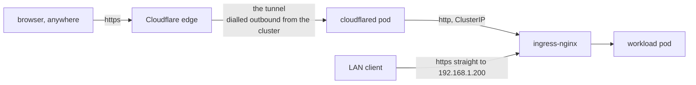

# 04 · Cloudflare: tunnel, DNS, certificates

This is the layer that makes the cluster reachable from the internet. In the Docker world
this job goes to a router port forward or a VPN, and both mean something at home is
listening for the whole internet to find. This setup inverts that.

Before this: every service is LAN-only. After this: every service has a public hostname
that works from anywhere, with zero ports opened on the router.

External access with **no inbound port open** anywhere. A Cloudflare Tunnel is an
outbound connection: a small program inside the cluster, `cloudflared` (Cloudflare's
tunnel client), dials out to Cloudflare and keeps the line open. Visitors reach
Cloudflare, and Cloudflare hands the traffic down that line. Your router never has a
port open.

Concretely: a request to `<host>.example.com` hits Cloudflare's edge (their servers
nearest the visitor), rides the tunnel back to a cloudflared pod, hops to
`ingress-nginx-controller` (the cluster's shared reverse proxy) over a ClusterIP, and
reaches the workload. A ClusterIP is a virtual IP that exists only inside the cluster
network, so nothing outside the cluster can reach that last hop directly.



Encryption end to end in the sense that matters: the visitor's HTTPS ends at Cloudflare's
edge with Cloudflare's own certificate, the tunnel leg is encrypted by cloudflared, and
the last hop travels as plain HTTP on the pod network inside the cluster.

Note the bottom arrow. A LAN client can skip Cloudflare entirely and hit ingress-nginx
directly, which is why the cluster issues its own certificates as well.

## Two tunnels, deliberately

| Tunnel | Runs where | Serves |
| --- | --- | --- |
| `cluster` | Deployment inside the cluster | `*.example.com` → ingress-nginx |
| `pi-ops` | Container on the Raspberry Pi | `git.example.com` → Forgejo |

Forgejo is the self-hosted git service that runs on the Pi
([06-ops-host](06-ops-host.md#forgejo)).

> [!NOTE]
> If the cluster is broken, so is the cluster's cloudflared, and so is every hostname it
> serves. The Pi's tunnel is a separate process on a separate host with its own DNS route,
> so **git stays reachable when the cluster is down**, which is exactly when you need the
> source of truth to rebuild from.

## Creating a tunnel (remotely-managed)

A tunnel can be configured two ways. The classic way keeps a `config.yml` file next to
cloudflared. This build uses the remotely-managed way instead: the routing rules live in
your Cloudflare account, so every route change is one API call and nothing in the cluster
needs editing or restarting.

> [!IMPORTANT]
> Two different credentials are about to appear, and mixing them up is the classic
> mistake. The **API token** (`$CF_TOKEN` below) can create tunnels and change routes. The
> **connector token** is much weaker: it lets a cloudflared process connect and serve an
> existing tunnel, but not reconfigure it. The pods get the weaker one on purpose.

Run the three calls below on the ops host. They need `curl`, your Cloudflare account ID
in `$ACCT_ID`, and an API token in `$CF_TOKEN` with the permission named in the comment.
Step 1 creates the tunnel (the `head -c32 /dev/urandom | base64` piece generates a random
tunnel secret) and replies with the new tunnel's UUID. Save it, the next steps use it as
`$TUNNEL_ID`. Step 2 fetches the connector token, the value the pods will hold. Step 3
pushes the routing rules: `*.example.com` is a wildcard, it matches any single name in
front of your domain, so every service lands on ingress-nginx through one rule, and the
second rule answers anything else with a 404.

```bash
# 1. create the tunnel  (token needs Account:Cloudflare Tunnel:Edit)
curl -X POST -H "Authorization: Bearer $CF_TOKEN" \
  https://api.cloudflare.com/client/v4/accounts/$ACCT_ID/cfd_tunnel \
  -d "{\"name\":\"cluster\",\"tunnel_secret\":\"$(head -c32 /dev/urandom | base64)\",\"config_src\":\"cloudflare\"}"
# → returns the tunnel UUID

# 2. fetch the CONNECTOR token. This is what the pod uses, NOT the API token
curl -H "Authorization: Bearer $CF_TOKEN" \
  https://api.cloudflare.com/client/v4/accounts/$ACCT_ID/cfd_tunnel/$TUNNEL_ID/token

# 3. push the ingress rules
curl -X PUT -H "Authorization: Bearer $CF_TOKEN" -H "Content-Type: application/json" \
  https://api.cloudflare.com/client/v4/accounts/$ACCT_ID/cfd_tunnel/$TUNNEL_ID/configurations \
  -d '{"config":{"ingress":[
    {"hostname":"*.example.com","service":"http://ingress-nginx-controller.ingress-nginx.svc.cluster.local:80"},
    {"service":"http_status:404"}
  ]}}'
```

Inside the cluster, cloudflared runs as a Deployment, the Kubernetes object that keeps a
set of identical pods running and replaces any that die. As of the pinned image
(cloudflared 2025.1.1) each replica opens four connections to Cloudflare, so two replicas
give eight paths to the edge, and losing a pod or a node drops half the connections and
none of the requests. The manifest below is the core of it. The full file, with the
namespace, scheduling, and resource extras, is
[`iac/platform/cloudflared.yaml`](../iac/platform/cloudflared.yaml). Apply it with
`kubectl apply -f` after storing the connector token in the Secret it references,
`cloudflared-tunnel-token` (both commands are in Stage I of
[BOOTSTRAP.md](../BOOTSTRAP.md)):

```yaml
apiVersion: apps/v1
kind: Deployment
metadata: { name: cloudflared, namespace: cloudflared }
spec:
  replicas: 2
  selector: { matchLabels: { app: cloudflared } }
  template:
    metadata: { labels: { app: cloudflared } }
    spec:
      containers:
        - name: cloudflared
          image: cloudflare/cloudflared:2025.1.1
          args: [tunnel, --no-autoupdate, --metrics, "0.0.0.0:2000", run]
          env:
            - name: TUNNEL_TOKEN
              valueFrom: { secretKeyRef: { name: cloudflared-tunnel-token, key: token } }
          livenessProbe:
            httpGet: { path: /ready, port: 2000 }
            initialDelaySeconds: 10
            periodSeconds: 30
```

Now confirm Cloudflare sees the pods. Run this wherever `$CF_TOKEN` is set. It asks the
API for the tunnel's state:

```bash
curl -sS -H "Authorization: Bearer $CF_TOKEN" \
  https://api.cloudflare.com/client/v4/accounts/$ACCT_ID/cfd_tunnel/$TUNNEL_ID \
  | grep -o '"status":"[^"]*"'          # want "status":"healthy"
```

> **✅ Verify:** the reply is `"status":"healthy"`, and the full response lists four
> connections per pod.

## The wildcard is on the tunnel, not on DNS

> [!IMPORTANT]
> This is the single most confusing part of the setup, so state it plainly:
>
> - **Tunnel routing has a wildcard.** `*.example.com` goes to ingress-nginx. Adding a
>   service needs **no tunnel config change**.
> - **DNS has no wildcard.** Every hostname needs its own DNS record, or browsers never
>   find Cloudflare in the first place and traffic never reaches the tunnel at all.

The record each hostname needs is a **proxied CNAME**. A CNAME is a DNS alias, a record
that says "this name points at that name", and here it points at
`<TUNNEL_UUID>.cfargotunnel.com`, the address Cloudflare assigns your tunnel. Proxied is
the orange-cloud toggle in the Cloudflare dashboard: with it on, Cloudflare answers DNS
with its own IPs and relays the traffic itself, which is what lets it feed your tunnel.
An unproxied record takes Cloudflare out of the traffic path, and the tunnel with it.

A wildcard DNS record can exist, but *proxying* one is an Enterprise feature, and an
unproxied wildcard defeats the point. So on a normal plan it is one CNAME per hostname.

Check the no-wildcard state with `dig`, the DNS lookup tool, from any machine that has
it. Run `dig +short random-xyz.example.com @1.1.1.1`, which asks Cloudflare's public
resolver (`1.1.1.1`) for a name you never created. It should print nothing: the
underlying answer is NXDOMAIN, the DNS reply for a name that does not exist.

### Adding a hostname

DNS records are not managed as code in this build. Adding a name is a one-shot API call,
wrapped for convenience in [`scripts/cf-dns-record.sh`](../scripts/cf-dns-record.sh).
Spelled out, it looks like this. Run it on the ops host with `kubectl` pointed at the
cluster: the first command borrows the Cloudflare token cert-manager already holds in a
Secret, so no second copy needs to live on disk. Fill in `<ZONE_ID>` (the ID Cloudflare
assigns your domain) and `<TUNNEL_UUID>` (from creating the tunnel), and set `HOST` to
the bare subdomain. The `curl` then creates the proxied CNAME:

```bash
TOKEN=$(kubectl -n cert-manager get secret cloudflare-api-token \
        -o jsonpath='{.data.api-token}' | base64 -d)
ZONE=<ZONE_ID>
TUNNEL=<TUNNEL_UUID>
HOST=myservice                      # bare subdomain, no trailing dot

curl -sS -X POST -H "Authorization: Bearer $TOKEN" -H "Content-Type: application/json" \
  https://api.cloudflare.com/client/v4/zones/$ZONE/dns_records \
  -d "{\"type\":\"CNAME\",\"name\":\"$HOST\",\"content\":\"$TUNNEL.cfargotunnel.com\",\"proxied\":true}"

dig +short $HOST.example.com @1.1.1.1     # must return Cloudflare anycast IPs
```

> **✅ Verify:** the `curl` replies with `success: true`, and the `dig` at the end is the
> check that actually counts. It must print IP addresses, and they will be Cloudflare
> anycast IPs (Cloudflare's own shared addresses, announced from all of its locations at
> once), not your home IP, because the record is proxied.

Then create a normal `Ingress` in-cluster with the annotation
`cert-manager.io/cluster-issuer: letsencrypt-prod`. An Ingress is the routing rule
ingress-nginx reads, "this hostname goes to that service". The annotation asks
cert-manager for a certificate from `letsencrypt-prod`, one of the two ClusterIssuers
created in Stage G of [BOOTSTRAP.md](../BOOTSTRAP.md). A ClusterIssuer is cert-manager's
cluster-wide recipe for fetching certificates, and this one proves domain ownership with
DNS-01: cert-manager writes a short-lived TXT record (a DNS entry that carries arbitrary
text) under your domain through the Cloudflare token, Let's Encrypt sees it, and the
certificate is issued with nothing in the cluster reachable from the internet.

> [!WARNING]
> **Always verify with `dig`.** Cloudflare's API returns `success: true` for records it
> then silently refuses to publish (see below), and the failure is invisible otherwise. If
> `dig` prints nothing, you have hit that problem: pick a different name.

### Why issue an internal Let's Encrypt cert if Cloudflare terminates?

So the same `Ingress` works whether it is reached through the tunnel or directly at
`192.168.1.200`, the LoadBalancer IP ingress-nginx answers on inside the LAN. One
certificate, both paths, no split configuration.

## Cloudflare gotchas

> [!WARNING]
> **Some hostnames are silently refused.** The API returns `success: true`, the record
> never appears on the nameservers that actually answer for your domain, and nothing
> anywhere says why.

Observed with names that read as an official property of a product: `argocd.<domain>` and
`n8n-community.<domain>` were both blocked, while `gitops`, `argo2`, `n8n-comm`, `n8n-oss`
and `community-n8n` all published instantly against the same tunnel.

It is not propagation delay: a control record created five minutes *later* resolved while
the blocked one still did not. Do not fight it. Probe a couple of alternatives, move on,
and remember this for any hostname that pairs a product name with an official-sounding
word.

> [!WARNING]
> **Universal SSL covers one label only.** Universal SSL is the free edge certificate
> every Cloudflare domain gets, and it covers `*.example.com`, where the `*` stands for
> exactly one label (one dot-separated piece of a name). `hooks.service.example.com` sits
> two labels deep, so it is not covered: visitors get a TLS error at the edge unless you
> buy Advanced Certificate Manager (a paid add-on). Keep every hostname single-level,
> `name.example.com` and never `name.sub.example.com`.

> [!CAUTION]
> **A failed record is worse than no record**, because the Ingress and certificate both
> look healthy. `dig` is the only honest check.
