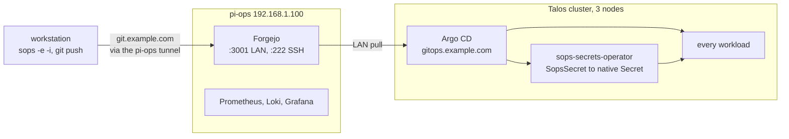

# 05 · GitOps: Forgejo + Argo CD + SOPS

GitOps means a git repo holds a description of everything that should run in the cluster,
and a program makes the cluster match it. Here that program is Argo CD. It runs in the
cluster and watches the repo: whatever the repo says should exist, Argo creates, and
whatever drifts from the repo, Argo puts back. That compare-and-fix loop is called
reconciling, and it never stops. You stop running `kubectl apply`. Git becomes the only
way anything changes.

Before this: the cluster was whatever I last typed. After this: it is whatever git says.

Every cluster workload is reconciled from git. The git server is Forgejo, a self-hosted
git service that looks and works like a private GitHub (set up in
[06](06-ops-host.md)). It deliberately runs **off** the cluster, on the Pi, behind its
own Cloudflare tunnel ([04](04-cloudflare.md)), so the source of truth does not depend
on the thing it exists to rebuild.



> [!NOTE]
> **The isolation is the point.** If the cluster is completely gone, `git.example.com`
> still serves the source of truth. Rebuild the cluster, run one bootstrap script, and
> Argo pulls everything back.

## Repo layout

One repo, `homelab-gitops`, drives the whole cluster. The notes on the right say what
each piece is for:

```
homelab-gitops/
├── .sops.yaml               age recipient + creation rules (public key only)
├── bootstrap/               root Application + one Application per app
│   ├── root-app.yaml           watches bootstrap/ recursively; self-registers everything
│   ├── infra-cert-manager.yaml
│   └── …
├── infra/                   Helm values + raw manifests for cluster plumbing
│   ├── cert-manager/values.yaml
│   ├── longhorn/values.yaml
│   └── …
├── apps/                    workload Applications
├── secrets/                 standalone SopsSecrets
└── scripts/bootstrap.sh     idempotent cold-start recovery
```

## The Application pattern

An Application is Argo's unit of deployment: one small YAML file naming what to deploy
and where. Every workload gets one, committed under `bootstrap/`, and Argo handles the
rest.

The "what" is usually a Helm chart, Kubernetes' package format. The vendor publishes
templated manifests, and you supply a values file, a plain YAML of settings that fills in
the blanks. If you know Docker, the shape is familiar: the vendor's compose file plus
your `.env`, except the vendor's half stays theirs.

Each Application here has two sources: the chart comes straight from the vendor's chart
repo, and the values file comes from this git repo. No fork, no vendored chart, no
wrapper.

```yaml
apiVersion: argoproj.io/v1alpha1
kind: Application
metadata:
  name: cert-manager
  namespace: argocd
  finalizers: [resources-finalizer.argocd.argoproj.io]
spec:
  project: default
  destination: { server: https://kubernetes.default.svc, namespace: cert-manager }
  sources:
    - repoURL: https://charts.jetstack.io
      chart: cert-manager
      targetRevision: v1.16.5
      helm:
        releaseName: cert-manager
        valueFiles: [$values/infra/cert-manager/values.yaml]
    - repoURL: http://192.168.1.100:3001/<user>/homelab-gitops.git
      targetRevision: main
      ref: values                    # ← this is what makes $values resolve above
  syncPolicy:
    automated: { prune: true, selfHeal: true }
    syncOptions: [CreateNamespace=true, ServerSideApply=true]
```

The `ref: values` line gives the git source a name, and that name is what
`$values/infra/...` in the chart source reaches into. Bump a chart by editing
`targetRevision`. Tune config by editing the values file. The `automated` policy is the
no-drift enforcement: `prune: true` deletes anything removed from git, and
`selfHeal: true` reverts anything edited by hand on the live cluster.

> [!WARNING]
> **Keep it to two sources.** Combining `chart` plus `ref: values` plus a `path:` for raw
> manifests in one Application is intermittently unreliable: the values-ref gRPC call to
> the repo-server (the Argo component that fetches repos and renders charts into plain
> manifests) fails under load. For workloads that also need raw manifests
> (SopsSecrets, extra Services), split into two Applications: `<name>` for the chart and
> `<name>-secrets` as a single-source `path:`. One extra Application, much less flakiness.

## Secrets: SOPS + age + sops-secrets-operator

Passwords and tokens cannot sit in git as plain text, but GitOps wants everything in
git. SOPS squares that: it encrypts only the secret values inside a YAML file, so the
file can live in git while its structure stays readable. age supplies the keys SOPS
encrypts to. It is a small keypair tool: think SSH keys, rebuilt for file encryption.

One age keypair covers the whole repo. The public half is committed in `.sops.yaml`,
which is safe, because a public key can only lock, never unlock. The private half lives
in a password manager and in `~/.config/sops/age/keys.txt`
(`%APPDATA%\sops\age\keys.txt` on Windows).

> [!CAUTION]
> That private key is the only thing that can decrypt anything in `secrets/`. Lose every
> copy and the encrypted files in git become permanently unreadable.

To create or edit a secret, on the workstation, inside your clone of the repo:

```bash
sops secrets/my-thing.sops.yaml    # opens $EDITOR with plaintext, re-encrypts on save
git commit -am "rotate thing" && git push
```

The plaintext exists only inside your editor. On save the file is re-encrypted before it
lands on disk, and the `.sops.yaml` creation rules encrypt only `data` and `stringData`,
so `name`, `namespace` and `kind` stay readable and `git diff` remains meaningful.

Decryption happens in the cluster. A CRD (custom resource definition) is how you teach
the Kubernetes API a new object type, and an operator is a program in the cluster that
watches one object type and acts on it. `sops-secrets-operator` is the operator for the
`SopsSecret` type: it mounts the age private key, watches every `SopsSecret`, and
reconciles each one into a native `Secret`. From a Deployment's point of view nothing is
unusual: it references `Secret/foo` as always.

**Chosen over External Secrets + a vault Connect server** because files stay editable
offline and there is no extra pod in the path. **Chosen over KSOPS** because it needs no
repo-server sidecar and no plugin config, and works with any GitOps tool. The trade-off
is that it only handles Secrets, which is exactly the surface needed.

## Cold start from git

Assumes the cluster is gone or beyond `kubectl apply`. The Pi, and Forgejo on it, are
fine, which is the whole reason they live off-cluster. Run every step below on the
machine you run `kubectl` from (the ops host in this build).

1. Rebuild the cluster: [BOOTSTRAP.md](../BOOTSTRAP.md) stages A–H (Talos, Cilium,
   Longhorn, cert-manager, ingress-nginx). This is the minimum Argo cannot do for itself.
2. Restore the age private key to `~/.config/sops/age/keys.txt`, from the password
   manager copy. Without it, nothing in `secrets/` can be decrypted.
3. Restore the Forgejo PAT: `export FORGEJO_TOKEN=…`. A PAT is a personal access token,
   a password scoped to git access. The bootstrap script hands it to Argo so Argo can
   pull the repo.
4. `git clone https://git.example.com/<user>/homelab-gitops.git && cd homelab-gitops`
   pulls the source of truth back down from the Pi.
5. `./scripts/bootstrap.sh` installs Argo CD and sops-secrets-operator, seeds the age
   key and the repo credential, and applies `bootstrap/root-app.yaml`. It is idempotent,
   so if it stops halfway, run it again.
6. `kubectl -n argocd get apps -w` watches the Application list live. Applications appear
   one by one as the root app registers them, then flip to `Synced` and `Healthy`. Give
   it a few minutes. Everything self-syncs, nothing more to type.

The Argo web UI at `gitops.example.com` asks for a generated initial password. Print it
with:
`kubectl -n argocd get secret argocd-initial-admin-secret -o jsonpath='{.data.password}' | base64 -d`

## Verify

From the same machine, ask the cluster for every Application with only the columns that
matter:

```bash
kubectl -n argocd get applications.argoproj.io \
  -o custom-columns=NAME:.metadata.name,SYNC:.status.sync.status,HEALTH:.status.health.status
```

> **✅ Verify:** every row reads `Synced` and `Healthy`. Anything else that persists past
> a few minutes has its explanation somewhere in the next section.

## Gotchas worth having read first

Find your symptom, then read that paragraph:

| Symptom | Cause |
| --- | --- |
| Argo pods crash-looping, `operation not permitted` dialling the repo-server | Repo-server memory |
| Adopting a hand-installed release fights Helm's annotations | `ServerSideApply=true` |
| *"Child secret is not owned by controller"* | SopsSecret over a plain Secret |
| `helm ls -A` still lists pre-Argo releases | Old Helm release metadata |
| OutOfSync forever, re-applying forever, nothing changes | Chart-rendered drift |
| Root says "all tasks run" but a new app never appears | StatefulSet drift stalling a sync wave |
| Auth error that reads like a bad password | Env-var `$(VAR)` ordering |
| Single-replica pod stuck `ContainerCreating` after an update | RWO PVC + RollingUpdate |
| A fixed hook keeps rendering its old spec | Argo caches hook manifests |

**Repo-server memory.** As of chart `argo/argo-cd` 10.2.1 (the version pinned below),
the default `repoServer.resources.limits.memory: 512Mi` is too small: the repo-server
runs out of memory during `helm pull` of larger charts. The container exits with code
137 (the signature of a memory kill), the pod `CrashLoopBackOff`s,
`Service/argocd-repo-server` has zero healthy backends, and the app-controller (the Argo
component that does the applying) then fails with
`dial tcp <svc-ip>:8081: connect: operation not permitted`, an `EPERM` that reads
exactly like a NetworkPolicy problem and is not. There is nothing listening, that is
all. Pin `requests: {cpu: 50m, memory: 512Mi}, limits: {memory: 2Gi}` in the Argo CD
values file.

**`ServerSideApply=true` is essential when adopting existing resources**, meaning the
things installed by hand during BOOTSTRAP.md before Argo existed. Client-side apply
rewrites the whole object and clashes with Helm's annotations. SSA merges only the
fields Argo manages and leaves the rest alone.

**SopsSecret over a pre-existing plain Secret** fails with *"Child secret is not owned by
controller"*: the operator refuses to steal ownership. Run
`kubectl delete secret <name>` once, and it is recreated in about two seconds with a
proper owner reference. Only bites during migration.

**Old Helm release metadata survives adoption.** `helm ls -A` keeps showing the pre-Argo
releases. Ignore them.

> [!CAUTION]
> Do **not** `helm uninstall` those leftover releases. It deletes the live resources Argo
> now owns.

**Chart-rendered resources that cause eternal drift**, where Argo reports OutOfSync
forever, re-applies forever, and nothing changes. Two recurring shapes:
- *Duplicate env vars.* A chart that derives `SOME_URL` from its ingress config, plus the
  same name restated in `extraEnv`, renders two entries with the same key. Legal YAML,
  illegal for the structured-merge diff SSA relies on. Don't restate chart-derived env
  vars.
- *`kubectl.kubernetes.io/last-applied-configuration` on chart-rendered CRs.* Some charts
  emit this legacy annotation on `ServiceMonitor`/`PodMonitor`. Argo's SSA won't remove
  it and re-applying re-adds it. `ignoreDifferences` on the annotation path is flaky. If
  the resource is unused anyway (no Prometheus Operator runs here), the real fix is
  `serviceMonitor.enabled: false`.

**Hand-written StatefulSets drift on kube-defaulted fields**, and that stalls the root
app's sync-wave chain. (A StatefulSet is the workload type for apps that keep state.
Sync waves are Argo's ordering: each Application carries a wave number, and everything
at one wave must be Synced and Healthy before the next wave starts, so infra lands
before workloads.) Kubernetes auto-populates a dozen fields you never wrote
(`ports[].protocol`, `terminationMessagePath`, `revisionHistoryLimit`,
`volumeClaimTemplates[].spec.volumeMode`, …) that Argo then flags forever. The child app
stays OutOfSync, root waits on it at that wave, and **a brand-new Application at a later
wave never materialises**. Symptom: root reports "all tasks run" while the resource
never appears at all. Escape hatch: `kubectl apply -f bootstrap/app-<name>.yaml` once,
Argo owns it from then on. Real fix: an `ignoreDifferences` block listing the defaulted
pointers.

**Env-var `$(VAR)` interpolation is order-dependent.** A `value:` string referencing
another env var only resolves it if that var is declared **earlier** in the same
container's `env` list. Declare `secretKeyRef` vars first, composed strings after. The
failure is silent: empty strings get substituted and the app reports a downstream auth
error that reads like a bad password.

**RWO PVC + default RollingUpdate = Multi-Attach deadlock** for any single-replica
workload with block storage. A PVC (persistent volume claim) is how a pod asks for
durable disk, and RWO (ReadWriteOnce) means that disk can attach to only one node at a
time. RollingUpdate, the default upgrade strategy, starts the replacement pod before
stopping the old one. The new pod schedules on a different node, the volume cannot
attach twice, and it sits in `ContainerCreating` until you kill the old one by hand. For
one replica on RWO the answer is `strategy.type: Recreate`, which stops the old pod
first. Many charts hardcode RollingUpdate and expose no knob, in which case a
PostSync-hook Job (a Job Argo runs after each sync) that patches the live Deployment is
the workaround.

**Argo caches hook manifests stubbornly.** Push a fix to a PreSync/PostSync hook and the
repo-server can keep rendering the pre-fix spec through hard refresh and pod restarts.
Rename the hook resource (`-v2`) so Argo treats it as new.

## Day-2 cheat sheet

The first two run where `kubectl` runs. The third runs in your repo checkout, and
needing no kubectl for it is the payoff of this whole chapter:

```bash
# force a sync now
kubectl -n argocd patch app <name> --type merge \
  -p '{"operation":{"initiatedBy":{"username":"manual"},"sync":{"revision":"HEAD"}}}'

# nudge a stuck SopsSecret
kubectl -n <ns> annotate sopssecret <name> reconcile-$(date +%s)=x --overwrite

# roll back a bad deploy. no kubectl needed, that is the whole point
git revert <bad-commit> && git push
```

Adding an app: create `apps/<name>/values.yaml`, copy an existing two-source Application
to `bootstrap/app-<name>.yaml`, add `apps/<name>/*.sops.yaml` plus a single-source
`app-<name>-secrets.yaml` if it needs secrets, push. Root picks it up. No kubectl there
either.

## Version pins

Everything above was true as of these versions. Newer releases may move defaults:

| Component | Version |
| --- | --- |
| Forgejo | 10.x (`codeberg.org/forgejo/forgejo:10`) |
| Argo CD | v3.4.5 (chart `argo/argo-cd 10.2.1`) |
| sops-secrets-operator | 0.16 (chart 0.28.0) |
| sops | 3.13.2 |
| age | 1.2.1 |
