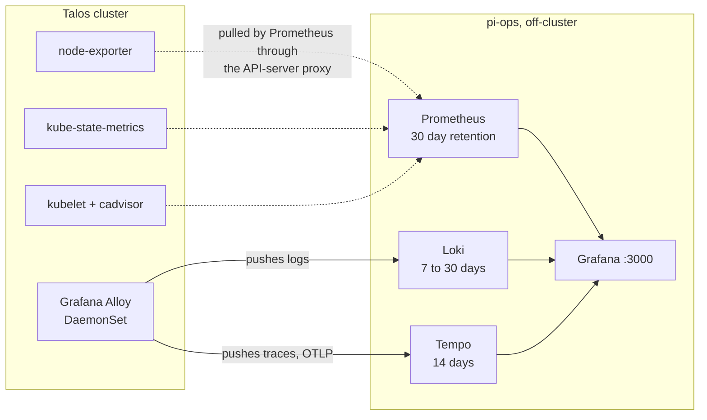

# 06 · Ops host (Raspberry Pi 5)

The ops host is the one box in this build that is not Kubernetes: a Raspberry Pi 5
running Debian and Docker Compose, which should feel like home if you arrived from
`docker run`. It sits outside the cluster on purpose: monitoring has to keep working
when the cluster is down, which is exactly when you need it, and git has to hold the
repo you rebuild the cluster from, so it cannot live on the thing being rebuilt.

Before this: a cluster you can only inspect from inside itself, with the rebuild source
on your laptop. After this: a Pi that watches the cluster from outside and serves the
git repo that recreates it.

Three jobs, all kept off the cluster on purpose:

1. **Observability**, the tools that watch the cluster. Prometheus collects numbers: on
   a timer it pulls a `/metrics` page from each thing it watches (that pull is called a
   scrape) and stores the history. Loki does the same for log lines, and Tempo for
   traces, the timed records of single requests. Grafana is the web UI that draws all
   three. They live on the Pi for one reason: when the cluster is down, or a
   `tofu destroy` has erased it, the graphs must still be up. Don't monitor a thing
   with itself.
2. **Git.** Forgejo is a self-hosted git server with a GitHub-style web UI. It sits
   behind its own Cloudflare tunnel and holds the repo the cluster is rebuilt from, so
   the source of truth outlives the cluster.
3. **Management.** The command-line tools (`talosctl`, `kubectl`, `helm`, `tofu`), the
   Terraform state, and the backup crons.



Dotted arrows are pulled, solid arrows are pushed. Nothing in the cluster is required for
any of it to keep working.

> [!CAUTION]
> The ops host is explicitly **not** a Kubernetes node. Do not `talosctl apply-config` to
> it.

Rebuild the whole host from a fresh Debian install with
[`scripts/bootstrap-ops-host.sh`](../scripts/bootstrap-ops-host.sh). The script is
idempotent: re-running it is safe and changes nothing that is already correct.

## Hardware

| Item | Notes |
| --- | --- |
| Raspberry Pi 5 8 GB | arm64, PCIe on the underside |
| NVMe HAT + ~256 GB NVMe | Or a USB 3 SSD. **Do not run this from an SD card.** Prometheus writes will kill it in months |
| PoE+ HAT or USB-C 5 A PSU | |
| Case with a fan | The Pi 5 throttles under sustained load without active cooling |

The Pi's address is `192.168.1.100`, reserved in the router so it never changes.

## Layout

```
/opt/lab/
├── tofu/           the OpenTofu roots (cluster, n8n)
├── kube/config     kubeconfig from `tofu output`
├── talos/config    talosconfig from `tofu output`
├── talos-images/   factory ISO + schematic.txt
└── cron/           backup scripts
/opt/obs/           Prometheus + Loki + Tempo + Grafana compose stack
/opt/git/           Forgejo + cloudflared + Actions runner compose stack
/mnt/data/          bind-mount root for all of the above
/mnt/nas/           NFS mount of the NAS backup share
```

Every service keeps its data under `/mnt/data` through bind mounts, which map a host
directory straight into a container. Swap the disk behind `/mnt/data` (SD card now, NVMe
later) and nothing in any YAML file changes.

## Observability stack

One Docker Compose file on the Pi runs the whole stack: four containers that start and
stop together, which is all a compose stack is. If you have written a `compose.yaml` at
home, nothing here will surprise you.

```yaml
# /opt/obs/compose.yaml
services:
  prometheus:
    image: prom/prometheus:v2.55.0
    user: "65534:65534"
    volumes:
      - ./prometheus.yml:/etc/prometheus/prometheus.yml:ro
      - /mnt/data/prom:/prometheus
    command:
      - --config.file=/etc/prometheus/prometheus.yml
      - --storage.tsdb.path=/prometheus
      - --storage.tsdb.retention.time=30d
      - --web.enable-remote-write-receiver     # Tempo's generator writes here
      - --enable-feature=exemplar-storage      # ...and its exemplars, which are
                                               # otherwise accepted and dropped
      - --web.enable-lifecycle                 # POST /-/reload; 403 without it
    ports: ["127.0.0.1:9090:9090"]
    extra_hosts: ["host.docker.internal:host-gateway"]
    restart: unless-stopped

  loki:
    image: grafana/loki:3.2.0
    user: "10001:10001"
    command: ['-config.file=/etc/loki/config.yaml']
    volumes:
      - ./loki-config.yaml:/etc/loki/config.yaml:ro
      - /mnt/data/loki:/loki
    ports: ["3100:3100"]        # LAN-reachable, in-cluster Alloy pushes here
    restart: unless-stopped

  tempo:
    image: grafana/tempo:2.6.1
    volumes:
      - ./tempo.yaml:/etc/tempo.yaml:ro
      - /mnt/data/tempo:/var/tempo
    ports: ["3200:3200", "4317:4317", "4318:4318"]
    restart: unless-stopped

  grafana:
    image: grafana/grafana:11.3.0
    user: "472:0"
    environment:
      GF_SECURITY_ADMIN_PASSWORD: ${GF_SECURITY_ADMIN_PASSWORD}   # /opt/obs/.env, mode 600
    volumes: ["/mnt/data/grafana:/var/lib/grafana"]
    ports: ["3000:3000"]        # the only externally exposed port
    restart: unless-stopped
```

> [!IMPORTANT]
> Each container runs as the numeric user on its `user:` line, and it can only write to a
> directory that user owns. Chown the bind-mounted directories to those UIDs (65534,
> 10001, 472) or nothing starts.

### Scraping the stack itself

Prometheus watches its housemates too. `bootstrap-ops-host.sh` sets up the `obs-loki` and
`obs-grafana` scrape jobs for the two stack services it creates. Tempo is added later
(the compose block above), so **its scrape job has to be added by hand**. The bootstrap
deliberately does not ship a job for a service that does not exist yet:

```yaml
# /opt/obs/prometheus.yml, add alongside obs-loki and obs-grafana
- job_name: obs-tempo
  static_configs: [{ targets: ['tempo:3200'] }]
```

Worth the two lines. A span is one timed step inside a trace. Tempo's metrics-generator
is the part of Tempo that turns spans into the `traces_spanmetrics_*` series the
node-latency dashboard reads, so if it stalls the dashboard goes flat with nothing else
to warn you. The two to alert on:

| Metric | Means |
|---|---|
| `tempo_metrics_generator_registry_active_series` | pinned at 0 → generation has stopped |
| `tempo_metrics_generator_spans_discarded_total` | spans arriving but being dropped |

After editing `prometheus.yml`, run `curl -X POST http://localhost:9090/-/reload` on the
Pi to make Prometheus re-read the file without a restart. That needs the
`--web.enable-lifecycle` flag, which is already in the compose block above. Without the
flag, the Prometheus version pinned there answers 403 `Lifecycle API is not enabled.`

### Scraping the cluster from outside

The Pi has no route into the pod network, so Prometheus goes through the front door
instead. It asks the Kubernetes API server, the address every cluster request goes
through, for the list of pods to watch (discovery). The scrapes then travel through the
**API-server proxy**: the API server will forward an HTTP request to any pod, so
Prometheus only ever needs a route to that one address. One bearer token (the credential
sent with every request) covers everything, there is no per-service LoadBalancer to
build, and new pods are covered automatically.

```yaml
# /opt/obs/prometheus.yml (one job; the others follow the same shape)
- job_name: k8s-kube-state-metrics
  scheme: https
  tls_config:    { ca_file: /etc/prometheus/k8s-ca.crt, insecure_skip_verify: true }
  authorization: { credentials_file: /etc/prometheus/k8s-token }
  kubernetes_sd_configs:
    - role: endpoints
      api_server: https://192.168.1.110:6443
      tls_config:    { ca_file: /etc/prometheus/k8s-ca.crt, insecure_skip_verify: true }
      authorization: { credentials_file: /etc/prometheus/k8s-token }
      namespaces: { names: [monitoring] }
  relabel_configs:
    - target_label: cluster            # community k8s dashboards filter on {cluster="$cluster"}
      replacement: talos-lab
    - source_labels: [__meta_kubernetes_service_name, __meta_kubernetes_pod_container_port_number]
      regex: kube-state-metrics;8080
      action: keep
    - source_labels: [__address__]
      replacement: 192.168.1.110:6443
      target_label: __address__
    - source_labels: [__meta_kubernetes_namespace, __meta_kubernetes_pod_name, __meta_kubernetes_pod_container_port_number]
      regex: (.+);(.+);(.+)
      target_label: __metrics_path__
      replacement: /api/v1/namespaces/$1/pods/$2:$3/proxy/metrics
```

The `relabel_configs` block does the interesting work: it picks out the right pods,
rewrites their addresses into API-server proxy URLs, and stamps every metric with
`cluster=talos-lab` for the dashboards later. The same shape repeats for node-exporter
(described below), for app `/metrics` endpoints, and, with `role: node`, for the
kubelet's `/metrics` and `/metrics/cadvisor`. The kubelet is the agent on every node
that actually runs your pods, and cadvisor is its built-in container stats page. That
cadvisor job is what feeds the per-pod CPU and memory panels.

Now the cluster side. RBAC is Kubernetes's permission system: rules for who may do what,
written as objects you apply like anything else. This one grants the Pi's token
read-only access to exactly what the scrapes touch, and nothing else:

```yaml
apiVersion: rbac.authorization.k8s.io/v1
kind: ClusterRole
metadata: { name: prometheus-external }
rules:
  - apiGroups: ['']
    resources: [nodes, nodes/proxy, nodes/metrics, services, services/proxy,
                endpoints, pods, pods/proxy]
    verbs: [get, list, watch]
  - nonResourceURLs: [/metrics, /metrics/cadvisor]
    verbs: [get]
```

A role does nothing until something holds it. Add a ServiceAccount (an account for
software rather than a person), a binding that ties it to the role above, and a
long-lived token Secret annotated `kubernetes.io/service-account.name`. That token is
what Prometheus presents on every scrape. Copy the token and the cluster CA certificate
to the Pi and mount them into the Prometheus container at the paths the scrape config
reads: `/etc/prometheus/k8s-token` and `/etc/prometheus/k8s-ca.crt`.

**The cluster itself runs only exporters.** An exporter is a small service that
publishes something else's stats as a `/metrics` page for Prometheus to pull. There are
two, both plain Helm charts with no operator and no CRDs to learn: `node-exporter`
reports each node's hardware and OS numbers, and `kube-state-metrics` reports the state
of Kubernetes objects (how many replicas a Deployment wants versus has, and so on).
node-exporter runs as a DaemonSet, the Kubernetes shape that puts one copy of a pod on
every node.

One gate to open first: node-exporter asks for hostPID and hostNetwork, host access that
namespaces block by default through Pod Security Admission. Label the `monitoring`
namespace `pod-security.kubernetes.io/enforce=privileged` or the pods are rejected.

### Verify

On the Pi, with the cluster jobs in `prometheus.yml` and the config reloaded, ask
Prometheus for the health of everything it scrapes:

```bash
curl -s http://localhost:9090/api/v1/targets | grep -o '"health":"[^"]*"' | sort | uniq -c
```

The command fetches Prometheus's target list and counts the health values.

> **✅ Verify:** every line reads `up`. A `down` target is one Prometheus can discover but
> not scrape. To see why, drop the `grep` and read the full JSON, which names the failing
> job and the error.

### Logs: Grafana Alloy to Loki

Logs need an agent inside the cluster, because the log files live on the nodes. Grafana
Alloy is that agent, Grafana's collector for logs and traces. A `grafana/alloy`
DaemonSet tails every file under `/var/log/pods/**` and pushes the lines to Loki on the
Pi. (Alloy rather than promtail, its predecessor, which is EOL.)

The pipeline below is written in Alloy's River config language and reads top to bottom:
find the pods, label them, read their logs, drop one noisy Longhorn message, ship the
rest to the Pi.

```
discovery.kubernetes "pods" { role = "pod" }

discovery.relabel "pod_logs" {
  targets = discovery.kubernetes.pods.targets
  // → namespace, pod, container, node, app, component labels
}

loki.source.kubernetes "pods" {
  targets    = discovery.relabel.pod_logs.output
  forward_to = [loki.process.pi.receiver]
}

loki.process "pi" {
  stage.match {
    selector = `{namespace="longhorn-system", container=~"engine|instance-manager"} |= "periodicRefresh"`
    action   = "drop"
  }
  forward_to = [loki.write.pi.receiver]
}

loki.write "pi" {
  endpoint { url = "http://192.168.1.100:3100/loki/api/v1/push" }
  external_labels = { cluster = "talos-lab" }
}
```

Alloy's namespace also needs the `privileged` Pod Security label, this time because the
pods mount `/var/log/pods` from the host.

> [!WARNING]
> **River syntax gotcha.** Block attributes must be newline-separated.
> `rule { source_labels = [...] target_label = "x" }` is a syntax error. Worse, the
> config-reloader fails **silently**. Alloy keeps running the last good config, so a
> broken `helm upgrade` looks successful.

### Traces: Alloy OTLP receiver to Tempo

Traces travel the same road. OTLP is the OpenTelemetry protocol, the standard wire
format apps use to send traces. The same Alloy DaemonSet listens for it
(`otelcol.receiver.otlp` on `0.0.0.0:4318` and `:4317`), batches what arrives, and
exports it to Tempo on the Pi. A dedicated `Service/alloy-otlp` (ClusterIP, both ports)
gives workloads one stable DNS name to send to.

> [!NOTE]
> n8n emits one span per workflow execution and one per node (a step in the workflow, not
> a cluster machine), so **an idle instance produces no spans**. Verify the pipeline with
> a real workflow run or a synthetic OTLP push, not by waiting.

A datasource is Grafana's connection to one backend it can query. Wire the Tempo
datasource with `tracesToLogsV2`, which jumps from a span to the Loki log lines sharing
its `service.name`, and with `tracesToMetrics`.

### Dashboards and datasources

Grafana can be configured two ways: click things together in the UI, or provision them,
meaning Grafana reads its setup from files on disk at startup. Provision both dashboards
and datasources **from files**, not the UI:
[`iac/platform/grafana-datasources.yaml`](../iac/platform/grafana-datasources.yaml) and
[`iac/platform/grafana-dashboards.yaml`](../iac/platform/grafana-dashboards.yaml), mounted
under `/etc/grafana/provisioning/`. That is the difference between an observability stack
you can rebuild and one you have to remember.

> [!NOTE]
> Partly retrofitted. The dashboards are now exported to files and shipped here, but the
> lab's own Grafana still has its **datasources** clicked in. They carry random UIDs like
> `cft4er82n82yod` rather than the stable ones `grafana-datasources.yaml` declares, which
> is exactly the drift that makes a raw dashboard export unusable elsewhere. So the
> datasource file here is still the fix rather than a mirror. If you are starting fresh,
> start provisioned. It costs nothing on day one and is tedious to retrofit.

Four datasources: **Prometheus**, **Loki**, **Tempo** (with `tracesToLogsV2` so a span
jumps to its log lines), and **n8n-postgres**, a direct connection to n8n's own database
used by the workflow analytics dashboard, which reads n8n's tables rather than
Prometheus. That last one needs the cluster's Postgres reachable on the LAN. See
[`iac/platform/cnpg-lan-service.yaml`](../iac/platform/cnpg-lan-service.yaml).

| ID | Dashboard (as titled in Grafana) | Reads from | Shows |
| --- | --- | --- | --- |
| none | n8n on Talos, *pick namespace/instance* | Prometheus + Loki | The landing page |
| 24474 | n8n System Health Overview, *pick instance* | Prometheus | Node.js heap, GC, event loop |
| 24475 | n8n Workflow & Execution Analytics | Postgres | Success rates, throughput, per-workflow trends. Reports on whichever instance `n8n-postgres` points at |
| 1860 | Node Exporter Full | Prometheus | Per-node CPU, memory, disk, network, temps |
| 15757 | Kubernetes / Views / Global | Prometheus | Namespaces, workloads, pressure |
| 15759 | Kubernetes / Views / Nodes | Prometheus | Allocatable vs allocated |
| 15760 | Kubernetes / Views / Pods | Prometheus | Restarts, throttling, OOMs |

All seven are vendored (committed to this repo) at
[`iac/platform/dashboards/`](../iac/platform/dashboards/). On the Pi, copy them into the
provisioning path and Grafana loads them within 30 seconds:

```bash
cp iac/platform/dashboards/*.json /mnt/data/grafana/dashboards/
```

Every panel finds its datasource by UID, an ID string. A UI-created datasource gets a
random UID like `cft4er82n82yod`, an export bakes that UID into every panel, and so a
raw export is useless on any other machine: the dashboard loads and every panel reads
*Datasource not found*. The vendored copies had their UIDs rewritten to the stable ones
`grafana-datasources.yaml` provisions (`prometheus`, `loki`, `tempo`, `n8n-postgres`).
Attribution and the full mapping are in
[`iac/platform/dashboards/README.md`](../iac/platform/dashboards/README.md).

> [!TIP]
> **Put the required template variable in the dashboard title.** A template variable is a
> dropdown at the top of a dashboard that every panel filters on. The *pick
> namespace/instance* suffixes above are deliberate. Several of these dashboards render
> blank until you select a value, and at a glance a blank dashboard is indistinguishable
> from a broken one, particularly six months later, or for anyone who is not you. Naming
> the variable in the title turns "this is broken" into "set the dropdown". Where a
> dashboard is pinned to one instance, put *that* in the title instead, so a second n8n
> deployment cannot be misread as the first.

The first row is the hand-built landing page, the only original in the set:
[`iac/platform/dashboards/n8n-on-talos.json`](../iac/platform/dashboards/n8n-on-talos.json).
Twelve panels: pod counts per role, queue depth, cache hit rate, node CPU and memory,
pod count by namespace, pods not Running, plus two logs panels (live n8n main, and a
cluster-wide error/warning filter).

It carries `DS_PROMETHEUS` and `DS_LOKI` **datasource-type template variables**, so it
binds to whatever datasources exist on import rather than to the UIDs of the Grafana it
was built on. Worth doing for any dashboard you intend to share: the alternative is a
dashboard that renders empty on every machine but yours, with no error explaining why.

For your own dashboards, either build them that way or export with **Share → Export →
"Export for sharing externally"**, which rewrites the hardcoded UIDs into `__inputs`
prompts at import time.

> [!WARNING]
> **Two things make these work, and both fail quietly:**
>
> - **The `cluster` label.** Every `157xx` dashboard filters on `{cluster="$cluster"}` and
>   renders completely empty without it. The scrape config injects it with a static
>   relabel. Nothing warns you: the panels read "No data" and that is all.
> - **The kubelet cadvisor job.** Pod-level CPU and memory panels read `container_*` and
>   `machine_*`, which come from `/metrics/cadvisor` on the kubelet, not from node-exporter
>   and not from kube-state-metrics. Miss that scrape job and the dashboard loads, most
>   panels populate, and only the per-pod ones are blank, which reads as a broken dashboard
>   rather than a missing target.

### Retention

Retention is how long each store keeps data before deleting it, and every store here
configures it somewhere different:

| Store | Retention | Configured in |
| --- | --- | --- |
| Prometheus | 30 d | `--storage.tsdb.retention.time` |
| Loki (default) | 7 d | `limits_config.retention_period` |
| Loki (ingress, app namespaces) | 30 d | `limits_config.retention_stream` |
| Tempo | 14 d | `compactor.compaction.block_retention` |

> [!WARNING]
> Loki's default is **never expire**. Set this on day one, not after the disk fills.

## Prebuilt Explore queries

Dashboards cover what you watch continuously. Explore is Grafana's blank-page query
view, the place for the one-off follow-up question. By default it opens empty, so
everyone ends up retyping TraceQL (Tempo's trace query language) from memory.

As of Grafana 11.3 there is no shareable query library (that arrived in later releases).
What it does have is per-user query history with a starred flag and an API to write to
it, which is enough. [`scripts/seed-explore-queries.py`](../scripts/seed-explore-queries.py)
seeds 14 labelled, starred queries across Prometheus, Tempo and Loki. Run it with
Grafana's admin password (the one in `/opt/obs/.env`) so it can log in:

```bash
GF_PASS="$GF_SECURITY_ADMIN_PASSWORD" ./scripts/seed-explore-queries.py
# then: Explore -> Query history -> Starred
```

It looks datasources up by **name**, not UID, so it works against a Grafana whose
datasources were created through the UI and carry random UIDs. It is also idempotent:
entries are matched on their label, and a label that already exists is PATCHed in place
rather than recreated. Editing a query in the script therefore reaches the entry you see
in Explore, and the entry keeps its uid. `--dry-run` prints what it would do without
changing anything.

> [!NOTE]
> The one real limitation: **query history is per user.** Seeding as `admin` gives the
> queries to `admin` only. On a single-operator box that is a non-issue. With a team, run
> it per login or accept it as an admin convenience.

## Forgejo

The git stack is a second compose file on the Pi, two containers: Forgejo itself, and
cloudflared, which keeps a Cloudflare tunnel open. The tunnel is an outbound connection
from the Pi to Cloudflare that carries `https://git.example.com/` traffic back in, so no
port on your router is ever opened. Worth noticing in the file: the database is SQLite
(one file, no database server to run) and registration is disabled, so the public URL
has no sign-up page.

```yaml
# /opt/git/compose.yaml
services:
  forgejo:
    image: codeberg.org/forgejo/forgejo:10
    environment:
      FORGEJO__server__ROOT_URL:   'https://git.example.com/'
      FORGEJO__server__DOMAIN:     'git.example.com'
      FORGEJO__server__HTTP_PORT:  '3000'
      FORGEJO__server__SSH_PORT:   '222'
      FORGEJO__database__DB_TYPE:  'sqlite3'
      FORGEJO__service__DISABLE_REGISTRATION: 'true'
      FORGEJO__security__INSTALL_LOCK:        'true'
      FORGEJO__webhook__ALLOWED_HOST_LIST:    '192.168.1.203'   # in-cluster webhook receivers
      FORGEJO__actions__DEFAULT_ACTIONS_URL:  'https://github.com'
    volumes: ["/mnt/data/forgejo:/data"]
    ports: ['3001:3000', '222:22']
  cloudflared:
    image: cloudflare/cloudflared:latest
    command: tunnel --no-autoupdate run
    environment:
      TUNNEL_TOKEN: ${TUNNEL_TOKEN}
    depends_on: [forgejo]
```

Argo pulls over the LAN URL `http://192.168.1.100:3001/<user>/homelab-gitops.git`.
Humans use `https://git.example.com/`.

A webhook is an HTTP call Forgejo makes to another system when something happens, a push
for example.

> [!WARNING]
> **`webhook.ALLOWED_HOST_LIST` defaults to `external`, which blocks every private IP.** A
> webhook aimed at a LAN address is refused before the request leaves the container, with
> `webhook can only call allowed HTTP servers` in Forgejo's log and *nothing at all* in
> the receiver's. Delivery is marked failed and **is not retried**. Fixing the allowlist
> replays nothing, so re-trigger the event yourself.

### Actions runner

Forgejo Actions is Forgejo's CI, driven by workflow files in the GitHub Actions style. A
runner is the worker that picks up queued jobs and executes them, and without one
nothing runs. This one is `data.forgejo.org/forgejo/runner:13.0.0` in the same compose
stack, its labels (the mapping from a workflow's `runs-on:` name to a job image) pointed
at `catthehacker/ubuntu:act-latest`, which publishes arm64, required on a Pi. The log
lines quoted below are what runner 13.0.0 prints.

- Register with a **shared secret**, not a registration token:
  `forgejo forgejo-cli actions register --secret <s> --scope <user> --name pi-ops-runner`.
  Idempotent: re-running updates the existing runner rather than duplicating it.
- The daemon needs `/data/.runner` or it exits with `0 server connections configured`.
  Run `forgejo-runner create-runner-file` before `daemon`.
- Needs the **docker group**, not only the socket mount: `user: '1000:1000'` plus
  `group_add: ['<docker-gid>']`. Jobs run as sibling containers, started on the Pi's own
  Docker daemon next to the runner, which is root-equivalent access to this host.
  Acceptable only for private repos.
- **Containers on this host cannot reach the host's own LAN IP.** A request from inside a container
  back to `192.168.1.100:3001` (a hairpin turn through the host's own IP) times out,
  even though the same URL works from the host shell and from the cluster. Use the compose DNS name
  (`http://forgejo:3000`) and set the runner's `container.network` to the compose network.
  Symptom if wrong: the daemon logs `Starting runner daemon`, looks fine for 60 s, dies
  with `fail to invoke Declare … context deadline exceeded`, and restart-loops. A healthy
  runner logs `declared successfully` and `[poller] launched`.
- `DEFAULT_ACTIONS_URL: https://github.com` (already in the compose block above).
  Without it Forgejo resolves the `uses:` lines in workflows against `code.forgejo.org`,
  which mirrors `actions/*` but not third-party actions.
- **Queued runs are inert without a runner.** The UI says `Waiting` forever, with no
  error anywhere.
- **CI triggers are a load decision on shared hardware.** A full test matrix per commit
  can queue faster than one Pi drains it. Manual triggering with `workflow_dispatch:` is
  a reasonable answer.

## Backups

Two cron jobs on the Pi (cron is Linux's scheduler: each line is a time pattern, then a
command). The first snapshots etcd, the cluster's state store, at 02:15 every night. The
second backs up the Pi itself at 03:30. Both append to logs under `/var/log/`:

```cron
15 2 * * * root /opt/lab/cron/etcd-snapshot.sh  >> /var/log/etcd-snapshot.log 2>&1
30 3 * * * root /opt/lab/cron/pi-selfbackup.sh  >> /var/log/pi-selfbackup.log 2>&1
```

See [`scripts/etcd-snapshot.sh`](../scripts/etcd-snapshot.sh).

> [!CAUTION]
> **Use absolute paths in cron scripts.** Cron's `PATH` lacks `/usr/local/bin`. A bare
> `talosctl` silently ate nineteen nights of snapshots before anyone read the log.

The rest of what will bite you:

- **`rsync -a --no-o --no-g`.** The NAS export is root-squashed (the NAS demotes root to
  an unprivileged user), so plain `rsync -a`, which tries to `chown` what it copies,
  dies with exit 23. The two extra flags tell rsync not to copy owner and group.
- **`--delete` is what propagates retention** to the NAS: rsync removes files from the
  NAS copy that were removed locally. Drop it and the NAS grows forever. Conversely,
  never point another system's backup target *inside* a tree that a `--delete` mirror
  owns, because the mirror will delete it.
- **Back up Grafana's SQLite, and back up every config the stack reads, not only the
  ones you remember writing.** The self-backup listed `/opt/obs/{.env,prometheus.yml,
  compose.yaml}` by name, which quietly excluded `tempo.yaml` (the file holding the
  span-metric dimensions the tracing dashboard is built on) and `loki-config.yaml`.
  `/mnt/data/grafana/grafana.db` was missing entirely, and it is the only copy of the
  datasource UIDs every UI-created dashboard binds to, plus Explore's starred queries.
  Dashboards are re-importable from git. The UIDs they bind to are not.

  Snapshot SQLite properly rather than copying it. Grafana is running, so `cp` can catch
  a torn write mid-transaction:

  ```bash
  sqlite3 /mnt/data/grafana/grafana.db ".backup '/opt/obs/grafana.db.snapshot'"
  ```

  Verify by counting rows in the snapshot, not by checking the file exists:
  `select count(*) from dashboard;` should match what Grafana shows.

Two copies: NAS (copy 1) and local disk (copy 2). Both scripts run `mountpoint -q`
first, which checks the NAS share is actually mounted, and warn to stderr rather than
syncing into the empty directory under the mount point.

> [!NOTE]
> **Still missing here, and worth adding:** a nightly check that the newest Longhorn
> backup (Longhorn is the cluster's storage layer) is under 36 hours old. Cheapest version
> is `kubectl -n longhorn-system get backups.longhorn.io` and an assertion on
> `.status.backupCreatedAt`. A backup job that stops silently is the same as no backup.

Skipped deliberately: a full Alertmanager stack (Prometheus's dedicated alert router).
Grafana's built-in contact points, the where-do-alerts-go setting, cover the lab case.
Add Alertmanager when there is an actual on-call rotation.

## Firewall

UFW, Debian's front end for the firewall, denies incoming traffic by default. Allowed
in, from the LAN only: SSH, Grafana (3000), Loki (3100) and node-exporter (9100). One
extra rule lets the Docker bridge range reach 9100, so the containerised Prometheus can
scrape the node-exporter running on the Pi itself.
