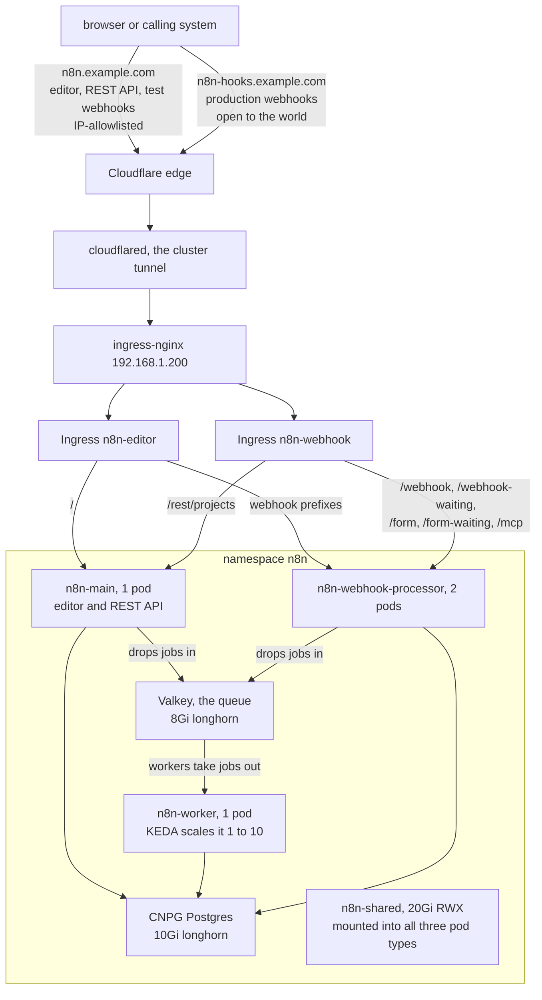
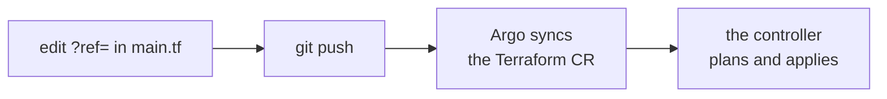

# 07 · n8n (Community edition)

If your n8n today is one container doing everything, this doc is where that model changes.
Queue mode splits n8n into three roles: a main process that serves the editor and API,
workers that execute workflows, and webhook processors that receive incoming calls.
Postgres replaces the SQLite file. Valkey is a Redis-compatible in-memory store, and here
it is only the queue: the main process drops jobs in, workers take jobs out. If the word
Redis means something to you, read Valkey as Redis. Before this: one process, one SQLite
file, a restart drops whatever was running. After this: editor, workers, and webhook
receivers in separate pods, scaling and restarting independently on top of Postgres and a
queue.

n8n runs in **queue mode** on the cluster, deployed by
[`terraform-kubernetes-n8n`](https://github.com/TpyoKnig/terraform-kubernetes-n8n), a
reusable OpenTofu module, and driven from Argo CD, the GitOps engine from
[05-gitops](05-gitops.md). It is the **Community edition**: the module renders no licence
key and no multi-main topology (several main processes at once, a licence-gated feature),
by design.

Source: [`iac/tofu/n8n/`](../iac/tofu/n8n/) (the root module, the small config that calls
the reusable module with this cluster's values) and
[`iac/argocd/n8n-terraform.yaml`](../iac/argocd/n8n-terraform.yaml) (what Argo applies).

A module version bump is a one-line commit: edit the `?ref=` in `main.tf`, push, and the
controller plans and applies it. See [Driving it from Argo CD](#driving-it-from-argo-cd).

## What the module gives you

- n8n main pod (editor, REST API, schedule triggers)
- Worker and webhook-processor pools, autoscaled on queue depth by KEDA (an add-on that
  watches how many jobs are waiting and grows or shrinks the pools to match)
- PostgreSQL via CloudNativePG, a Kubernetes operator (resident software that installs,
  heals and upgrades a program on your behalf) that runs Postgres in-cluster (or point
  the module at an external database)
- A Redis-compatible queue via Valkey (or external)
- Namespace, Secrets, and optionally the Ingress with TLS (an Ingress is a routing rule
  for the cluster's shared reverse proxy, ingress-nginx here)

The shape of the whole thing, top to bottom. The two hostnames at the top are the split
the rest of this doc keeps coming back to:



The webhook Ingress has **no catch-all**. Anything not on that prefix list gets a 404,
which is the point of putting it on an open hostname.

## Calling the module

This is the heart of [`main.tf`](../iac/tofu/n8n/main.tf) in the root module, trimmed to
the decisions. Each input picks a piece: which Postgres, which queue, which hostnames go
where, and which n8n version runs.

```hcl
module "n8n" {
  source  = "TpyoKnig/n8n/kubernetes"
  version = "~> 0.1.0"

  postgres_backend = "cnpg"
  redis_backend    = "valkey"
  create_namespace = true
  k8s_namespace    = var.namespace

  create_ingress   = false            # routing is caller-owned; see below
  n8n_webhook_url  = "https://${var.webhook_host}"
  k8s_ingress_host = var.editor_host
  n8n_domain       = var.editor_host

  k8s_keda_installed = true
  n8n_image_tag      = var.n8n_version
}
```

Three notes on that call:

**The registry address works under both binaries, but that took a second publication.**
Terraform and OpenTofu run the same config language, and this lab uses OpenTofu. They do
not share a module registry: Terraform resolves `source` against `registry.terraform.io`,
OpenTofu against `registry.opentofu.org`, and the two indexes are entirely separate. This
module went to the Terraform registry first, so for a while the README's own `source`
line failed under `tofu init` with `Module not found`, a correct config that looked
broken. The fix was publishing to OpenTofu's index as well
([opentofu/registry#4980](https://github.com/opentofu/registry/issues/4980)), not changing
anything in the config. Until that landed, every root here used a
`git::https://github.com/TpyoKnig/terraform-kubernetes-n8n.git?ref=0.1.0` source, which
pins the same commit and behaves identically.

> [!TIP]
> The general lesson: **a module being on one registry tells you nothing about the
> other.** If a published `source` 404s, check which index your binary is asking before
> you touch the config.

**Pin with a range, and make it tighter than you think.** A version pin stops the module
changing underneath you between applies. `~> 0.1.0` is patch-only, meaning
`>= 0.1.0, < 0.2.0`: bugfixes arrive on their own, anything bigger waits for you.
`~> 0.1` would also accept `0.2.0`, and pre-1.0 a minor bump is exactly where a module is
still free to break its input surface (rename its inputs, or change what they mean). The
`0.0.1-beta.*` tags remain valid *exact* pins, but they never matched a range at all,
because neither Terraform nor OpenTofu resolves a range against a pre-release. That is
why `0.1.0` exists: same tree as `0.0.1-beta.5`, retagged without the suffix so a
constraint could match it.

**Turn metrics on, then turn the other 19 on too.** `/metrics` is the page Prometheus
reads its numbers from. `n8n_metrics_enabled = true` sets `N8N_METRICS`, plus the queue
and cache groups, and stops there.

> [!WARNING]
> As of the n8n version pinned here, there are **23** `N8N_METRICS_INCLUDE_*` groups and
> the remaining 19 default to false, so `/metrics` answers, Prometheus scrapes happily,
> and nothing reports on webhooks, the scheduler, the DB pool, execution-data I/O, SSRF
> blocks or DNS cache. Nothing signals the absence.

Enabling all of them took one instance from 66 to 127 metric names for roughly 1,700
extra series.

Two things about scraping it, both of which produce confidently wrong numbers if missed:

- **Scrape every role, not just main.** An execution is recorded by whichever process ran
  it, and a webhook-triggered run lands on the *webhook-processor*. A scrape job keeping
  only `component=main` reports zero executions forever, on a healthy system.
- **`sum()` counters, `max()` gauges.** A counter counts events each process saw, and a
  gauge reports a current value. Execution counters are per-process, so summing them is
  right. `n8n_active_workflow_count` is read from the database and reported *identically*
  by every pod, so summing multiplies it by the pod count.

**Pin the image tag.** Leaving the chart (the n8n Helm chart the module wraps) on its
floating `stable` tag means a node with a cached `stable` layer never re-pulls, and which
version you get depends on which node the pod lands on.

> [!CAUTION]
> Bump deliberately. n8n runs its database migrations (automatic schema upgrades) on
> startup and they are one-way, so rolling back to an earlier tag against a migrated
> database is not a supported path.

## Why the ingress is split, and why routing is caller-owned

Caller-owned means `create_ingress = false` in the module call: the module still builds
everything the routing points at, but writes no routing rules itself. This root supplies
its own two Ingresses instead, and this section is why.

n8n's own SSO (single sign-on, logging in through a central identity provider) is
licence-gated, and this is Community edition, so any authentication policy has to live at
the ingress, in front of n8n.

> [!IMPORTANT]
> **One hostname serving both the editor and production webhooks forces a choice between
> an unauthenticated editor and broken webhook delivery**, because the machines calling a
> webhook cannot complete an interactive login.

Two hostnames dissolve that. The editor host carries an IP allowlist, a short list of
addresses (your LAN, anywhere else you trust) that are let in while every other client is
refused. The webhook host stays open to the world and exposes only the webhook prefixes.

The prefix list comes from the module's `n8n_webhook_path_prefixes` output (a value the
module computes and hands back) rather than being hardcoded, so the Ingresses cannot
drift as n8n adds endpoints.

Both Ingresses live in [`iac/tofu/n8n/ingress.tf`](../iac/tofu/n8n/ingress.tf), which is
the file this whole section describes.

**Routing the webhook prefixes on the *editor* host too is not cosmetic.** The module
runs the chart with `disableProductionWebhooksOnMainProcess = true`, so main pods serve
none of those prefixes. Without explicit rules, the catch-all (the default route that
matches whatever nothing else claimed) hands `/webhook` to a main pod.

> [!WARNING]
> The main pod has no handler for it, the request falls through to the editor's
> single-page-app handler, which answers every unknown path with the editor page, and the
> caller gets **HTTP 200 with an HTML body**: a delivery that reads as success while
> nothing executed.

> [!TIP]
> The tell when testing: a correctly routed webhook prefix returns `application/json`,
> never `text/html`.

### `/rest/projects` on the webhook host

The one non-webhook path on the open hostname, and it has to be there.

n8n's Agents chat integrations build three URLs by appending
`rest/projects/<projectId>/agents/v2/<agentId>/…` onto `getWebhookBaseUrl()`, which
returns `WEBHOOK_URL`, which is the webhook hostname. Those three are the Slack
app-install OAuth callback, the Slack event webhook, and the generic per-platform event
webhook.

They are **main-process routes**. In n8n's code, only `start.ts` (main) registers the
REST API and `webhook.ts` registers none of it, so a webhook-processor answers 404 on
every `/rest` path.

> [!WARNING]
> Without the rule, connecting a Slack agent 404s at the *end* of the OAuth flow (the
> browser round-trip where the user grants the app access), after consent is already
> given, with nothing logged anywhere.

This is upstream n8n's URL construction, and no module input avoids it.
`N8N_DISABLE_PRODUCTION_MAIN_PROCESS` looks like the knob and is not: it has a single
consumer setting `webhooksEnabled` and controls the reverse direction.

The rule is scoped to `/rest/projects` rather than all of `/rest`: it is a literal prefix
(no `use-regex` annotation needed) covering all three constructions, and it keeps
`/rest/login` and `/rest/credentials` off the open hostname.

Two caveats. The rule has to be *publicly* reachable, not merely routed, because the
OAuth callback is a browser redirect and the platform webhooks are server-to-server
POSTs. And it is correct only until n8n adds a fourth construction outside
`/rest/projects`, which would fail the same silent way. Re-check on upgrades with the
command in [After an n8n minor upgrade](#after-an-n8n-minor-upgrade). Widening to `/rest`
is the fix.

Raised upstream for the AWS sibling as
[n8n-io/terraform-aws-n8n#92](https://github.com/n8n-io/terraform-aws-n8n/issues/92).

## Tracing, because metrics cannot see inside a node

n8n's Prometheus endpoint stops at the workflow boundary. It will tell you an execution
took 8 seconds and nothing about where the 8 seconds went, and there are **no
task-runner metrics at all** (task runners are the sidecar processes that execute
Code-node JavaScript and Python): `dist/metrics/prometheus/` holds 23 metric services and
none of them is about runners. The runner's own `health-check-server.js` answers every
path with a literal `OK`, and the task broker's HTTP server registers only `/healthz`
and its auth endpoint. There is nothing to scrape.

n8n ships the answer, switched off. A trace is a timeline of one request as it moves
through a system, each timed step in it is a span, and OpenTelemetry is the open standard
for emitting them. n8n's built-in OpenTelemetry module emits a `workflow.execute` span
per execution and a `node.execute` span per node, which is exactly the breakdown the
metrics cannot give.

**It is not a licensed feature.** Module gating in n8n is the `licenseFlag` property on
the `@BackendModule` decorator:

```js
BackendModule({ name: 'log-streaming',  licenseFlag: LICENSE_FEATURES.LOG_STREAMING, ... })
BackendModule({ name: 'source-control', licenseFlag: 'feat:sourceControl', ... })
BackendModule({ name: 'otel', instanceTypes: ['main', 'worker', 'webhook'] })   // no flag
```

`otel` is also already in the module registry's `defaultModules` list, so it loads on
every start. The env var is the only switch. Note `instanceTypes` includes `worker`,
which is the part that matters: the worker is what runs the node.

Turning it on is four inputs on the same module call:

```hcl
n8n_otel_enabled                = true
n8n_otel_exporter_otlp_endpoint = "http://192.168.1.100:4318"  # base URL; n8n appends /v1/traces
n8n_otel_exporter_service_name  = "n8n-community"
n8n_otel_traces_production_only = false   # default true drops manual editor runs
```

Use the module's dedicated `n8n_otel_*` inputs. Passing the raw `N8N_OTEL_*` names
through `n8n_extra_env` is rejected at plan time (the plan errors before anything
changes), along with every other name the module manages.

What it produces, from one real execution here, is the same 8 seconds finally attributed:

```
workflow.execute                              7988.8ms
  node.execute  Webhook           webhook        0.4ms
  node.execute  Validate Input    set            3.9ms
  node.execute  Code JS           code        7827.5ms   <-- 98%
  node.execute  Respond           respondTo…     2.6ms
```

For that same node the workflow's own internal counter reported 53 ms. It measures the
Code body, not the wait to get onto a runner.

To graph and alert on this rather than reading traces one at a time, let Tempo (the
trace store these spans land in) convert the spans into Prometheus series with its
metrics-generator. See
[`iac/platform/tempo-metrics-generator.yaml`](../iac/platform/tempo-metrics-generator.yaml)
and the `n8n-node-latency-tracing` dashboard.

Two things to expect:

- **A permanent startup error line**, `Failed to connect to OpenTelemetry OTLP endpoint
  during startup`. It is cosmetic. The check probes with `HEAD` and an OTLP receiver
  answers `405` to anything but `POST`. It only logs; export works.
- **Node type cannot distinguish task runners.** A Code node is `n8n-nodes-base.code`
  on both the JavaScript and Python runner, and there is no language attribute on the
  span. Only the node name separates them. Worth knowing before you conclude "Code
  nodes are slow" when one runner is fine and the other is 20× worse.

## `N8N_PROXY_HOPS = 2`

A proxy hop is any server that forwards traffic on its way in, and each hop appends the
address it saw to the `X-Forwarded-For` header. This number tells n8n how many of those
entries to trust when working out the real client address.

The module's split-ingress example uses `1`, which is right when ingress-nginx is the
only thing in front. Here the chain is Cloudflare edge → cloudflared → ingress-nginx, so
it is two.

Undercount and n8n reads a proxy address as the client. Overcount and it reads a value
the client could have forged. Every rate limit, audit log line and IP restriction depends
on it, including the editor's allowlist, which only works because ingress-nginx runs
with `use-forwarded-headers` and `compute-full-forwarded-for` (the settings that make it
read the client address from that header instead of from the nearest pod).

## Shared storage across the three pod types

Queue mode runs three pod types and they do **not** share a filesystem. The chart mounts
its `data` volume on main only, and at the chart default that volume is an `emptyDir`
(scratch space that vanishes with the pod). Split routing makes the gap concrete: a
webhook arrives at a webhook-processor, the execution runs on a worker, and the editor
renders it on main. A file one of them writes has to be readable by the other two.

An RWX claim (ReadWriteMany, a volume that pods on different nodes can mount read-write
at the same time) mounted into the n8n container of all three pod types fixes it. The
claim itself is in [`iac/tofu/n8n/storage.tf`](../iac/tofu/n8n/storage.tf), and the
module call wires it in like this:

```hcl
n8n_extra_volumes = [{
  name                    = "shared"
  persistent_volume_claim = { claim_name = kubernetes_persistent_volume_claim_v1.shared.metadata[0].name }
}]

n8n_extra_volume_mounts = [{
  name       = "shared"
  mount_path = "/opt/n8n-shared"
  read_only  = false
}]
```

**Two settings make it work and the second is the one people miss:**

```hcl
{ name = "N8N_DEFAULT_BINARY_DATA_MODE", value = "filesystem" }
{ name = "N8N_STORAGE_PATH",             value = "/opt/n8n-shared/storage" }
```

Binary data is any file a workflow carries (an upload, a generated PDF) as opposed to
its JSON fields.

> [!WARNING]
> n8n defaults binary data to `filesystem` in regular mode but to **`database` in scaling
> mode**, and this module always runs queue mode. Mount the volume without setting the
> mode and every payload still goes to Postgres: the mount is there, empty, and nothing
> reports a problem.

You can confirm the mode took without running a
workflow, because n8n creates `/opt/n8n-shared/storage` itself at startup. From wherever
your kubeconfig works, ask the main pod whether the folder exists:

```bash
kubectl -n n8n exec deploy/n8n-main -c n8n-main -- ls -d /opt/n8n-shared/storage
# pass: the path prints
# "No such file or directory" means the mode did not take and payloads still go to Postgres
```

Existing binary data stays where it was written. n8n records the mode per reference, so
old payloads remain readable. There is no migration.

The **task-runner sidecar does not get the mount**: `n8n_extra_volume_mounts` reaches the
n8n container only, which is documented module behaviour.

## AI Assistant and Agents

This build turns on two optional n8n modules: `instance-ai`, the in-editor AI Assistant,
and `agents`, the chat integrations (Slack and other platforms). The assistant needs a
model to talk to, a sandbox to run code in ([08-n8n-sandbox](08-n8n-sandbox.md)), and a
web search backend ([09-searxng](09-searxng.md)). All of it is plain env vars on the
module call:

```hcl
{ name = "N8N_ENABLED_MODULES",              value = "instance-ai,agents" }
{ name = "N8N_INSTANCE_AI_MODEL",            value = "anthropic/claude-opus-4-8" }
{ name = "N8N_INSTANCE_AI_SANDBOX_ENABLED",  value = "true" }
{ name = "N8N_INSTANCE_AI_SANDBOX_PROVIDER", value = "n8n-sandbox" }
{ name = "N8N_SANDBOX_SERVICE_URL",          value = "http://n8n-sandbox-service-api.n8n-sandbox.svc.cluster.local:8080" }
{ name = "N8N_INSTANCE_AI_SEARXNG_URL",      value = "http://searxng-http.searxng.svc.cluster.local:8080" }
```

The two API keys stay out of Terraform state (the file where Terraform records
everything it manages, values included). The module renders them as `secretKeyRef`, a
pointer to a Kubernetes Secret, and never reads a value. Create that Secret out of band,
once, with your real keys in place of the `...`:

```bash
kubectl -n n8n create secret generic ai-assistant-secrets \
  --from-literal=model-api-key=... \
  --from-literal=sandbox-api-key=...
```

kubectl answers `secret/ai-assistant-secrets created`, and the module call references
the two keys by name:

```hcl
n8n_extra_env_from_secret = [
  { name = "N8N_INSTANCE_AI_MODEL_API_KEY", secret_name = "ai-assistant-secrets", secret_key = "model-api-key" },
  { name = "N8N_SANDBOX_SERVICE_API_KEY",   secret_name = "ai-assistant-secrets", secret_key = "sandbox-api-key" },
]
```

Three things verified by reading the code inside the shipped n8n image rather than the
docs:

**The env var names.** The `N8N_SANDBOX_SERVICE_*` pair above is what shipped builds
read. Nothing errors on a name n8n does not read, so a misspelled variable produces an
assistant that loads and cannot execute anything, with no log line saying why.

**The minimum version.** The Agents module needs n8n 2.32.3 or later. On an older tag the
assistant half-loads with nothing naming the version as the cause.

**Which search backend actually runs.** `buildSearchMethod()` picks exactly one, in this
order: the n8n-hosted search proxy (needs a licence *and* `N8N_AI_ASSISTANT_BASE_URL`),
then Brave if a key is set, then SearXNG if a URL is set, then nothing, in which case
the tool silently returns an empty result list. Setting a Brave key therefore takes
SearXNG out of the path entirely.

Do **not** trust the SearXNG pod log to tell you which was used: it has no access log,
and a successful search is completely silent. Read the stored tool output instead. This
SQL runs against n8n's Postgres database (any `psql` session into the CNPG cluster
works):

```sql
select content from instance_ai_messages
where content::text like '%"toolName":"research"%';
```

Brave snippets carry `<strong>` highlight tags and SearXNG's do not, so the stored
result is its own backend fingerprint.

The sandbox URL and the sandbox API key are per-instance and **have to move together**.
Rotate one without the other and the editor and assistant chat keep working while only
code execution fails, which reads as a sandbox outage rather than a credential mismatch.

## Driving it from Argo CD

Argo CD does not run Terraform itself. It renders Helm charts, Kustomize and plain
manifests. But it does not need to run Terraform: git holds a `Terraform` custom
resource (a custom resource is a new object type a controller adds to Kubernetes,
managed like any built-in object), Argo syncs it into the cluster like any manifest, and
a controller inside the cluster sees it and runs `plan` and `apply` against a module
sourced by git ref or from a registry.
The result is the loop you actually want:



Version bumps are a commit. Drift (the live cluster diverging from what git declares) is
detected on an interval, the same as every other app.

The controller here is [`tofu-controller`](https://github.com/flux-iac/tofu-controller),
the former Weave GitOps Terraform Controller, community-maintained since 2024. It needs
one piece of Flux (a second GitOps tool) called `source-controller`, whose only job here
is fetching the git repo. That is **not** all of Flux, and it does not conflict with
Argo. Manifests: [`iac/argocd/n8n-terraform.yaml`](../iac/argocd/n8n-terraform.yaml).

```yaml
apiVersion: source.toolkit.fluxcd.io/v1
kind: GitRepository
metadata: { name: homelab-gitops, namespace: flux-system }
spec:
  interval: 3m
  url: http://192.168.1.100:3001/<user>/homelab-gitops.git
  ref: { branch: main }
---
apiVersion: infra.contrib.fluxcd.io/v1alpha2
kind: Terraform
metadata: { name: n8n, namespace: flux-system }
spec:
  interval: 10m
  path: ./iac/tofu/n8n            # the root module, where the ?ref= lives
  sourceRef: { kind: GitRepository, name: homelab-gitops, namespace: flux-system }
  approvePlan: auto               # "" to require manual approval per plan
  destroyResourcesOnDeletion: false
  writeOutputsToSecret:
    name: n8n-tofu-outputs        # n8n_encryption_key lands here
```

Reading it top to bottom: the `GitRepository` tells source-controller which repo to
fetch and how often, and the `Terraform` object points the controller at one folder of
that repo and lets it apply what it plans.

> [!NOTE]
> The root module in `path:` is unchanged from the CLI version: same `main.tf`, same
> `module "n8n" { source = "git::…?ref=0.1.0" }`. Only *who runs it* changes.

Then a normal Argo Application owns those two manifests
([`iac/argocd/app-n8n.yaml`](../iac/argocd/app-n8n.yaml)), so they are reconciled from git
like everything else.

### What this fixes versus running `tofu apply` by hand

| | CLI on the ops host | Under the controller |
| --- | --- | --- |
| Version bump | SSH, edit, `tofu apply` | Commit the `?ref=`, push |
| Drift | Only noticed when you next plan | Detected every `interval` |
| State | Local file on one host, unencrypted | A cluster Secret, in the cluster backup set |
| Encryption key | `tofu output`, on that host | `writeOutputsToSecret`, readable by RBAC |
| Audit | Shell history | Git history |

The state moving into a cluster Secret is the real win: the encryption key and the Valkey
password stop living in a plaintext file on a single Raspberry Pi.

### Things to get right

**`approvePlan`.** `auto` means a push applies with no human in the loop. Set it to `""`
and the controller stops at the plan, which you then approve by setting the field to the
plan's ID.

> [!IMPORTANT]
> That is worth doing for anything that can destroy data. n8n's Postgres migrations are
> one-way, so a pinned `n8n_image_tag` plus manual approval is a reasonable posture.

**Secrets still stay out of state.** `ai-assistant-secrets` is created out of band
exactly as before, and the module only renders `secretKeyRef`. Nothing about the
controller changes that, and it should not: the controller's state Secret would
otherwise hold the API keys.

**Give the controller its own ServiceAccount and RBAC** (its in-cluster identity and the
permissions granted to it). It creates namespaces, Deployments, Ingresses, CNPG clusters
and Secrets. Scope it deliberately. The default is broad.

**The `<ref>` is the version, so tag it.** Pinning to a branch reintroduces exactly the
"which version am I on" problem the tag was solving. Pin to a tag or a commit SHA, and
read the module CHANGELOG before bumping. It is pre-1.0, so a minor bump is allowed to
break the input surface.

### Alternatives

- **Crossplane `provider-terraform`.** A `Workspace` CR instead, with the module inline
  or remote. Avoids Flux's source-controller entirely at the cost of running Crossplane.
  Reasonable if Crossplane is already in the cluster, overkill if it is not.
- **Argo CD plus a plain `Job`** that runs `tofu apply` from an init image. Fewest
  components, but you own state, locking and drift detection yourself. Not worth it once a
  controller exists.
- **Skip Terraform, deploy the underlying chart directly from Argo.** Legitimate, and the
  fastest path if you do not care about the module. You lose the module's CNPG, Valkey and
  KEDA wiring and the `n8n_webhook_path_prefixes` output the Ingresses depend on.

## Day-2

Day-2 is everything after the first install: version bumps, config changes, and checking
on things. The normal path is a commit, then let the controller do the work. From your
clone of the gitops repo on the ops host, edit, push, and watch:

```bash
$EDITOR iac/tofu/n8n/main.tf      # bump ?ref=, change sizing, add env
git commit -am "n8n: module 0.1.1" && git push
kubectl -n flux-system get terraform n8n -w
kubectl -n flux-system describe terraform n8n     # the plan, and why it did or didn't apply
```

> **✅ Verify:** the `n8n` object reports Ready. If it does not get there, `describe`
> shows the plan it ran and the reason it stopped.

Read the generated encryption key:

```bash
kubectl -n flux-system get secret n8n-tofu-outputs \
  -o jsonpath='{.data.n8n_encryption_key}' | base64 -d
```

> [!CAUTION]
> A long random string prints. That string is the key, and **credentials stored in the
> instance cannot be decrypted without it**. Store it with your other backups, not only in
> the cluster.

Watching the workload, in order: the pods, the worker scaling rule, the Postgres health,
and the main pod's log:

```bash
kubectl -n n8n get pods
kubectl -n n8n get scaledobject        # KEDA workers on queue depth
kubectl -n n8n get cluster             # CNPG health
kubectl -n n8n logs deploy/n8n-main -c n8n-main -f
```

Two of those are custom resources: `scaledobject` is KEDA's per-workload scaling rule,
and `cluster` is CNPG's Postgres object, not the Kubernetes cluster itself.

> **✅ Verify:** every pod reads `Running`. The other three commands are where to look
> when one does not.

Running the same root by hand, from the repo checkout on the ops host, still works and
is the right tool for a first bring-up or a debugging session. Expect the controller to
reconcile over anything you change out of band, because git remains the source of truth:

```bash
cd iac/tofu/n8n && tofu init && tofu plan
```

### Verifying the split still routes

Both commands run from anywhere outside the cluster, because the point is to test the
public front door. The first asks for a webhook that does not exist, and the pass is a
JSON 404: an error body whose content type prints as `application/json`. HTML means the
prefixes are reaching a main pod. The second confirms the webhook host has no catch-all,
and `404` is the pass.

```bash
curl -s https://n8n-hooks.example.com/webhook/nope -w "\n%{content_type}\n"
curl -s -o /dev/null -w "%{http_code}\n" https://n8n-hooks.example.com/    # expect 404
```

And that the agents rule still reaches a main pod. Slack's `url_verification` handshake is
the cleanest probe, because n8n answers it before it cares whether the project or agent id
exists:

```bash
curl -s -X POST -H 'Content-Type: application/json' \
  -d '{"type":"url_verification","challenge":"probe456"}' \
  https://n8n-hooks.example.com/rest/projects/x/agents/v2/y/webhooks/slack
# pass: {"challenge":"probe456"}
```

> [!WARNING]
> Do not use a GET here, and do not use JSON-versus-HTML as the tell, because that is the
> trap. A GET on that path returns HTML either way. The difference is *whose* HTML.
> `Cannot GET /rest/projects/…` comes from Express, n8n's web framework, so the rule
> matched and a main pod answered. A page footed `nginx` is the ingress controller's
> default backend, so the rule is gone.

> [!TIP]
> When reading the ingress log, filter by `[proxy_upstream_name]`, not by hostname.
> nginx's default log format has no `$host` field.

### After an n8n minor upgrade

Check that nothing new is built onto the webhook base URL outside the routed prefixes.
Grep the running code, not the docs, which are wrong about this area. This runs from
wherever your kubeconfig works and searches n8n's installed source inside the main pod:

```bash
kubectl -n n8n exec deploy/n8n-main -c n8n-main -- sh -c \
  'cd /usr/local/lib/node_modules/n8n/dist
   grep -rn "rest/projects" . | cut -c1-200
   grep -rhoE "getWebhookBaseUrl\(\)[^;]{0,80}" . | sort -u'
```

Both greps are needed, because one of the three constructions assigns the base URL to a
local variable first, so it never appears next to the call. The pass condition is that
every hit sits under `rest/projects`. Anything under a different `rest/` path is the
signal to widen the rule.

## Known gaps

- **The allowlist deny path is untested.** It has been verified only from the permitted
  side.
- **No database backups.** CNPG takes none by default and the module provisions none. The
  Postgres data is Longhorn-only (replicated block storage survives a dead node, not a
  bad delete or a botched migration).
- **Resource requests are module defaults**, not numbers derived from a load test on this
  hardware.
