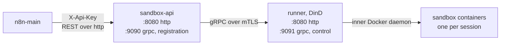

# 08 · n8n sandbox service

> [!NOTE]
> **Moved upstream, still running here.** n8n adopted this service and maintains it at
> [n8n-io/n8n-sandbox-service](https://github.com/n8n-io/n8n-sandbox-service). This lab's
> original repo was archived 2026-08-20 the same week. Since chart `0.4.0`
> ([PR #126](https://github.com/n8n-io/n8n-sandbox-service/pull/126)) immutable-rootfs
> distros are supported directly with `privileged` isolation, and that chart is what this
> lab runs today. The old `0.0.1` tag pin is history. The Talos failure modes below are
> not, which is why the doc stays.

The short version for newcomers: this service gives the n8n AI Assistant somewhere to
run the code it writes, one disposable container per session. The Talos part matters
because Talos boots from an immutable rootfs, a read-only root filesystem that nothing
can change at runtime. Putting Docker-in-Docker on a system like that forces choices you
will meet again with any workload that needs privileges.

Docker-in-Docker, DinD from here on, means a container that runs a complete Docker
daemon inside itself. Each sandbox from
[`n8n-sandbox-service`](https://github.com/n8n-io/n8n-sandbox-service) is a Debian
container that inner daemon creates and tears down on request, over a REST API.

Without the service, the assistant loads and chats but every code execution fails.

> [!IMPORTANT]
> **On Talos, or any immutable-rootfs distro: use the upstream chart, not the old pin.**
> Chart `0.4.0` and later gives you the same Docker-in-Docker runner without sysbox
> (the alternative runtime explained below):
> ```yaml
> runner:
>   isolation: privileged
>   acknowledgePrivileged: true   # the render fails until you accept the weaker boundary
> ```
> plus `pod-security.kubernetes.io/enforce=privileged` on the namespace. Follow the
> [upstream k8s quickstart](https://github.com/n8n-io/n8n-sandbox-service/blob/main/docs/quickstart-k8s.md).
> The values in [`iac/apps/n8n-sandbox/values.yaml`](../iac/apps/n8n-sandbox/values.yaml)
> are this shape, and they are what the lab runs.

The lab deploys from the upstream repo pinned at commit `2a5af877` (chart `0.4.0`,
`appVersion` `1.1.0`). The chart is **not published to a registry**, so you reference a
commit or tag to get an exact copy. It runs in `privileged` isolation, which exists for
exactly this kind of cluster. A privileged container is one the kernel lets do nearly
anything the host can. That is what lets it run its own inner Docker daemon, and it is
also why the namespace has to opt in explicitly (install step 1).

## Shape



Two kinds of traffic appear there. The `http` ports carry the REST API that n8n (and
you, when testing) call. gRPC is a different protocol built for service-to-service
calls, and the API and runner use it between themselves. That gRPC link is what the
certificates in install step 3 protect.

| Component | Role |
| --- | --- |
| API `Deployment` | Public HTTP API, runner registration, sandbox routing state |
| Runner `StatefulSet` | Owns sandbox lifecycles via an inner Docker daemon |
| sandbox containers | One per session, from a configurable Debian image |

Two workload types, on purpose. A `Deployment` (the API) runs interchangeable pods, and
any replica can answer any request. A `StatefulSet` (the runner) gives each pod a stable
name that survives restarts, and the **headless Service** in front of it hands out one
DNS name per pod instead of one load-balanced address for the whole group. That matters
because a sandbox lives inside one specific runner's Docker daemon: the API must call
exactly that runner for exec, files and control, and a load-balanced Service would send
those calls to whichever runner answered. Stable per-pod DNS also makes the runner
control certificate's SANs practical (SANs are the list of names a certificate is valid
for).

> [!WARNING]
> If a runner dies, sandboxes on it should be treated as lost.

## Why `dind` mode on Talos

The names below are from the `0.3.0`-era chart this doc first documented. Chart `0.4.0`,
which the lab runs now, renamed them: `dind` became `runner.isolation: privileged`,
`sysbox` became `runner.isolation: sysbox`, and `dataPlane.mode` is now `in-cluster` or
`external`. The reasoning is unchanged.

The chart offers three data-plane modes. The data plane here means the part that
actually runs sandboxes, as opposed to the API that manages them:

| Mode | Runner | Isolation from the node | Works on Talos |
| --- | --- | --- | --- |
| `sysbox` | in-cluster, `runtimeClassName: sysbox-runc` | user-namespaced by the sysbox runtime | No |
| `dind` | in-cluster, privileged Docker-in-Docker | container capabilities only | Yes |
| `external` | outside Kubernetes | not applicable, only the API is rendered | Partly |

**`sysbox` is the default and the stronger of the two. Prefer it wherever the node
runtime can be changed.** Sysbox is an alternative container runtime that uses a user
namespace, a kernel feature that makes a process feel like root inside its container
while the node sees an ordinary unprivileged user. It is not an option here: installing
sysbox means writing the node's containerd configuration (containerd is the program that
actually starts containers on each node) and restarting kubelet (the node agent that
runs pods), and Talos has no shell, no package manager and a read-only `/`. The
installer cannot run at all. Flatcar and Fedora CoreOS are the same story. GKE Autopilot
blocks privileged containers, so *neither* mode works there.

On such a cluster `sysbox` is not slower or harder, it is **unavailable**. A
RuntimeClass is how a pod asks Kubernetes for a specific runtime, one that has to be
installed on the node already. The `sysbox-runc` RuntimeClass never exists here, so the
runner pod stays `Pending` forever with no obvious cause: Kubernetes is waiting for a
runtime that will never appear.

**What `dind` gives up, stated plainly:** sysbox runs the runner inside a user
namespace, so the inner Docker daemon never holds real privileges on the node. `dind`
takes those capabilities from the kernel directly, and a privileged container can see
the node's cgroup tree (the kernel's ledger of every process on the node) and the node's
devices.

> [!CAUTION]
> That is defensible for a namespace running code you already control, including
> AI-generated code from your own instance. It is **not** defensible for a shared or
> multi-tenant cluster. If you need that boundary and cannot run sysbox, the answer is a
> separate cluster, or a node pool you are willing to treat as compromised. It is not this
> mode with extra settings.

Both in-cluster modes run the same runner image and share the whole config, TLS and
service surface. They differ only in where the container gets its privileges. The chart
**fails at render time**, the moment Helm turns the chart plus your values into
manifests, rather than producing a pod that starts and then cannot run a sandbox.
`dind` without `privileged`, `dind` naming a `runtimeClassName`, and `sysbox` with
`privileged` are each rejected at install.

The `dind` path is verified end to end on Talos v1.13.7 / Kubernetes v1.36.3, which is
this lab's exact configuration.

## Install

Manifests: [`iac/argocd/app-n8n-sandbox.yaml`](../iac/argocd/app-n8n-sandbox.yaml) and
[`iac/apps/n8n-sandbox/values.yaml`](../iac/apps/n8n-sandbox/values.yaml).

Every command below runs on the ops host, or anywhere else `kubectl` and `helm` already
point at this cluster.

### 1. The namespace must permit privileged pods

```bash
kubectl create namespace n8n-sandbox
kubectl label namespace n8n-sandbox \
  pod-security.kubernetes.io/enforce=privileged \
  pod-security.kubernetes.io/warn=privileged \
  pod-security.kubernetes.io/audit=privileged
```

This creates the namespace and opts it into running privileged pods. kubectl confirms
each command with a short `created` or `labeled` line. `enforce` is the one that
matters. `warn` and `audit` only keep the install output readable.

The labels speak to Pod Security Admission, the gatekeeper built into Kubernetes that
checks every new pod against the security level its namespace declares. It refuses
privileged pods by default, which is the right default, and this label is the namespace
opting in on purpose.

> [!WARNING]
> **Skip this and the symptom is that no runner pod is ever created and nothing obviously
> errors.** Pod Security Admission puts the denial on the StatefulSet as an event, not on
> a pod, so there is no failed pod to inspect.

### 2. Auth Secret

Four keys in one Secret.

> [!IMPORTANT]
> **`runner-api-key` and `runner-api-keys` must hold the same value.** The API presents
> the first when it calls a runner, and the runner checks callers against the second, so a
> mismatch leaves the two halves unable to talk.

The block below generates three random values with `openssl` and stores them as the
Secret `sandbox-auth`:

```bash
RUNNER_KEY=$(openssl rand -hex 24)

kubectl -n n8n-sandbox create secret generic sandbox-auth \
  --from-literal=api-keys="$(openssl rand -hex 24)" \
  --from-literal=runner-registration-token="$(openssl rand -hex 24)" \
  --from-literal=runner-api-key="$RUNNER_KEY" \
  --from-literal=runner-api-keys="$RUNNER_KEY"
```

> **✅ Verify:** one line, `secret/sandbox-auth created`.

The chart's `auth.generated.*` path works too but puts the values in the Helm release,
the record Helm keeps in the cluster of everything it installed. Prefer the Secret. (The
chart refuses to render on an empty or `changeme` generated value, so it will not let
you expose the API with placeholder credentials.)

In this cluster, deliver that Secret as a `SopsSecret` like every other credential. A
SopsSecret is a Secret encrypted with sops so it can live safely in git, and the
sops-secrets-operator inside the cluster decrypts it into the real thing. See
[05-gitops](05-gitops.md#secrets-sops--age--sops-secrets-operator).

### 3. mTLS certificates

The API and runner authenticate to each other with mTLS, mutual TLS. In ordinary TLS
only the server proves who it is. In mutual TLS each side presents a certificate and
verifies the other's, so a random pod in the cluster cannot pose as a runner. The
chart's default `tls.mode: existingSecret` expects **four** TLS Secrets it does not
create.

> [!WARNING]
> Leave them missing and both pods sit in `ContainerCreating`, waiting for volumes that
> never appear.

`tls.mode: certManager` renders all four `Certificate` resources instead. cert-manager
is already in this cluster ([03-platform-layer](03-platform-layer.md#cert-manager)), so
this is a private CA plus one value. A CA (certificate authority) signs certificates,
which gives both sides one signer they trust when checking the other. An `Issuer` is
cert-manager's certificate-signing object inside a namespace. The YAML below makes a
self-signed Issuer, uses it once to mint a CA certificate, then turns that CA into the
Issuer the four service certificates will come from:

```yaml
apiVersion: cert-manager.io/v1
kind: Issuer
metadata: { name: sandbox-selfsigned, namespace: n8n-sandbox }
spec: { selfSigned: {} }
---
apiVersion: cert-manager.io/v1
kind: Certificate
metadata: { name: sandbox-ca, namespace: n8n-sandbox }
spec:
  isCA: true
  commonName: n8n-sandbox-ca
  secretName: sandbox-ca
  privateKey: { algorithm: ECDSA, size: 256 }
  issuerRef: { name: sandbox-selfsigned, kind: Issuer, group: cert-manager.io }
---
apiVersion: cert-manager.io/v1
kind: Issuer
metadata: { name: sandbox-ca, namespace: n8n-sandbox }
spec:
  ca: { secretName: sandbox-ca }
```

Apply it the way you deliver any other manifest here, `kubectl apply -f` by hand or
through the gitops flow, and cert-manager reports the `sandbox-ca` Certificate
`READY: True`.

> [!IMPORTANT]
> **This is a separate, private CA, not `letsencrypt-prod`.** These certificates are for
> in-cluster mTLS between two workloads. A public ACME issuer (ACME is the protocol Let's
> Encrypt uses to prove you own a public domain name) is the wrong tool and would prove
> nothing here.

The four certificates are: API registration server (`server auth`), API control client
(`client auth`), runner registration client (`client auth`), runner control server
(`server auth`). The chart fills in the Service DNS names for you, including a wildcard
pod DNS name so every runner pod in the StatefulSet is covered.

### 4. The chart

No node labels, no tolerations, no RuntimeClass. Any node that can run a privileged pod
can run this.

**The chart is not published to any registry.** Normally you would `helm repo add` a
published chart, or pull it as an OCI artifact (a chart stored in a container registry
the way images are). Here there is neither. The chart is vendored in the service repo,
meaning its files are committed inside it, so you clone the repo and point Helm at the
chart directory. `0.4.0` is the version string inside `Chart.yaml`. The thing you
actually reference is a commit (the lab pins `2a5af877`, the PR #126 merge). Pin the
commit, not the chart version.

The block below clones the repo, checks out the pinned commit, and installs the chart
from that checkout with this lab's values file. Run it from the root of a checkout of
this repo, so the `-f` path resolves:

```bash
git clone https://github.com/n8n-io/n8n-sandbox-service.git
git -C n8n-sandbox-service checkout 2a5af877
helm upgrade --install n8n-sandbox-service \
  ./n8n-sandbox-service/charts/n8n-sandbox-service \
  --namespace n8n-sandbox \
  -f iac/apps/n8n-sandbox/values.yaml
```

> **✅ Verify:** Helm reports the release as deployed. The pods themselves get checked in
> the Verify section below.

The Argo CD Application takes the same route (`repoURL` + `path: charts/n8n-sandbox-service`
+ a pinned `targetRevision`) for exactly this reason. If a registry-published chart ever
appears, swapping `sources[0]` to an `oci://` reference is the only change needed.

> [!TIP]
> **Name the release after the chart.** The chart builds resource names the standard
> Helm way: `<release>-<chart>`, collapsed to `<release>` alone when the release name
> already contains the chart name. Installing as release `n8n-sandbox` against chart
> `n8n-sandbox-service` therefore yields `n8n-sandbox-n8n-sandbox-service-api`, which is
> what the upstream quickstart shows. Release `n8n-sandbox-service` collapses it to
> `n8n-sandbox-service-api`, which is the name used throughout this repo.
> `fullnameOverride: sandbox` is the shorter alternative if you prefer `sandbox-api`.
>
> Whatever you pick, `N8N_SANDBOX_SERVICE_URL` has to match it.

## Verify

The first command lists the pods, the second searches the API log for the line it
writes when a runner signs up:

```bash
kubectl -n n8n-sandbox get pods
kubectl -n n8n-sandbox logs deploy/n8n-sandbox-service-api | grep 'runner registered'
```

> **✅ Verify:** every pod `Running` and at least one `runner registered` line, where the
> runner also reports its capacity.

> [!IMPORTANT]
> **That a runner started is not evidence that it works.** Create a sandbox and run
> something in it.

The block below reads an API key
back out of the `sandbox-auth` Secret, then makes two API calls from inside the API pod
with `kubectl exec`, so nothing has to be exposed outside the cluster. The first call
creates a sandbox, the second runs `echo ok` in it:

```bash
KEY=$(kubectl -n n8n-sandbox get secret sandbox-auth \
      -o jsonpath='{.data.api-keys}' | base64 -d | cut -d, -f1)
API=n8n-sandbox-service-api

ID=$(kubectl -n n8n-sandbox exec deploy/$API -- \
  wget -qO- --header "X-Api-Key: $KEY" --header 'Content-Type: application/json' \
  --post-data '{}' http://localhost:8080/sandboxes | sed 's/.*"id":"\([^"]*\)".*/\1/')

kubectl -n n8n-sandbox exec deploy/$API -- \
  wget -qO- --header "X-Api-Key: $KEY" --header 'Content-Type: application/json' \
  --post-data '{"command":"echo ok"}' "http://localhost:8080/sandboxes/$ID/executions"
```

> **✅ Verify:** the second call streams NDJSON (newline-delimited JSON, one JSON object
> per line) and ends with an `exit` event carrying `"success":true`. That single line
> proves the whole chain: API, runner, inner Docker daemon, and a sandbox container that
> ran your command.

## Wiring n8n to it

n8n finds the service through three environment variables. In the n8n Terraform root
(see [07-n8n](07-n8n.md)):

```hcl
{ name = "N8N_INSTANCE_AI_SANDBOX_ENABLED",  value = "true" }
{ name = "N8N_INSTANCE_AI_SANDBOX_PROVIDER", value = "n8n-sandbox" }
{ name = "N8N_SANDBOX_SERVICE_URL",          value = "http://n8n-sandbox-service-api.n8n-sandbox.svc.cluster.local:8080" }
```

plus `N8N_SANDBOX_SERVICE_API_KEY` from a Secret, holding one of the values in the
service's `api-keys` list.

> [!WARNING]
> **The variable names are `N8N_SANDBOX_SERVICE_URL` and `N8N_SANDBOX_SERVICE_API_KEY`.**
> n8n does not error on an environment variable it never reads, so a misspelled name gives
> you an assistant that loads and cannot execute anything, silently.

> [!IMPORTANT]
> **The URL and the key move together.** Rotate one without the other and the editor and
> assistant chat keep working while only code execution breaks. That failure reads as a
> sandbox outage rather than a credential mismatch, and sends you debugging the wrong
> component.

## Operational notes

**Storage.** The inner Docker daemon writes image layers to `/var/lib/docker`, the same
path Docker uses on any machine. Sysbox would give the container its own. In `dind` mode
the chart mounts an `emptyDir` there (scratch space on the node that is deleted with the
pod), capped by `dindRunner.dockerDataRoot.emptyDirSizeLimit` (20 Gi default). The cap
is deliberately not tiny: the sandbox image alone is most of a gigabyte, and a pod
evicted for outgrowing its scratch space takes every running sandbox with it. Set
`dindRunner.dockerDataRoot.persistence.enabled=true` for a `volumeClaimTemplate`
instead. That survives a restart and skips re-pulling the sandbox image, at the cost of
one PVC (PersistentVolumeClaim, storage that survives pod restarts) per replica.

> [!CAUTION]
> Never share one `/var/lib/docker` across runner pods. dockerd requires exclusive access
> to its data directory.

**API state.** The API keeps its sandbox-routing records in SQLite by default, with
`api.persistence.enabled` on so the records survive a restart. Keep
`api.replicaCount: 1` on SQLite, which is a single-writer file, not a shared database.
Multi-pod means Postgres via `api.config.store=postgres` and the
`SANDBOX_API_POSTGRES_*` env vars, and CNPG (CloudNativePG, the Postgres operator this
cluster already runs) is here if you want it.

**Metrics.** The API and runner expose `/metrics` on their HTTP ports. The chart's
`ServiceMonitor` needs the Prometheus Operator CRD, and this cluster does not run that
operator. A CRD (custom resource definition) is how an operator teaches the cluster a
new resource type, so without the operator the `ServiceMonitor` type does not exist at
all. Leave `monitoring.serviceMonitor.enabled: false` and scrape via the
API-server-proxy pattern like everything else
([06-ops-host](06-ops-host.md#scraping-the-cluster-from-outside)).

**NetworkPolicy**, the pod-level firewall rule, is off by default. Worth enabling here:
restrict the API's HTTP port to the n8n namespace, since nothing else should be creating
sandboxes.

**Chart 0.3.0 renamed two keys** (`networkPolicy.sysboxRunner.ingressFrom` became
`networkPolicy.runner.ingressFrom`, along with the matching `monitoring.serviceMonitor.*`).
The old names are *rejected* at render rather than ignored, so an upgrade carrying either
fails loudly instead of quietly changing behaviour.

## Troubleshooting

Symptom first, then the cause to check.

| Symptom | Cause |
| --- | --- |
| No runner pod, no error | Missing privileged namespace label. `kubectl -n n8n-sandbox describe statefulset` shows the PodSecurity event |
| `dockerd` exits immediately | Container did not get privileged. Check `.spec.containers[0].securityContext` |
| Runner pod stays `Pending` | A leftover sysbox `nodeSelector` or toleration. `dindRunner.scheduling` defaults to empty for this reason |
| Pods stuck `ContainerCreating` | A missing Secret. The kubelet blocks on the volume rather than reporting a config error. Expect `sandbox-auth` plus the four TLS Secrets, and `kubectl get certificate` shows `READY: False` with a reason |
| `operation not permitted` dialing the API, at runner startup | **Expected, and self-clearing.** The runner comes up before its inner Docker daemon finishes networking, so early registration attempts back off. Only worry if `runner registered` never appears in the API log |
