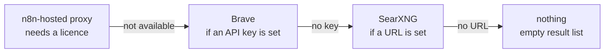

# 09 · SearXNG

SearXNG is a self-hosted metasearch engine: it forwards your query to many search engines
at once (Google, Brave, DuckDuckGo, Wikipedia, and more) and merges the results, without
you holding an account or API key at any of them. Two jobs here: a private search
front-end for the household, and the **web-search backend for n8n's AI Assistant**, so
queries don't carry a commercial API key or a client identity that stays the same from
search to search.

Before this: n8n's assistant has no web search, short of paying Brave for a key. After
this: it searches through a pod in this cluster, and no commercial key exists to leak.

Argo CD, the GitOps engine from [05-gitops](05-gitops.md) that keeps the cluster matched
to what git says, deploys it with the standard two-source pattern: the chart from
`https://charts.kubito.dev` (a Helm chart, the app packaged as Kubernetes templates), and
the values from git (the overrides layered on top). Manifests:
[`iac/argocd/app-searxng.yaml`](../iac/argocd/app-searxng.yaml) and
[`iac/apps/searxng/values.yaml`](../iac/apps/searxng/values.yaml).

> [!NOTE]
> The upstream `searxng/searxng-helm-chart` was archived in 2025-05. The kubito chart is
> the maintained one.

## Values that matter

```yaml
replicaCount: 1        # pinned so a chart bump can't silently scale up

image:
  repository: searxng/searxng
  tag: "2026.8.3-aa059419f"    # a real tag. `latest` drifts and Argo will not notice

config:
  settings:
    server:
      secret_key: "<GENERATE: openssl rand -hex 32>"
      limiter: false       # true needs Redis; add when abuse actually happens
      image_proxy: true
    search:
      safe_search: 0
      formats: [html, json]    # json is what makes it usable as an LLM tool
```

> [!IMPORTANT]
> `formats: [html, json]` is the line the assistant use case depends on. `html` is the
> normal web page for people, and `json` is the machine-readable output a program like n8n
> can parse. Without `json`, SearXNG serves humans only.

`limiter: false` turns off SearXNG's rate limiting, the guard that throttles clients
sending too many requests too fast. Turning it on needs a Redis install, so it stays off
until abuse actually shows up.

The `secret_key` is not a password to anything. SearXNG uses it to sign session cookies
and the limiter token. It is still a secret: run the `openssl rand -hex 32` from the
placeholder (any machine, it prints a random value) and, if you care, deliver it as a
`SopsSecret` (encrypted in git, decrypted in-cluster, see [05-gitops](05-gitops.md)) or
via an `existingSecret` rather than in plaintext values.

## Ingress

The Ingress is the rule that gives SearXNG its hostname through the cluster's shared web
entry point (ingress-nginx). This one is home-only, with the same allowlist pattern used
elsewhere in the cluster: only the source IPs on the list get in, everyone else is turned
away.

```yaml
ingress:
  enabled: true
  className: nginx
  annotations:
    cert-manager.io/cluster-issuer: letsencrypt-prod
    nginx.ingress.kubernetes.io/whitelist-source-range: "203.0.113.10/32,192.168.1.0/24"
  hosts:
    - host: searxng.example.com
      paths: [{ path: /, pathType: Prefix }]
  tls:
    - hosts: [searxng.example.com]
      secretName: searxng-tls
```

The LAN `/24` is included so a direct hit on `http://192.168.1.200`, bypassing the tunnel,
still works. The allowlist only works at all because ingress-nginx runs with
`use-forwarded-headers` and `compute-full-forwarded-for`, the settings that let it see
the real client IP instead of an internal hop address. See
[03-platform-layer](03-platform-layer.md#ingress-nginx).

## As the assistant's search backend

n8n reaches it over cluster DNS (every Service gets an internal hostname of the form
`name.namespace.svc.cluster.local`, resolvable only from inside the cluster), no ingress
involved:

```hcl
{ name = "N8N_INSTANCE_AI_SEARXNG_URL", value = "http://searxng-http.searxng.svc.cluster.local:8080" }
```

n8n picks exactly one search backend, and the first one configured wins:



> [!WARNING]
> **A Brave API key outranks SearXNG.** Setting one silently removes SearXNG from the
> path.

> [!WARNING]
> **The pod log will not tell you which one ran.** SearXNG has no access log. The only
> lines it writes are error dumps from failing upstream engines, so a successful search is
> completely silent. That makes it tempting to conclude "SearXNG receives nothing" while
> it is in fact serving every query. Check the stored tool output instead. See
> [07-n8n](07-n8n.md#ai-assistant-and-agents).

> [!NOTE]
> **What this buys, and what it does not.** SearXNG queries its own upstreams (Google,
> Brave, DuckDuckGo, Wikipedia) *from the cluster*, so this is not LAN-only search. What
> it buys is that your commercial API key and your client identity stay out of it.

## Verify

Run this from any machine where `kubectl` talks to the cluster. It starts a throwaway
curl pod inside the cluster, requests a JSON search on the same in-cluster URL n8n uses,
prints only the HTTP status code, and removes the pod when it exits:

```bash
kubectl -n searxng run verify --rm -i --restart=Never --image=curlimages/curl -- \
  -s -o /dev/null -w "%{http_code}\n" \
  "http://searxng-http.searxng.svc.cluster.local:8080/search?q=talos&format=json"
```

> **✅ Verify:** `200` proves the Service, cluster DNS, and the `json` format in one hit.
> A `403` means `json` is missing from `formats`.
