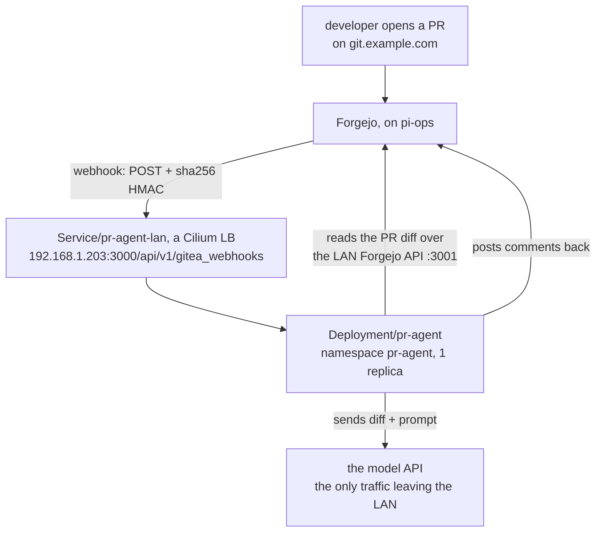

# 10 · PR-Agent: AI code review on Forgejo

Every pull request on every Forgejo repo gets an automatic AI review comment. Nothing to
click, nothing to run.

That comment comes from PR-Agent, an open-source reviewer you run yourself as one small
container in the cluster. When a pull request (a proposed change, waiting for review before
it merges) opens, PR-Agent reads the diff (the changed lines) and sends it to a model API (a
paid AI service reached over HTTPS) to write the review. That model call is the only traffic
it sends outside the LAN. Every change to this lab lands as a pull request, cluster config
and docs alike, so an automatic review on each diff catches mistakes before they merge into
a running cluster. Before this: a PR merged with whatever scrutiny I had left that evening.
After this: every PR gets a reviewer before merge, whether I remember to ask or not.

[PR-Agent](https://github.com/The-PR-Agent/pr-agent) is the original open-source PR
reviewer. Qodo built it and handed it to a community-owned org in April 2026, and it is
MIT now. The Qodo-branded product advertised today is a separate commercial thing. This is
not that, and nothing here talks to Qodo's servers. Only the model API is called.

**Why it works against Forgejo at all:** Forgejo began as a fork of Gitea and still speaks
the Gitea API, and PR-Agent ships a built-in `gitea` provider with full `/describe`,
`/review`, `/improve` and `/ask` support. No fork, no adapter, no shim.

Manifests: [`iac/apps/pr-agent/`](../iac/apps/pr-agent/) and
[`iac/argocd/app-pr-agent.yaml`](../iac/argocd/app-pr-agent.yaml). The first folder holds
four Kubernetes objects. A Namespace is a named slice of the cluster that keeps this app's
resources fenced off from everything else. A Deployment is the spec that keeps the PR-Agent
container running and replaces it when it dies. A Service gives that container one stable
in-cluster address, because the pods behind it come and go. And the SopsSecret template
carries the app's secrets encrypted, so they can live in git without being readable there
(the pattern from [05-gitops](05-gitops.md)).

Upstream publishes no Helm chart (Kubernetes' app packaging format) for the open-source
image. The commercial Qodo Merge on-prem product ships one as a tarball to its customers,
which is a different thing. So this is the one workload here deployed from raw YAML by a
**single-source** Argo Application (Argo CD reads one thing, the manifest folder in git)
rather than the two-source chart+values pattern every other app here uses.

> [!NOTE]
> Image naming changed at the handover. Old images are `codiumai/pr-agent:*` and stop at
> `0.34`. Current images are `pragent/pr-agent:<version>-<target>`. The one to run is the
> `-gitea_app` variant, the always-on server that receives webhooks (built on FastAPI)
> rather than the run-once CLI. Docs referencing `codiumai` predate the transfer.

## Flow

A webhook is Forgejo calling out: when a PR opens, Forgejo sends an HTTP request to a URL
you configured, and PR-Agent is what answers it. Here is the whole round trip:



> [!NOTE]
> Both hops that touch Forgejo use the **LAN** address, not the public hostname. That
> traffic never leaves the house and never touches the Cloudflare tunnel.

**No ingress (the Kubernetes reverse-proxy layer), no DNS record, no TLS. All deliberate.**
A public hostname would add internet-facing attack surface for zero benefit. What stands in
for authentication is the webhook secret, a random string that only Forgejo and PR-Agent
know. Forgejo signs each delivery with a sha256 HMAC, a signature computed from the payload
plus that shared secret. PR-Agent recomputes it on arrival, and a match proves the POST
really came from Forgejo.

## What it posts

It runs on its own when a pull request is **opened**, **reopened** or **synchronized**
(Forgejo's word for every new push to an open PR):

| Command | Result |
| --- | --- |
| `/describe` | Rewrites the PR body with a generated summary, type and file walkthrough. Original text is preserved above it under "User description" |
| `/review` | A reviewer-guide comment: effort estimate, tests, key issues |
| `/improve` | Concrete code suggestions. "No code suggestions" is a real answer, not a failure |

Push-to-branch triggers are off (`handle_push_trigger=false`), so commits outside a PR
cost nothing.

On-demand: comment `/review`, `/improve`, `/describe`, `/ask <question>` or `/help` on an
open PR.

### Comment style

Set `PR_REVIEWER__PERSISTENT_COMMENT=false` and
`PR_CODE_SUGGESTIONS__PERSISTENT_COMMENT=false`. The upstream default is "persistent",
which means every run silently *edits the same comment* near the top of the thread. That
reads fine for a one-shot PR and terribly for an agent-driven branch, where after each
commit you scroll back up to find what changed. With it off, the thread is chronological:
one round per commit, top to bottom.

Two consequences: nothing is auto-collapsed or resolved (Forgejo issue comments have no
"resolve", and the gitea provider can't minimise them the way the GitHub one can), and
`PR_REVIEWER__FINAL_UPDATE_MESSAGE` becomes meaningless, so turn it off too.

### Token budget

`CONFIG__MAX_MODEL_TOKENS=200000`. Tokens are the chunks a model reads text in, roughly
three-quarters of a word each, and this setting caps how much diff PR-Agent may send per
review. The image ships `32000`, which caps **every** model regardless of what it can
actually take. A large diff gets silently trimmed and the review ends with "Additional
modified files (insufficient token budget to process)" listing what it dropped. If you see
that line, raise the limit rather than shrinking the PR. The pod log (wording as of the
pinned `0.42.0` image) says which happened: a `pruning diff` line when over the limit, a
`returning full diff` line when under.

## Adding a repo

**New repos: nothing to do.** Configure a Forgejo **default webhook** once at admin level
and Forgejo copies it into every repository it creates from then on.

**Repos created before the default webhook existed** need it added once, because default
webhooks only apply at creation. Same for any repo you import or migrate later.

Run this on the ops host, which has both `kubectl` access to the cluster and LAN access to
Forgejo. The first command pulls the shared webhook secret out of the cluster (`base64 -d`
undoes the encoding Kubernetes stores secrets in). The second registers the webhook on one
repo through Forgejo's API. Fill in `<user>:<password>` with a Forgejo login that can admin
the repo, and `<user>/<REPO>` with the repo to wire up:

```bash
WHS=$(kubectl -n pr-agent get secret pr-agent-secrets \
      -o jsonpath='{.data.GITEA__WEBHOOK_SECRET}' | base64 -d)

curl -s -X POST -u "<user>:<password>" -H "Content-Type: application/json" \
  -d "{\"type\":\"gitea\",\"active\":true,\"branch_filter\":\"*\",
       \"config\":{\"url\":\"http://192.168.1.203:3000/api/v1/gitea_webhooks\",
                   \"content_type\":\"json\",\"secret\":\"${WHS}\"},
       \"events\":[\"pull_request\",\"issue_comment\"]}" \
  http://192.168.1.100:3001/api/v1/repos/<user>/<REPO>/hooks
```

> **✅ Verify:** Forgejo answers with the new webhook as a block of JSON, and the repo's
> webhook settings page lists it.

> [!IMPORTANT]
> `events` must include **both**. `pull_request` drives the automatic review, and
> `issue_comment` is what makes the `/review`-style commands work.

**Per-repo tuning** goes in a `.pr_agent.toml` at that repo's root, not in the Deployment
env (which is global). Useful keys: `[pr_reviewer] extra_instructions`, `[config] model`,
`[pr_description] publish_description_as_comment`.

## Deployment notes

| Thing | Value |
| --- | --- |
| Namespace | `pr-agent`, PSS **restricted** |
| Image | `pragent/pr-agent:0.42.0-gitea_app`, **digest-pinned** |
| Service | `pr-agent-lan`, LoadBalancer `192.168.1.203:3000` |
| Forgejo side | the LB IP must be in `FORGEJO__webhook__ALLOWED_HOST_LIST` |
| Secrets | Forgejo PAT, webhook HMAC, model API key, all in one SopsSecret |

Four of those rows deserve a plain sentence. PSS is Pod Security Standards, Kubernetes'
built-in tiers of what a pod is allowed to do, and **restricted** is the strictest tier:
it matters here because the image would otherwise run as root, and under this policy it
runs as uid 1000, an ordinary user. **Digest-pinned** means the manifest names the image
by its content hash as well as its tag, so a re-published tag upstream cannot silently
change what runs here. A LoadBalancer Service is how something outside the cluster reaches
a pod inside it: Cilium answers on a dedicated LAN IP, `192.168.1.203`, and forwards the
traffic to the pod, and that IP is where Forgejo on the Pi delivers its webhooks. A PAT is
a personal access token, a password substitute minted in Forgejo's user settings and
scoped to only what the holder needs, and it is what PR-Agent logs in with to read diffs
and post comments.

> [!WARNING]
> **Model config:** change `CONFIG__MODEL` and `CONFIG__FALLBACK_MODELS` **together**. The
> fallback list is what PR-Agent retries with when the main model errors. The image
> defaults both to OpenAI models, so if there is no OpenAI key in the cluster, a
> half-changed config only fails on the retry path, which is the worst way to find out.

Model names must appear in PR-Agent's token map (`pr_agent/algo/__init__.py`, the source
file that tells it each model's size limit) or be paired with
`config.custom_model_max_tokens`.

**Credentials:** use a scoped PAT (`write:repository`, `write:issue`, `read:user`), not an
admin token, so a leaked token can only do what a reviewer needs to do.

> [!IMPORTANT]
> The webhook secret lives in two places, the SopsSecret and every Forgejo webhook.
> Rotating it means editing **both sides together**, or every delivery fails the signature
> check with a 401 until they match again.

## Verify

From the ops host. This asks the cluster whether the Deployment reached its desired state
and waits until it has:

```bash
kubectl -n pr-agent rollout status deploy/pr-agent
```

> **✅ Verify:** `deployment "pr-agent" successfully rolled out` means the receiver is
> running. That proves the pod, not the loop. For the full loop, open a throwaway PR on
> any repo that has the webhook: the `/describe`, `/review` and `/improve` comments should
> land within a minute or two. If nothing shows, work the chain below.

## Troubleshooting

Nothing happens when a PR opens. Work down the chain, in decreasing order of likelihood:

1. **No webhook on that repo.** See "Adding a repo" above.
2. **Forgejo refused to deliver.** On the Pi ops host, where Forgejo's container runs:
   `docker logs <forgejo-container> --since 15m | grep -i webhook`. The classic find is a
   line saying `webhook can only call allowed HTTP servers`, which means the LB IP is
   missing from `ALLOWED_HOST_LIST`. **A failed delivery is not retried.** Fix the cause,
   then re-trigger by closing and reopening the PR or by pushing another commit.
3. **PR-Agent rejected it.** From the ops host:
   `kubectl -n pr-agent logs deploy/pr-agent --since=15m`. A `Missing signature header` or
   `Invalid signature` line means the webhook secret drifted from the SopsSecret.
4. **The model call failed.** Same logs. Look for `AI response` and any `Error`/`Failed`.

**Expected log noise, not failures:**

- `Error getting file: AGENTS.md, content: (404)`. PR-Agent reads `AGENTS.md` from the
  default branch as extra prompt context. Most repos do not have one, and adding one
  genuinely improves reviews.
- `Failed to get PR labels` and `Failed to get comments`. Gaps in the upstream gitea
  provider. Reviews post fine regardless.

**Health check.** A `GET` on the webhook path returns 404 by design (it is POST-only), so
the pod's health probes only check that the TCP port answers. Manual smoke test, from any
machine on the LAN:

```bash
curl -s -o /dev/null -w "%{http_code}\n" -X POST -d '{}' \
  -H 'Content-Type: application/json' \
  http://192.168.1.203:3000/api/v1/gitea_webhooks
# 400 = server is up and rejecting unsigned payloads. That is the healthy answer.
```

## Cost and what was skipped

Per PR: one `/describe` + one `/review` + one `/improve` call, sized by the diff. Small
PRs are fractions of a cent, and a large refactor is meaningfully more. Cheapest knobs, in
order: switch to a smaller model, or trim `pr_commands` to `/review` alone in a repo-level
`.pr_agent.toml`.

Skipped deliberately: an ingress and public hostname (add one only if a non-LAN git host
ever needs to reach it, and then the HMAC stops being the only guard). More than one
replica (a review that runs twice does no harm and no state lives in the pod, so a restart
loses at most one in-flight review). A ServiceMonitor, the object that would feed its
metrics to Prometheus (there is no Prometheus Operator here, and pod logs go to Loki like
everything else).
